GlassClassification
================

Loading the dataset

``` r
glass = read.csv(file = "glass.csv")
head(glass)
```

    ##        RI    Na   Mg   Al    Si    K   Ca Ba   Fe Type
    ## 1 1.52101 13.64 4.49 1.10 71.78 0.06 8.75  0 0.00    1
    ## 2 1.51761 13.89 3.60 1.36 72.73 0.48 7.83  0 0.00    1
    ## 3 1.51618 13.53 3.55 1.54 72.99 0.39 7.78  0 0.00    1
    ## 4 1.51766 13.21 3.69 1.29 72.61 0.57 8.22  0 0.00    1
    ## 5 1.51742 13.27 3.62 1.24 73.08 0.55 8.07  0 0.00    1
    ## 6 1.51596 12.79 3.61 1.62 72.97 0.64 8.07  0 0.26    1

``` r
names(glass)
```

    ##  [1] "RI"   "Na"   "Mg"   "Al"   "Si"   "K"    "Ca"   "Ba"   "Fe"   "Type"

``` r
glass[glass == " "] = NA
```

Check for missing values

``` r
anyNA(glass)
```

    ## [1] FALSE

From the above there is no missing values \#sum(is.na(glass)) to check the number of Missing values

``` r
summary(glass)
```

    ##        RI              Na              Mg              Al       
    ##  Min.   :1.511   Min.   :10.73   Min.   :0.000   Min.   :0.290  
    ##  1st Qu.:1.517   1st Qu.:12.91   1st Qu.:2.115   1st Qu.:1.190  
    ##  Median :1.518   Median :13.30   Median :3.480   Median :1.360  
    ##  Mean   :1.518   Mean   :13.41   Mean   :2.685   Mean   :1.445  
    ##  3rd Qu.:1.519   3rd Qu.:13.82   3rd Qu.:3.600   3rd Qu.:1.630  
    ##  Max.   :1.534   Max.   :17.38   Max.   :4.490   Max.   :3.500  
    ##        Si              K                Ca               Ba       
    ##  Min.   :69.81   Min.   :0.0000   Min.   : 5.430   Min.   :0.000  
    ##  1st Qu.:72.28   1st Qu.:0.1225   1st Qu.: 8.240   1st Qu.:0.000  
    ##  Median :72.79   Median :0.5550   Median : 8.600   Median :0.000  
    ##  Mean   :72.65   Mean   :0.4971   Mean   : 8.957   Mean   :0.175  
    ##  3rd Qu.:73.09   3rd Qu.:0.6100   3rd Qu.: 9.172   3rd Qu.:0.000  
    ##  Max.   :75.41   Max.   :6.2100   Max.   :16.190   Max.   :3.150  
    ##        Fe               Type     
    ##  Min.   :0.00000   Min.   :1.00  
    ##  1st Qu.:0.00000   1st Qu.:1.00  
    ##  Median :0.00000   Median :2.00  
    ##  Mean   :0.05701   Mean   :2.78  
    ##  3rd Qu.:0.10000   3rd Qu.:3.00  
    ##  Max.   :0.51000   Max.   :7.00

All of the type Nuemeric, so we need the Type as Factor to classify the Instance. Also range are different so we need to scale the data(Normalize to 0-1 range)

Now let visualise the data

``` r
library(AppliedPredictiveModeling)
```

    ## Warning: package 'AppliedPredictiveModeling' was built under R version
    ## 3.4.3

``` r
library(caret)
```

    ## Warning: package 'caret' was built under R version 3.4.3

    ## Loading required package: lattice

    ## Warning: package 'lattice' was built under R version 3.4.3

    ## Loading required package: ggplot2

``` r
transparentTheme(trans = .4)
library(ggplot2)

featurePlot(x = glass[,1:9],
            y = glass[,10],
            plot = "pairs",
            title = " Glass Visuaisation",
            auto.key = list(columns = 5)
            )
```

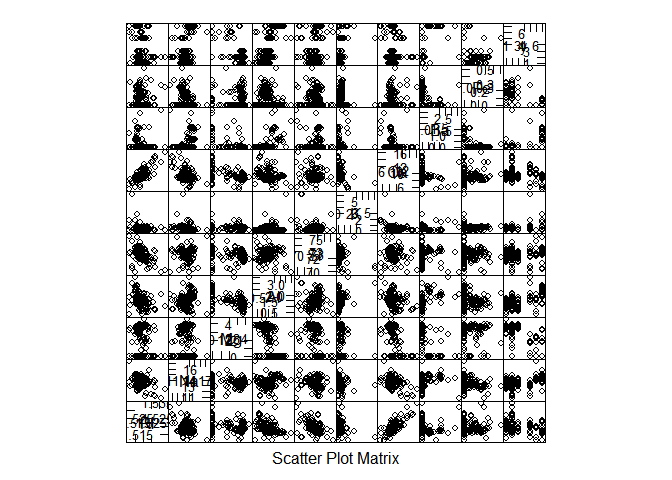

``` r
library(AppliedPredictiveModeling)
library(caret)
featurePlot(x = glass[,1:9],
            y = glass[,10], 
            plot = "box", 
            ## Pass in options to bwplot() 
            scales = list(y = list(relation="free"),
                          x = list(rot = 90)),  
            layout = c(3,1 ), 
            auto.key = list(columns = 2))
```

    ## NULL

``` r
library(AppliedPredictiveModeling)
library(caret)
transparentTheme(trans = .9)
featurePlot(x = glass[,1:9],
            y = glass[,10],
            plot = "density", 
            ## Pass in options to xyplot() to 
            ## make it prettier
            scales = list(x = list(relation="free"), 
                          y = list(relation="free")), 
            adjust = 1.5, 
            pch = "|", 
            layout = c(4, 1), 
            auto.key = list(columns = 3))
```

    ## NULL

From the above visualisation of data we can find few Features have lesser importance. which will be use full to make decisions in the classifiers as we can see FE features has many 0 for many instance.

From the above we can observe more predominance of type 1 and 3.

``` r
dim (glass)
```

    ## [1] 214  10

``` r
glass[,10] = as.factor(glass[,10])
str(glass[,10])
```

    ##  Factor w/ 6 levels "1","2","3","5",..: 1 1 1 1 1 1 1 1 1 1 ...

So they are 6 types of class in the datset

``` r
unique(glass[,10], incomparables = FALSE)
```

    ## [1] 1 2 3 5 6 7
    ## Levels: 1 2 3 5 6 7

From the above we can observe they are 7 types of glass but we have only 6 of them in the dataset

``` r
normal = function(x){
  num = x - min(x)
  den = max(x) - min(x)
  return (num/den)
}
glassnormal = as.data.frame(lapply(Filter(is.numeric,glass[,1:9]),normal))
glassnormal = cbind(glassnormal,type = glass[,10])
dim(glassnormal)
```

    ## [1] 214  10

``` r
names(glassnormal)
```

    ##  [1] "RI"   "Na"   "Mg"   "Al"   "Si"   "K"    "Ca"   "Ba"   "Fe"   "type"

Last step of preprocessing lets clean the outliers.

``` r
boxplot(Filter(is.numeric,glassnormal[,1:9]))
```

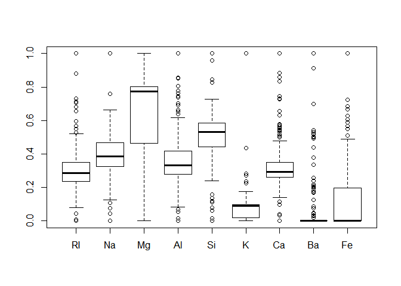 From the above points are very near to range, only CA , K and Ba seems to have potential few outliers. Removing values more thena 0.9 will remove most of them.

Since we have very few instance 214, so lets keep the ouliters since we are doing supervised learning we know the lables. where as this will be a problem in unsupervised Learning.

Since the Instance is very low and we have more feature lets first remove the less significant features.

Boruta is type of feature selection It gives the importance of every feature.

``` r
library(Boruta)
```

    ## Warning: package 'Boruta' was built under R version 3.4.3

    ## Loading required package: ranger

    ## Warning: package 'ranger' was built under R version 3.4.3

``` r
set.seed(123)
borutaselection = Boruta(type~ . , data = glassnormal, doTrace = 2)
```

    ##  1. run of importance source...

    ##  2. run of importance source...

    ##  3. run of importance source...

    ##  4. run of importance source...

    ##  5. run of importance source...

    ##  6. run of importance source...

    ##  7. run of importance source...

    ##  8. run of importance source...

    ##  9. run of importance source...

    ##  10. run of importance source...

    ## After 10 iterations, +0.95 secs:

    ##  confirmed 8 attributes: Al, Ba, Ca, K, Mg and 3 more;

    ##  still have 1 attribute left.

    ##  11. run of importance source...

    ##  12. run of importance source...

    ##  13. run of importance source...

    ##  14. run of importance source...

    ##  15. run of importance source...

    ##  16. run of importance source...

    ##  17. run of importance source...

    ##  18. run of importance source...

    ##  19. run of importance source...

    ##  20. run of importance source...

    ##  21. run of importance source...

    ##  22. run of importance source...

    ##  23. run of importance source...

    ##  24. run of importance source...

    ## After 24 iterations, +2 secs:

    ##  confirmed 1 attribute: Fe;

    ##  no more attributes left.

``` r
borutaselection
```

    ## Boruta performed 24 iterations in 1.98155 secs.
    ##  9 attributes confirmed important: Al, Ba, Ca, Fe, K and 4 more;
    ##  No attributes deemed unimportant.

From the above we can obseerve all the features are important.

Lets divide the dataset into Train and test

``` r
set.seed(123)
jumble = runif(nrow(glassnormal))
glassnormal = glassnormal[ordered(jumble),]
glasssample = sample(2,nrow(glassnormal), replace = TRUE,prob = c(0.67,0.33))
glass_train = glassnormal[glasssample == 1,]
glass_test = glassnormal[glasssample == 2,]
dim(glass_train)
```

    ## [1] 144  10

``` r
dim(glass_test)
```

    ## [1] 70 10

``` r
table(glass$Type)
```

    ## 
    ##  1  2  3  5  6  7 
    ## 70 76 17 13  9 29

``` r
table(glass_train$type)
```

    ## 
    ##  1  2  3  5  6  7 
    ## 47 52 12  9  7 17

``` r
table(glass_test$type)
```

    ## 
    ##  1  2  3  5  6  7 
    ## 23 24  5  4  2 12

From the above we can see the dataset is divided properly. since it is small dataset it fine. if we have a bigger datase then it will be issue as type 6 has 9 and type 1 has 70 which is almost 7 types higher.

``` r
glasspca = prcomp(glass_train[,1:9], scale. = T)
names(glasspca)
```

    ## [1] "sdev"     "rotation" "center"   "scale"    "x"

``` r
library(bioplots)
```

    ## Warning: package 'bioplots' was built under R version 3.4.3

``` r
biplot(glasspca)
```

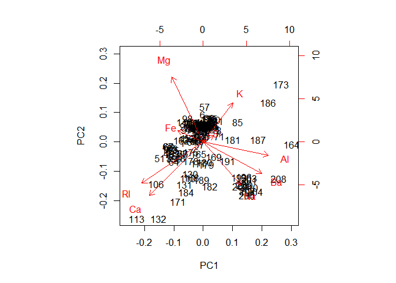

``` r
variance = glasspca$sdev
varaince2 = variance^2
varaince2
```

    ## [1] 2.687267062 1.970408858 1.382117679 1.194002158 0.888043769 0.463228793
    ## [7] 0.339219090 0.074269084 0.001443507

``` r
covarage = varaince2 / sum(varaince2)
covarage
```

    ## [1] 0.2985852291 0.2189343176 0.1535686310 0.1326669064 0.0986715299
    ## [6] 0.0514698659 0.0376910099 0.0082521204 0.0001603897

``` r
plot(covarage, xlab = "princple of component", ylab = " variance explained ", type ="b")
```

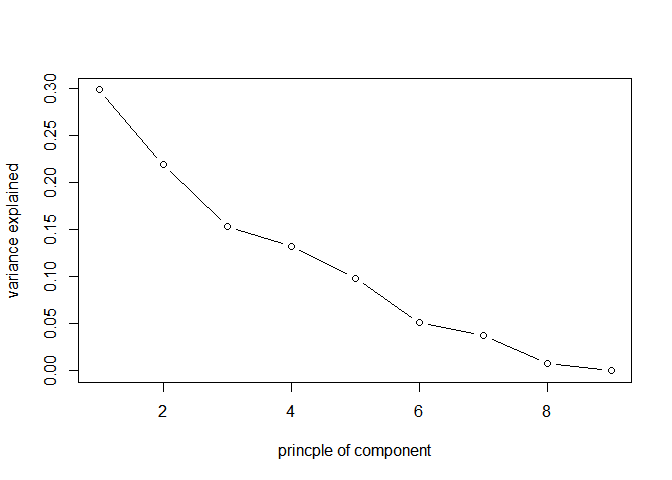

``` r
plot(cumsum(covarage),xlab = "princple of component", ylab = " variance explained ", type ="b" )
text(cumsum(covarage),cex=0.45)
```

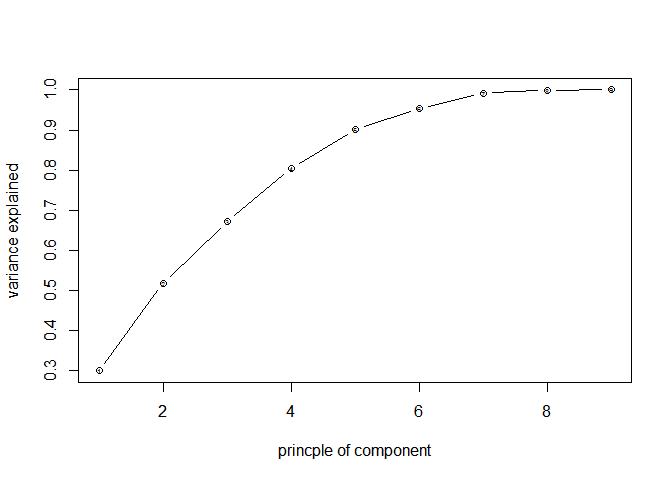

``` r
covaragesum = cumsum(covarage )
covaragesum
```

    ## [1] 0.2985852 0.5175195 0.6710882 0.8037551 0.9024266 0.9538965 0.9915875
    ## [8] 0.9998396 1.0000000

7 components is required to have almost more than 99% of variance

``` r
plotpca = as.data.frame(glasspca$x)
names(plotpca)
```

    ## [1] "PC1" "PC2" "PC3" "PC4" "PC5" "PC6" "PC7" "PC8" "PC9"

``` r
library(ggplot2)
ggplot(plotpca,aes(x = PC1, y =PC2, z = PC3,color = glass_train$type)) + geom_point()
```

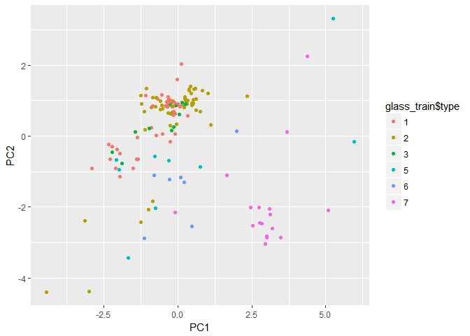

We are nt able to see any visible cluster except type 7.

Trying few Classifier

To use MLR package we need to create a task

``` r
names(glass_test)
```

    ##  [1] "RI"   "Na"   "Mg"   "Al"   "Si"   "K"    "Ca"   "Ba"   "Fe"   "type"

``` r
library(mlr)
```

    ## Warning: package 'mlr' was built under R version 3.4.2

    ## Loading required package: ParamHelpers

    ## Warning: package 'ParamHelpers' was built under R version 3.4.2

    ## 
    ## Attaching package: 'mlr'

    ## The following object is masked from 'package:caret':
    ## 
    ##     train

``` r
glass_traintask = makeClassifTask(data = glass_train, target = "type")
glass_testtask = makeClassifTask(data = glass_test,target= "type")
```

LDA analysis

``` r
glass_lda_model = makeLearner("classif.lda", predict.type = "response")
glass_lda_train = train(glass_lda_model,glass_traintask)
glass_lda_predicts = predict(glass_lda_train,glass_testtask)
confusionMatrix(glass_lda_predicts$data$response,glass_test$type)
```

    ## Confusion Matrix and Statistics
    ## 
    ##           Reference
    ## Prediction  1  2  3  5  6  7
    ##          1 14  4  4  0  0  0
    ##          2  9 15  1  1  0  1
    ##          3  0  0  0  0  0  0
    ##          5  0  4  0  3  0  1
    ##          6  0  1  0  0  2  0
    ##          7  0  0  0  0  0 10
    ## 
    ## Overall Statistics
    ##                                           
    ##                Accuracy : 0.6286          
    ##                  95% CI : (0.5048, 0.7411)
    ##     No Information Rate : 0.3429          
    ##     P-Value [Acc > NIR] : 1.009e-06       
    ##                                           
    ##                   Kappa : 0.4928          
    ##  Mcnemar's Test P-Value : NA              
    ## 
    ## Statistics by Class:
    ## 
    ##                      Class: 1 Class: 2 Class: 3 Class: 5 Class: 6 Class: 7
    ## Sensitivity            0.6087   0.6250  0.00000  0.75000  1.00000   0.8333
    ## Specificity            0.8298   0.7391  1.00000  0.92424  0.98529   1.0000
    ## Pos Pred Value         0.6364   0.5556      NaN  0.37500  0.66667   1.0000
    ## Neg Pred Value         0.8125   0.7907  0.92857  0.98387  1.00000   0.9667
    ## Prevalence             0.3286   0.3429  0.07143  0.05714  0.02857   0.1714
    ## Detection Rate         0.2000   0.2143  0.00000  0.04286  0.02857   0.1429
    ## Detection Prevalence   0.3143   0.3857  0.00000  0.11429  0.04286   0.1429
    ## Balanced Accuracy      0.7192   0.6821  0.50000  0.83712  0.99265   0.9167

The accuracy is 67%

``` r
library(pROC)
```

    ## Warning: package 'pROC' was built under R version 3.4.3

    ## Type 'citation("pROC")' for a citation.

    ## 
    ## Attaching package: 'pROC'

    ## The following objects are masked from 'package:stats':
    ## 
    ##     cov, smooth, var

``` r
actual = as.numeric(as.character(glass_test$type))
lda_glass_pred= as.numeric(as.character(glass_lda_predicts$data$response))
roc = multiclass.roc(lda_glass_pred,actual)
auc(roc)
```

    ## Multi-class area under the curve: 0.8604

``` r
plot.roc(roc$rocs[[1]])
sapply(2:length(roc$rocs),function(i) lines.roc(roc$rocs[[i]],col=i))
```

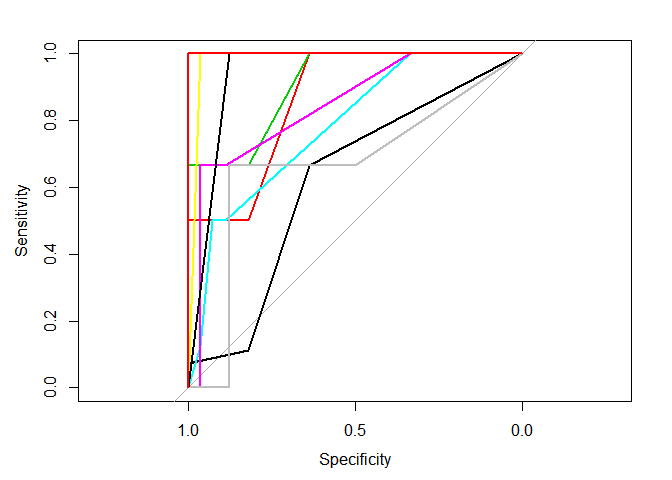

    ##                    [,1]        [,2]        [,3]        [,4]       
    ## percent            FALSE       FALSE       FALSE       FALSE      
    ## sensitivities      Numeric,6   Numeric,5   Numeric,5   Numeric,6  
    ## specificities      Numeric,6   Numeric,5   Numeric,5   Numeric,6  
    ## thresholds         Numeric,6   Numeric,5   Numeric,5   Numeric,6  
    ## direction          "<"         "<"         "<"         "<"        
    ## cases              Numeric,8   Numeric,3   Numeric,10  Numeric,8  
    ## controls           Numeric,22  Numeric,22  Numeric,22  Numeric,27 
    ## fun.sesp           ?           ?           ?           ?          
    ## call               Expression  Expression  Expression  Expression 
    ## original.predictor Numeric,70  Numeric,70  Numeric,70  Numeric,70 
    ## original.response  Numeric,70  Numeric,70  Numeric,70  Numeric,70 
    ## predictor          Numeric,30  Numeric,25  Numeric,32  Numeric,35 
    ## response           Numeric,30  Numeric,25  Numeric,32  Numeric,35 
    ## levels             Character,2 Character,2 Character,2 Character,2
    ##                    [,5]        [,6]        [,7]        [,8]       
    ## percent            FALSE       FALSE       FALSE       FALSE      
    ## sensitivities      Numeric,7   Numeric,6   Numeric,5   Numeric,4  
    ## specificities      Numeric,7   Numeric,6   Numeric,5   Numeric,4  
    ## thresholds         Numeric,7   Numeric,6   Numeric,5   Numeric,4  
    ## direction          "<"         "<"         "<"         "<"        
    ## cases              Numeric,3   Numeric,10  Numeric,3   Numeric,10 
    ## controls           Numeric,27  Numeric,27  Numeric,8   Numeric,8  
    ## fun.sesp           ?           ?           ?           ?          
    ## call               Expression  Expression  Expression  Expression 
    ## original.predictor Numeric,70  Numeric,70  Numeric,70  Numeric,70 
    ## original.response  Numeric,70  Numeric,70  Numeric,70  Numeric,70 
    ## predictor          Numeric,30  Numeric,37  Numeric,11  Numeric,18 
    ## response           Numeric,30  Numeric,37  Numeric,11  Numeric,18 
    ## levels             Character,2 Character,2 Character,2 Character,2
    ##                    [,9]       
    ## percent            FALSE      
    ## sensitivities      Numeric,4  
    ## specificities      Numeric,4  
    ## thresholds         Numeric,4  
    ## direction          "<"        
    ## cases              Numeric,10 
    ## controls           Numeric,3  
    ## fun.sesp           ?          
    ## call               Expression 
    ## original.predictor Numeric,70 
    ## original.response  Numeric,70 
    ## predictor          Numeric,13 
    ## response           Numeric,13 
    ## levels             Character,2

decision Tree

``` r
glass_dec_model = makeLearner("classif.rpart",predict.type = "response")

treecv =  makeResampleDesc("CV",iters = 3L) 
param = makeParamSet( makeIntegerParam("minsplit",lower = 10, upper = 20), 
                      makeIntegerParam("minbucket", lower = 5, upper = 10),
                      makeNumericParam("cp", lower = 0.001, upper = 0.1) 
                    ) 
 
 
control = makeTuneControlGrid() 

glass_dec_tuning = tuneParams(learner = glass_dec_model, task = glass_testtask, resampling = treecv, control = control, par.set = param, measures = acc)
```

    ## [Tune] Started tuning learner classif.rpart for parameter set:

    ##              Type len Def       Constr Req Tunable Trafo
    ## minsplit  integer   -   -     10 to 20   -    TRUE     -
    ## minbucket integer   -   -      5 to 10   -    TRUE     -
    ## cp        numeric   -   - 0.001 to 0.1   -    TRUE     -

    ## With control class: TuneControlGrid

    ## Imputation value: -0

    ## [Tune-x] 1: minsplit=10; minbucket=5; cp=0.001

    ## [Tune-y] 1: acc.test.mean=0.398; time: 0.0 min

    ## [Tune-x] 2: minsplit=11; minbucket=5; cp=0.001

    ## [Tune-y] 2: acc.test.mean=0.441; time: 0.0 min

    ## [Tune-x] 3: minsplit=12; minbucket=5; cp=0.001

    ## [Tune-y] 3: acc.test.mean=0.456; time: 0.0 min

    ## [Tune-x] 4: minsplit=13; minbucket=5; cp=0.001

    ## [Tune-y] 4: acc.test.mean=0.456; time: 0.0 min

    ## [Tune-x] 5: minsplit=14; minbucket=5; cp=0.001

    ## [Tune-y] 5: acc.test.mean=0.456; time: 0.0 min

    ## [Tune-x] 6: minsplit=16; minbucket=5; cp=0.001

    ## [Tune-y] 6: acc.test.mean=0.456; time: 0.0 min

    ## [Tune-x] 7: minsplit=17; minbucket=5; cp=0.001

    ## [Tune-y] 7: acc.test.mean=0.528; time: 0.0 min

    ## [Tune-x] 8: minsplit=18; minbucket=5; cp=0.001

    ## [Tune-y] 8: acc.test.mean=0.485; time: 0.0 min

    ## [Tune-x] 9: minsplit=19; minbucket=5; cp=0.001

    ## [Tune-y] 9: acc.test.mean=0.485; time: 0.0 min

    ## [Tune-x] 10: minsplit=20; minbucket=5; cp=0.001

    ## [Tune-y] 10: acc.test.mean=0.485; time: 0.0 min

    ## [Tune-x] 11: minsplit=10; minbucket=6; cp=0.001

    ## [Tune-y] 11: acc.test.mean=0.47; time: 0.0 min

    ## [Tune-x] 12: minsplit=11; minbucket=6; cp=0.001

    ## [Tune-y] 12: acc.test.mean=0.47; time: 0.0 min

    ## [Tune-x] 13: minsplit=12; minbucket=6; cp=0.001

    ## [Tune-y] 13: acc.test.mean=0.47; time: 0.0 min

    ## [Tune-x] 14: minsplit=13; minbucket=6; cp=0.001

    ## [Tune-y] 14: acc.test.mean=0.47; time: 0.0 min

    ## [Tune-x] 15: minsplit=14; minbucket=6; cp=0.001

    ## [Tune-y] 15: acc.test.mean=0.47; time: 0.0 min

    ## [Tune-x] 16: minsplit=16; minbucket=6; cp=0.001

    ## [Tune-y] 16: acc.test.mean=0.543; time: 0.0 min

    ## [Tune-x] 17: minsplit=17; minbucket=6; cp=0.001

    ## [Tune-y] 17: acc.test.mean=0.543; time: 0.0 min

    ## [Tune-x] 18: minsplit=18; minbucket=6; cp=0.001

    ## [Tune-y] 18: acc.test.mean=0.499; time: 0.0 min

    ## [Tune-x] 19: minsplit=19; minbucket=6; cp=0.001

    ## [Tune-y] 19: acc.test.mean=0.499; time: 0.0 min

    ## [Tune-x] 20: minsplit=20; minbucket=6; cp=0.001

    ## [Tune-y] 20: acc.test.mean=0.499; time: 0.0 min

    ## [Tune-x] 21: minsplit=10; minbucket=7; cp=0.001

    ## [Tune-y] 21: acc.test.mean=0.499; time: 0.0 min

    ## [Tune-x] 22: minsplit=11; minbucket=7; cp=0.001

    ## [Tune-y] 22: acc.test.mean=0.499; time: 0.0 min

    ## [Tune-x] 23: minsplit=12; minbucket=7; cp=0.001

    ## [Tune-y] 23: acc.test.mean=0.499; time: 0.0 min

    ## [Tune-x] 24: minsplit=13; minbucket=7; cp=0.001

    ## [Tune-y] 24: acc.test.mean=0.499; time: 0.0 min

    ## [Tune-x] 25: minsplit=14; minbucket=7; cp=0.001

    ## [Tune-y] 25: acc.test.mean=0.499; time: 0.0 min

    ## [Tune-x] 26: minsplit=16; minbucket=7; cp=0.001

    ## [Tune-y] 26: acc.test.mean=0.572; time: 0.0 min

    ## [Tune-x] 27: minsplit=17; minbucket=7; cp=0.001

    ## [Tune-y] 27: acc.test.mean=0.572; time: 0.0 min

    ## [Tune-x] 28: minsplit=18; minbucket=7; cp=0.001

    ## [Tune-y] 28: acc.test.mean=0.499; time: 0.0 min

    ## [Tune-x] 29: minsplit=19; minbucket=7; cp=0.001

    ## [Tune-y] 29: acc.test.mean=0.499; time: 0.0 min

    ## [Tune-x] 30: minsplit=20; minbucket=7; cp=0.001

    ## [Tune-y] 30: acc.test.mean=0.499; time: 0.0 min

    ## [Tune-x] 31: minsplit=10; minbucket=8; cp=0.001

    ## [Tune-y] 31: acc.test.mean=0.528; time: 0.0 min

    ## [Tune-x] 32: minsplit=11; minbucket=8; cp=0.001

    ## [Tune-y] 32: acc.test.mean=0.528; time: 0.0 min

    ## [Tune-x] 33: minsplit=12; minbucket=8; cp=0.001

    ## [Tune-y] 33: acc.test.mean=0.528; time: 0.0 min

    ## [Tune-x] 34: minsplit=13; minbucket=8; cp=0.001

    ## [Tune-y] 34: acc.test.mean=0.528; time: 0.0 min

    ## [Tune-x] 35: minsplit=14; minbucket=8; cp=0.001

    ## [Tune-y] 35: acc.test.mean=0.528; time: 0.0 min

    ## [Tune-x] 36: minsplit=16; minbucket=8; cp=0.001

    ## [Tune-y] 36: acc.test.mean=0.528; time: 0.0 min

    ## [Tune-x] 37: minsplit=17; minbucket=8; cp=0.001

    ## [Tune-y] 37: acc.test.mean=0.528; time: 0.0 min

    ## [Tune-x] 38: minsplit=18; minbucket=8; cp=0.001

    ## [Tune-y] 38: acc.test.mean=0.456; time: 0.0 min

    ## [Tune-x] 39: minsplit=19; minbucket=8; cp=0.001

    ## [Tune-y] 39: acc.test.mean=0.456; time: 0.0 min

    ## [Tune-x] 40: minsplit=20; minbucket=8; cp=0.001

    ## [Tune-y] 40: acc.test.mean=0.456; time: 0.0 min

    ## [Tune-x] 41: minsplit=10; minbucket=9; cp=0.001

    ## [Tune-y] 41: acc.test.mean= 0.5; time: 0.0 min

    ## [Tune-x] 42: minsplit=11; minbucket=9; cp=0.001

    ## [Tune-y] 42: acc.test.mean= 0.5; time: 0.0 min

    ## [Tune-x] 43: minsplit=12; minbucket=9; cp=0.001

    ## [Tune-y] 43: acc.test.mean= 0.5; time: 0.0 min

    ## [Tune-x] 44: minsplit=13; minbucket=9; cp=0.001

    ## [Tune-y] 44: acc.test.mean= 0.5; time: 0.0 min

    ## [Tune-x] 45: minsplit=14; minbucket=9; cp=0.001

    ## [Tune-y] 45: acc.test.mean= 0.5; time: 0.0 min

    ## [Tune-x] 46: minsplit=16; minbucket=9; cp=0.001

    ## [Tune-y] 46: acc.test.mean= 0.5; time: 0.0 min

    ## [Tune-x] 47: minsplit=17; minbucket=9; cp=0.001

    ## [Tune-y] 47: acc.test.mean= 0.5; time: 0.0 min

    ## [Tune-x] 48: minsplit=18; minbucket=9; cp=0.001

    ## [Tune-y] 48: acc.test.mean= 0.5; time: 0.0 min

    ## [Tune-x] 49: minsplit=19; minbucket=9; cp=0.001

    ## [Tune-y] 49: acc.test.mean= 0.5; time: 0.0 min

    ## [Tune-x] 50: minsplit=20; minbucket=9; cp=0.001

    ## [Tune-y] 50: acc.test.mean= 0.5; time: 0.0 min

    ## [Tune-x] 51: minsplit=10; minbucket=10; cp=0.001

    ## [Tune-y] 51: acc.test.mean=0.472; time: 0.0 min

    ## [Tune-x] 52: minsplit=11; minbucket=10; cp=0.001

    ## [Tune-y] 52: acc.test.mean=0.472; time: 0.0 min

    ## [Tune-x] 53: minsplit=12; minbucket=10; cp=0.001

    ## [Tune-y] 53: acc.test.mean=0.472; time: 0.0 min

    ## [Tune-x] 54: minsplit=13; minbucket=10; cp=0.001

    ## [Tune-y] 54: acc.test.mean=0.472; time: 0.0 min

    ## [Tune-x] 55: minsplit=14; minbucket=10; cp=0.001

    ## [Tune-y] 55: acc.test.mean=0.472; time: 0.0 min

    ## [Tune-x] 56: minsplit=16; minbucket=10; cp=0.001

    ## [Tune-y] 56: acc.test.mean=0.472; time: 0.0 min

    ## [Tune-x] 57: minsplit=17; minbucket=10; cp=0.001

    ## [Tune-y] 57: acc.test.mean=0.472; time: 0.0 min

    ## [Tune-x] 58: minsplit=18; minbucket=10; cp=0.001

    ## [Tune-y] 58: acc.test.mean=0.472; time: 0.0 min

    ## [Tune-x] 59: minsplit=19; minbucket=10; cp=0.001

    ## [Tune-y] 59: acc.test.mean=0.472; time: 0.0 min

    ## [Tune-x] 60: minsplit=20; minbucket=10; cp=0.001

    ## [Tune-y] 60: acc.test.mean=0.472; time: 0.0 min

    ## [Tune-x] 61: minsplit=10; minbucket=5; cp=0.012

    ## [Tune-y] 61: acc.test.mean=0.398; time: 0.0 min

    ## [Tune-x] 62: minsplit=11; minbucket=5; cp=0.012

    ## [Tune-y] 62: acc.test.mean=0.441; time: 0.0 min

    ## [Tune-x] 63: minsplit=12; minbucket=5; cp=0.012

    ## [Tune-y] 63: acc.test.mean=0.456; time: 0.0 min

    ## [Tune-x] 64: minsplit=13; minbucket=5; cp=0.012

    ## [Tune-y] 64: acc.test.mean=0.456; time: 0.0 min

    ## [Tune-x] 65: minsplit=14; minbucket=5; cp=0.012

    ## [Tune-y] 65: acc.test.mean=0.456; time: 0.0 min

    ## [Tune-x] 66: minsplit=16; minbucket=5; cp=0.012

    ## [Tune-y] 66: acc.test.mean=0.456; time: 0.0 min

    ## [Tune-x] 67: minsplit=17; minbucket=5; cp=0.012

    ## [Tune-y] 67: acc.test.mean=0.528; time: 0.0 min

    ## [Tune-x] 68: minsplit=18; minbucket=5; cp=0.012

    ## [Tune-y] 68: acc.test.mean=0.485; time: 0.0 min

    ## [Tune-x] 69: minsplit=19; minbucket=5; cp=0.012

    ## [Tune-y] 69: acc.test.mean=0.485; time: 0.0 min

    ## [Tune-x] 70: minsplit=20; minbucket=5; cp=0.012

    ## [Tune-y] 70: acc.test.mean=0.485; time: 0.0 min

    ## [Tune-x] 71: minsplit=10; minbucket=6; cp=0.012

    ## [Tune-y] 71: acc.test.mean=0.47; time: 0.0 min

    ## [Tune-x] 72: minsplit=11; minbucket=6; cp=0.012

    ## [Tune-y] 72: acc.test.mean=0.47; time: 0.0 min

    ## [Tune-x] 73: minsplit=12; minbucket=6; cp=0.012

    ## [Tune-y] 73: acc.test.mean=0.47; time: 0.0 min

    ## [Tune-x] 74: minsplit=13; minbucket=6; cp=0.012

    ## [Tune-y] 74: acc.test.mean=0.47; time: 0.0 min

    ## [Tune-x] 75: minsplit=14; minbucket=6; cp=0.012

    ## [Tune-y] 75: acc.test.mean=0.47; time: 0.0 min

    ## [Tune-x] 76: minsplit=16; minbucket=6; cp=0.012

    ## [Tune-y] 76: acc.test.mean=0.543; time: 0.0 min

    ## [Tune-x] 77: minsplit=17; minbucket=6; cp=0.012

    ## [Tune-y] 77: acc.test.mean=0.543; time: 0.0 min

    ## [Tune-x] 78: minsplit=18; minbucket=6; cp=0.012

    ## [Tune-y] 78: acc.test.mean=0.499; time: 0.0 min

    ## [Tune-x] 79: minsplit=19; minbucket=6; cp=0.012

    ## [Tune-y] 79: acc.test.mean=0.499; time: 0.0 min

    ## [Tune-x] 80: minsplit=20; minbucket=6; cp=0.012

    ## [Tune-y] 80: acc.test.mean=0.499; time: 0.0 min

    ## [Tune-x] 81: minsplit=10; minbucket=7; cp=0.012

    ## [Tune-y] 81: acc.test.mean=0.499; time: 0.0 min

    ## [Tune-x] 82: minsplit=11; minbucket=7; cp=0.012

    ## [Tune-y] 82: acc.test.mean=0.499; time: 0.0 min

    ## [Tune-x] 83: minsplit=12; minbucket=7; cp=0.012

    ## [Tune-y] 83: acc.test.mean=0.499; time: 0.0 min

    ## [Tune-x] 84: minsplit=13; minbucket=7; cp=0.012

    ## [Tune-y] 84: acc.test.mean=0.499; time: 0.0 min

    ## [Tune-x] 85: minsplit=14; minbucket=7; cp=0.012

    ## [Tune-y] 85: acc.test.mean=0.499; time: 0.0 min

    ## [Tune-x] 86: minsplit=16; minbucket=7; cp=0.012

    ## [Tune-y] 86: acc.test.mean=0.572; time: 0.0 min

    ## [Tune-x] 87: minsplit=17; minbucket=7; cp=0.012

    ## [Tune-y] 87: acc.test.mean=0.572; time: 0.0 min

    ## [Tune-x] 88: minsplit=18; minbucket=7; cp=0.012

    ## [Tune-y] 88: acc.test.mean=0.499; time: 0.0 min

    ## [Tune-x] 89: minsplit=19; minbucket=7; cp=0.012

    ## [Tune-y] 89: acc.test.mean=0.499; time: 0.0 min

    ## [Tune-x] 90: minsplit=20; minbucket=7; cp=0.012

    ## [Tune-y] 90: acc.test.mean=0.499; time: 0.0 min

    ## [Tune-x] 91: minsplit=10; minbucket=8; cp=0.012

    ## [Tune-y] 91: acc.test.mean=0.528; time: 0.0 min

    ## [Tune-x] 92: minsplit=11; minbucket=8; cp=0.012

    ## [Tune-y] 92: acc.test.mean=0.528; time: 0.0 min

    ## [Tune-x] 93: minsplit=12; minbucket=8; cp=0.012

    ## [Tune-y] 93: acc.test.mean=0.528; time: 0.0 min

    ## [Tune-x] 94: minsplit=13; minbucket=8; cp=0.012

    ## [Tune-y] 94: acc.test.mean=0.528; time: 0.0 min

    ## [Tune-x] 95: minsplit=14; minbucket=8; cp=0.012

    ## [Tune-y] 95: acc.test.mean=0.528; time: 0.0 min

    ## [Tune-x] 96: minsplit=16; minbucket=8; cp=0.012

    ## [Tune-y] 96: acc.test.mean=0.528; time: 0.0 min

    ## [Tune-x] 97: minsplit=17; minbucket=8; cp=0.012

    ## [Tune-y] 97: acc.test.mean=0.528; time: 0.0 min

    ## [Tune-x] 98: minsplit=18; minbucket=8; cp=0.012

    ## [Tune-y] 98: acc.test.mean=0.456; time: 0.0 min

    ## [Tune-x] 99: minsplit=19; minbucket=8; cp=0.012

    ## [Tune-y] 99: acc.test.mean=0.456; time: 0.0 min

    ## [Tune-x] 100: minsplit=20; minbucket=8; cp=0.012

    ## [Tune-y] 100: acc.test.mean=0.456; time: 0.0 min

    ## [Tune-x] 101: minsplit=10; minbucket=9; cp=0.012

    ## [Tune-y] 101: acc.test.mean= 0.5; time: 0.0 min

    ## [Tune-x] 102: minsplit=11; minbucket=9; cp=0.012

    ## [Tune-y] 102: acc.test.mean= 0.5; time: 0.0 min

    ## [Tune-x] 103: minsplit=12; minbucket=9; cp=0.012

    ## [Tune-y] 103: acc.test.mean= 0.5; time: 0.0 min

    ## [Tune-x] 104: minsplit=13; minbucket=9; cp=0.012

    ## [Tune-y] 104: acc.test.mean= 0.5; time: 0.0 min

    ## [Tune-x] 105: minsplit=14; minbucket=9; cp=0.012

    ## [Tune-y] 105: acc.test.mean= 0.5; time: 0.0 min

    ## [Tune-x] 106: minsplit=16; minbucket=9; cp=0.012

    ## [Tune-y] 106: acc.test.mean= 0.5; time: 0.0 min

    ## [Tune-x] 107: minsplit=17; minbucket=9; cp=0.012

    ## [Tune-y] 107: acc.test.mean= 0.5; time: 0.0 min

    ## [Tune-x] 108: minsplit=18; minbucket=9; cp=0.012

    ## [Tune-y] 108: acc.test.mean= 0.5; time: 0.0 min

    ## [Tune-x] 109: minsplit=19; minbucket=9; cp=0.012

    ## [Tune-y] 109: acc.test.mean= 0.5; time: 0.0 min

    ## [Tune-x] 110: minsplit=20; minbucket=9; cp=0.012

    ## [Tune-y] 110: acc.test.mean= 0.5; time: 0.0 min

    ## [Tune-x] 111: minsplit=10; minbucket=10; cp=0.012

    ## [Tune-y] 111: acc.test.mean=0.472; time: 0.0 min

    ## [Tune-x] 112: minsplit=11; minbucket=10; cp=0.012

    ## [Tune-y] 112: acc.test.mean=0.472; time: 0.0 min

    ## [Tune-x] 113: minsplit=12; minbucket=10; cp=0.012

    ## [Tune-y] 113: acc.test.mean=0.472; time: 0.0 min

    ## [Tune-x] 114: minsplit=13; minbucket=10; cp=0.012

    ## [Tune-y] 114: acc.test.mean=0.472; time: 0.0 min

    ## [Tune-x] 115: minsplit=14; minbucket=10; cp=0.012

    ## [Tune-y] 115: acc.test.mean=0.472; time: 0.0 min

    ## [Tune-x] 116: minsplit=16; minbucket=10; cp=0.012

    ## [Tune-y] 116: acc.test.mean=0.472; time: 0.0 min

    ## [Tune-x] 117: minsplit=17; minbucket=10; cp=0.012

    ## [Tune-y] 117: acc.test.mean=0.472; time: 0.0 min

    ## [Tune-x] 118: minsplit=18; minbucket=10; cp=0.012

    ## [Tune-y] 118: acc.test.mean=0.472; time: 0.0 min

    ## [Tune-x] 119: minsplit=19; minbucket=10; cp=0.012

    ## [Tune-y] 119: acc.test.mean=0.472; time: 0.0 min

    ## [Tune-x] 120: minsplit=20; minbucket=10; cp=0.012

    ## [Tune-y] 120: acc.test.mean=0.472; time: 0.0 min

    ## [Tune-x] 121: minsplit=10; minbucket=5; cp=0.023

    ## [Tune-y] 121: acc.test.mean=0.398; time: 0.0 min

    ## [Tune-x] 122: minsplit=11; minbucket=5; cp=0.023

    ## [Tune-y] 122: acc.test.mean=0.441; time: 0.0 min

    ## [Tune-x] 123: minsplit=12; minbucket=5; cp=0.023

    ## [Tune-y] 123: acc.test.mean=0.456; time: 0.0 min

    ## [Tune-x] 124: minsplit=13; minbucket=5; cp=0.023

    ## [Tune-y] 124: acc.test.mean=0.456; time: 0.0 min

    ## [Tune-x] 125: minsplit=14; minbucket=5; cp=0.023

    ## [Tune-y] 125: acc.test.mean=0.456; time: 0.0 min

    ## [Tune-x] 126: minsplit=16; minbucket=5; cp=0.023

    ## [Tune-y] 126: acc.test.mean=0.456; time: 0.0 min

    ## [Tune-x] 127: minsplit=17; minbucket=5; cp=0.023

    ## [Tune-y] 127: acc.test.mean=0.528; time: 0.0 min

    ## [Tune-x] 128: minsplit=18; minbucket=5; cp=0.023

    ## [Tune-y] 128: acc.test.mean=0.485; time: 0.0 min

    ## [Tune-x] 129: minsplit=19; minbucket=5; cp=0.023

    ## [Tune-y] 129: acc.test.mean=0.485; time: 0.0 min

    ## [Tune-x] 130: minsplit=20; minbucket=5; cp=0.023

    ## [Tune-y] 130: acc.test.mean=0.485; time: 0.0 min

    ## [Tune-x] 131: minsplit=10; minbucket=6; cp=0.023

    ## [Tune-y] 131: acc.test.mean=0.47; time: 0.0 min

    ## [Tune-x] 132: minsplit=11; minbucket=6; cp=0.023

    ## [Tune-y] 132: acc.test.mean=0.47; time: 0.0 min

    ## [Tune-x] 133: minsplit=12; minbucket=6; cp=0.023

    ## [Tune-y] 133: acc.test.mean=0.47; time: 0.0 min

    ## [Tune-x] 134: minsplit=13; minbucket=6; cp=0.023

    ## [Tune-y] 134: acc.test.mean=0.47; time: 0.0 min

    ## [Tune-x] 135: minsplit=14; minbucket=6; cp=0.023

    ## [Tune-y] 135: acc.test.mean=0.47; time: 0.0 min

    ## [Tune-x] 136: minsplit=16; minbucket=6; cp=0.023

    ## [Tune-y] 136: acc.test.mean=0.543; time: 0.0 min

    ## [Tune-x] 137: minsplit=17; minbucket=6; cp=0.023

    ## [Tune-y] 137: acc.test.mean=0.543; time: 0.0 min

    ## [Tune-x] 138: minsplit=18; minbucket=6; cp=0.023

    ## [Tune-y] 138: acc.test.mean=0.499; time: 0.0 min

    ## [Tune-x] 139: minsplit=19; minbucket=6; cp=0.023

    ## [Tune-y] 139: acc.test.mean=0.499; time: 0.0 min

    ## [Tune-x] 140: minsplit=20; minbucket=6; cp=0.023

    ## [Tune-y] 140: acc.test.mean=0.499; time: 0.0 min

    ## [Tune-x] 141: minsplit=10; minbucket=7; cp=0.023

    ## [Tune-y] 141: acc.test.mean=0.499; time: 0.0 min

    ## [Tune-x] 142: minsplit=11; minbucket=7; cp=0.023

    ## [Tune-y] 142: acc.test.mean=0.499; time: 0.0 min

    ## [Tune-x] 143: minsplit=12; minbucket=7; cp=0.023

    ## [Tune-y] 143: acc.test.mean=0.499; time: 0.0 min

    ## [Tune-x] 144: minsplit=13; minbucket=7; cp=0.023

    ## [Tune-y] 144: acc.test.mean=0.499; time: 0.0 min

    ## [Tune-x] 145: minsplit=14; minbucket=7; cp=0.023

    ## [Tune-y] 145: acc.test.mean=0.499; time: 0.0 min

    ## [Tune-x] 146: minsplit=16; minbucket=7; cp=0.023

    ## [Tune-y] 146: acc.test.mean=0.572; time: 0.0 min

    ## [Tune-x] 147: minsplit=17; minbucket=7; cp=0.023

    ## [Tune-y] 147: acc.test.mean=0.572; time: 0.0 min

    ## [Tune-x] 148: minsplit=18; minbucket=7; cp=0.023

    ## [Tune-y] 148: acc.test.mean=0.499; time: 0.0 min

    ## [Tune-x] 149: minsplit=19; minbucket=7; cp=0.023

    ## [Tune-y] 149: acc.test.mean=0.499; time: 0.0 min

    ## [Tune-x] 150: minsplit=20; minbucket=7; cp=0.023

    ## [Tune-y] 150: acc.test.mean=0.499; time: 0.0 min

    ## [Tune-x] 151: minsplit=10; minbucket=8; cp=0.023

    ## [Tune-y] 151: acc.test.mean=0.528; time: 0.0 min

    ## [Tune-x] 152: minsplit=11; minbucket=8; cp=0.023

    ## [Tune-y] 152: acc.test.mean=0.528; time: 0.0 min

    ## [Tune-x] 153: minsplit=12; minbucket=8; cp=0.023

    ## [Tune-y] 153: acc.test.mean=0.528; time: 0.0 min

    ## [Tune-x] 154: minsplit=13; minbucket=8; cp=0.023

    ## [Tune-y] 154: acc.test.mean=0.528; time: 0.0 min

    ## [Tune-x] 155: minsplit=14; minbucket=8; cp=0.023

    ## [Tune-y] 155: acc.test.mean=0.528; time: 0.0 min

    ## [Tune-x] 156: minsplit=16; minbucket=8; cp=0.023

    ## [Tune-y] 156: acc.test.mean=0.528; time: 0.0 min

    ## [Tune-x] 157: minsplit=17; minbucket=8; cp=0.023

    ## [Tune-y] 157: acc.test.mean=0.528; time: 0.0 min

    ## [Tune-x] 158: minsplit=18; minbucket=8; cp=0.023

    ## [Tune-y] 158: acc.test.mean=0.456; time: 0.0 min

    ## [Tune-x] 159: minsplit=19; minbucket=8; cp=0.023

    ## [Tune-y] 159: acc.test.mean=0.456; time: 0.0 min

    ## [Tune-x] 160: minsplit=20; minbucket=8; cp=0.023

    ## [Tune-y] 160: acc.test.mean=0.456; time: 0.0 min

    ## [Tune-x] 161: minsplit=10; minbucket=9; cp=0.023

    ## [Tune-y] 161: acc.test.mean= 0.5; time: 0.0 min

    ## [Tune-x] 162: minsplit=11; minbucket=9; cp=0.023

    ## [Tune-y] 162: acc.test.mean= 0.5; time: 0.0 min

    ## [Tune-x] 163: minsplit=12; minbucket=9; cp=0.023

    ## [Tune-y] 163: acc.test.mean= 0.5; time: 0.0 min

    ## [Tune-x] 164: minsplit=13; minbucket=9; cp=0.023

    ## [Tune-y] 164: acc.test.mean= 0.5; time: 0.0 min

    ## [Tune-x] 165: minsplit=14; minbucket=9; cp=0.023

    ## [Tune-y] 165: acc.test.mean= 0.5; time: 0.0 min

    ## [Tune-x] 166: minsplit=16; minbucket=9; cp=0.023

    ## [Tune-y] 166: acc.test.mean= 0.5; time: 0.0 min

    ## [Tune-x] 167: minsplit=17; minbucket=9; cp=0.023

    ## [Tune-y] 167: acc.test.mean= 0.5; time: 0.0 min

    ## [Tune-x] 168: minsplit=18; minbucket=9; cp=0.023

    ## [Tune-y] 168: acc.test.mean= 0.5; time: 0.0 min

    ## [Tune-x] 169: minsplit=19; minbucket=9; cp=0.023

    ## [Tune-y] 169: acc.test.mean= 0.5; time: 0.0 min

    ## [Tune-x] 170: minsplit=20; minbucket=9; cp=0.023

    ## [Tune-y] 170: acc.test.mean= 0.5; time: 0.0 min

    ## [Tune-x] 171: minsplit=10; minbucket=10; cp=0.023

    ## [Tune-y] 171: acc.test.mean=0.472; time: 0.0 min

    ## [Tune-x] 172: minsplit=11; minbucket=10; cp=0.023

    ## [Tune-y] 172: acc.test.mean=0.472; time: 0.0 min

    ## [Tune-x] 173: minsplit=12; minbucket=10; cp=0.023

    ## [Tune-y] 173: acc.test.mean=0.472; time: 0.0 min

    ## [Tune-x] 174: minsplit=13; minbucket=10; cp=0.023

    ## [Tune-y] 174: acc.test.mean=0.472; time: 0.0 min

    ## [Tune-x] 175: minsplit=14; minbucket=10; cp=0.023

    ## [Tune-y] 175: acc.test.mean=0.472; time: 0.0 min

    ## [Tune-x] 176: minsplit=16; minbucket=10; cp=0.023

    ## [Tune-y] 176: acc.test.mean=0.472; time: 0.0 min

    ## [Tune-x] 177: minsplit=17; minbucket=10; cp=0.023

    ## [Tune-y] 177: acc.test.mean=0.472; time: 0.0 min

    ## [Tune-x] 178: minsplit=18; minbucket=10; cp=0.023

    ## [Tune-y] 178: acc.test.mean=0.472; time: 0.0 min

    ## [Tune-x] 179: minsplit=19; minbucket=10; cp=0.023

    ## [Tune-y] 179: acc.test.mean=0.472; time: 0.0 min

    ## [Tune-x] 180: minsplit=20; minbucket=10; cp=0.023

    ## [Tune-y] 180: acc.test.mean=0.472; time: 0.0 min

    ## [Tune-x] 181: minsplit=10; minbucket=5; cp=0.034

    ## [Tune-y] 181: acc.test.mean=0.528; time: 0.0 min

    ## [Tune-x] 182: minsplit=11; minbucket=5; cp=0.034

    ## [Tune-y] 182: acc.test.mean=0.528; time: 0.0 min

    ## [Tune-x] 183: minsplit=12; minbucket=5; cp=0.034

    ## [Tune-y] 183: acc.test.mean=0.528; time: 0.0 min

    ## [Tune-x] 184: minsplit=13; minbucket=5; cp=0.034

    ## [Tune-y] 184: acc.test.mean=0.528; time: 0.0 min

    ## [Tune-x] 185: minsplit=14; minbucket=5; cp=0.034

    ## [Tune-y] 185: acc.test.mean=0.528; time: 0.0 min

    ## [Tune-x] 186: minsplit=16; minbucket=5; cp=0.034

    ## [Tune-y] 186: acc.test.mean=0.528; time: 0.0 min

    ## [Tune-x] 187: minsplit=17; minbucket=5; cp=0.034

    ## [Tune-y] 187: acc.test.mean=0.528; time: 0.0 min

    ## [Tune-x] 188: minsplit=18; minbucket=5; cp=0.034

    ## [Tune-y] 188: acc.test.mean=0.485; time: 0.0 min

    ## [Tune-x] 189: minsplit=19; minbucket=5; cp=0.034

    ## [Tune-y] 189: acc.test.mean=0.485; time: 0.0 min

    ## [Tune-x] 190: minsplit=20; minbucket=5; cp=0.034

    ## [Tune-y] 190: acc.test.mean=0.485; time: 0.0 min

    ## [Tune-x] 191: minsplit=10; minbucket=6; cp=0.034

    ## [Tune-y] 191: acc.test.mean=0.543; time: 0.0 min

    ## [Tune-x] 192: minsplit=11; minbucket=6; cp=0.034

    ## [Tune-y] 192: acc.test.mean=0.543; time: 0.0 min

    ## [Tune-x] 193: minsplit=12; minbucket=6; cp=0.034

    ## [Tune-y] 193: acc.test.mean=0.543; time: 0.0 min

    ## [Tune-x] 194: minsplit=13; minbucket=6; cp=0.034

    ## [Tune-y] 194: acc.test.mean=0.543; time: 0.0 min

    ## [Tune-x] 195: minsplit=14; minbucket=6; cp=0.034

    ## [Tune-y] 195: acc.test.mean=0.543; time: 0.0 min

    ## [Tune-x] 196: minsplit=16; minbucket=6; cp=0.034

    ## [Tune-y] 196: acc.test.mean=0.543; time: 0.0 min

    ## [Tune-x] 197: minsplit=17; minbucket=6; cp=0.034

    ## [Tune-y] 197: acc.test.mean=0.543; time: 0.0 min

    ## [Tune-x] 198: minsplit=18; minbucket=6; cp=0.034

    ## [Tune-y] 198: acc.test.mean=0.499; time: 0.0 min

    ## [Tune-x] 199: minsplit=19; minbucket=6; cp=0.034

    ## [Tune-y] 199: acc.test.mean=0.499; time: 0.0 min

    ## [Tune-x] 200: minsplit=20; minbucket=6; cp=0.034

    ## [Tune-y] 200: acc.test.mean=0.499; time: 0.0 min

    ## [Tune-x] 201: minsplit=10; minbucket=7; cp=0.034

    ## [Tune-y] 201: acc.test.mean=0.572; time: 0.0 min

    ## [Tune-x] 202: minsplit=11; minbucket=7; cp=0.034

    ## [Tune-y] 202: acc.test.mean=0.572; time: 0.0 min

    ## [Tune-x] 203: minsplit=12; minbucket=7; cp=0.034

    ## [Tune-y] 203: acc.test.mean=0.572; time: 0.0 min

    ## [Tune-x] 204: minsplit=13; minbucket=7; cp=0.034

    ## [Tune-y] 204: acc.test.mean=0.572; time: 0.0 min

    ## [Tune-x] 205: minsplit=14; minbucket=7; cp=0.034

    ## [Tune-y] 205: acc.test.mean=0.572; time: 0.0 min

    ## [Tune-x] 206: minsplit=16; minbucket=7; cp=0.034

    ## [Tune-y] 206: acc.test.mean=0.572; time: 0.0 min

    ## [Tune-x] 207: minsplit=17; minbucket=7; cp=0.034

    ## [Tune-y] 207: acc.test.mean=0.572; time: 0.0 min

    ## [Tune-x] 208: minsplit=18; minbucket=7; cp=0.034

    ## [Tune-y] 208: acc.test.mean=0.499; time: 0.0 min

    ## [Tune-x] 209: minsplit=19; minbucket=7; cp=0.034

    ## [Tune-y] 209: acc.test.mean=0.499; time: 0.0 min

    ## [Tune-x] 210: minsplit=20; minbucket=7; cp=0.034

    ## [Tune-y] 210: acc.test.mean=0.499; time: 0.0 min

    ## [Tune-x] 211: minsplit=10; minbucket=8; cp=0.034

    ## [Tune-y] 211: acc.test.mean=0.572; time: 0.0 min

    ## [Tune-x] 212: minsplit=11; minbucket=8; cp=0.034

    ## [Tune-y] 212: acc.test.mean=0.572; time: 0.0 min

    ## [Tune-x] 213: minsplit=12; minbucket=8; cp=0.034

    ## [Tune-y] 213: acc.test.mean=0.572; time: 0.0 min

    ## [Tune-x] 214: minsplit=13; minbucket=8; cp=0.034

    ## [Tune-y] 214: acc.test.mean=0.572; time: 0.0 min

    ## [Tune-x] 215: minsplit=14; minbucket=8; cp=0.034

    ## [Tune-y] 215: acc.test.mean=0.572; time: 0.0 min

    ## [Tune-x] 216: minsplit=16; minbucket=8; cp=0.034

    ## [Tune-y] 216: acc.test.mean=0.572; time: 0.0 min

    ## [Tune-x] 217: minsplit=17; minbucket=8; cp=0.034

    ## [Tune-y] 217: acc.test.mean=0.572; time: 0.0 min

    ## [Tune-x] 218: minsplit=18; minbucket=8; cp=0.034

    ## [Tune-y] 218: acc.test.mean=0.499; time: 0.0 min

    ## [Tune-x] 219: minsplit=19; minbucket=8; cp=0.034

    ## [Tune-y] 219: acc.test.mean=0.499; time: 0.0 min

    ## [Tune-x] 220: minsplit=20; minbucket=8; cp=0.034

    ## [Tune-y] 220: acc.test.mean=0.499; time: 0.0 min

    ## [Tune-x] 221: minsplit=10; minbucket=9; cp=0.034

    ## [Tune-y] 221: acc.test.mean= 0.5; time: 0.0 min

    ## [Tune-x] 222: minsplit=11; minbucket=9; cp=0.034

    ## [Tune-y] 222: acc.test.mean= 0.5; time: 0.0 min

    ## [Tune-x] 223: minsplit=12; minbucket=9; cp=0.034

    ## [Tune-y] 223: acc.test.mean= 0.5; time: 0.0 min

    ## [Tune-x] 224: minsplit=13; minbucket=9; cp=0.034

    ## [Tune-y] 224: acc.test.mean= 0.5; time: 0.0 min

    ## [Tune-x] 225: minsplit=14; minbucket=9; cp=0.034

    ## [Tune-y] 225: acc.test.mean= 0.5; time: 0.0 min

    ## [Tune-x] 226: minsplit=16; minbucket=9; cp=0.034

    ## [Tune-y] 226: acc.test.mean= 0.5; time: 0.0 min

    ## [Tune-x] 227: minsplit=17; minbucket=9; cp=0.034

    ## [Tune-y] 227: acc.test.mean= 0.5; time: 0.0 min

    ## [Tune-x] 228: minsplit=18; minbucket=9; cp=0.034

    ## [Tune-y] 228: acc.test.mean= 0.5; time: 0.0 min

    ## [Tune-x] 229: minsplit=19; minbucket=9; cp=0.034

    ## [Tune-y] 229: acc.test.mean= 0.5; time: 0.0 min

    ## [Tune-x] 230: minsplit=20; minbucket=9; cp=0.034

    ## [Tune-y] 230: acc.test.mean= 0.5; time: 0.0 min

    ## [Tune-x] 231: minsplit=10; minbucket=10; cp=0.034

    ## [Tune-y] 231: acc.test.mean=0.472; time: 0.0 min

    ## [Tune-x] 232: minsplit=11; minbucket=10; cp=0.034

    ## [Tune-y] 232: acc.test.mean=0.472; time: 0.0 min

    ## [Tune-x] 233: minsplit=12; minbucket=10; cp=0.034

    ## [Tune-y] 233: acc.test.mean=0.472; time: 0.0 min

    ## [Tune-x] 234: minsplit=13; minbucket=10; cp=0.034

    ## [Tune-y] 234: acc.test.mean=0.472; time: 0.0 min

    ## [Tune-x] 235: minsplit=14; minbucket=10; cp=0.034

    ## [Tune-y] 235: acc.test.mean=0.472; time: 0.0 min

    ## [Tune-x] 236: minsplit=16; minbucket=10; cp=0.034

    ## [Tune-y] 236: acc.test.mean=0.472; time: 0.0 min

    ## [Tune-x] 237: minsplit=17; minbucket=10; cp=0.034

    ## [Tune-y] 237: acc.test.mean=0.472; time: 0.0 min

    ## [Tune-x] 238: minsplit=18; minbucket=10; cp=0.034

    ## [Tune-y] 238: acc.test.mean=0.472; time: 0.0 min

    ## [Tune-x] 239: minsplit=19; minbucket=10; cp=0.034

    ## [Tune-y] 239: acc.test.mean=0.472; time: 0.0 min

    ## [Tune-x] 240: minsplit=20; minbucket=10; cp=0.034

    ## [Tune-y] 240: acc.test.mean=0.472; time: 0.0 min

    ## [Tune-x] 241: minsplit=10; minbucket=5; cp=0.045

    ## [Tune-y] 241: acc.test.mean=0.528; time: 0.0 min

    ## [Tune-x] 242: minsplit=11; minbucket=5; cp=0.045

    ## [Tune-y] 242: acc.test.mean=0.528; time: 0.0 min

    ## [Tune-x] 243: minsplit=12; minbucket=5; cp=0.045

    ## [Tune-y] 243: acc.test.mean=0.528; time: 0.0 min

    ## [Tune-x] 244: minsplit=13; minbucket=5; cp=0.045

    ## [Tune-y] 244: acc.test.mean=0.528; time: 0.0 min

    ## [Tune-x] 245: minsplit=14; minbucket=5; cp=0.045

    ## [Tune-y] 245: acc.test.mean=0.528; time: 0.0 min

    ## [Tune-x] 246: minsplit=16; minbucket=5; cp=0.045

    ## [Tune-y] 246: acc.test.mean=0.528; time: 0.0 min

    ## [Tune-x] 247: minsplit=17; minbucket=5; cp=0.045

    ## [Tune-y] 247: acc.test.mean=0.528; time: 0.0 min

    ## [Tune-x] 248: minsplit=18; minbucket=5; cp=0.045

    ## [Tune-y] 248: acc.test.mean=0.485; time: 0.0 min

    ## [Tune-x] 249: minsplit=19; minbucket=5; cp=0.045

    ## [Tune-y] 249: acc.test.mean=0.485; time: 0.0 min

    ## [Tune-x] 250: minsplit=20; minbucket=5; cp=0.045

    ## [Tune-y] 250: acc.test.mean=0.485; time: 0.0 min

    ## [Tune-x] 251: minsplit=10; minbucket=6; cp=0.045

    ## [Tune-y] 251: acc.test.mean=0.543; time: 0.0 min

    ## [Tune-x] 252: minsplit=11; minbucket=6; cp=0.045

    ## [Tune-y] 252: acc.test.mean=0.543; time: 0.0 min

    ## [Tune-x] 253: minsplit=12; minbucket=6; cp=0.045

    ## [Tune-y] 253: acc.test.mean=0.543; time: 0.0 min

    ## [Tune-x] 254: minsplit=13; minbucket=6; cp=0.045

    ## [Tune-y] 254: acc.test.mean=0.543; time: 0.0 min

    ## [Tune-x] 255: minsplit=14; minbucket=6; cp=0.045

    ## [Tune-y] 255: acc.test.mean=0.543; time: 0.0 min

    ## [Tune-x] 256: minsplit=16; minbucket=6; cp=0.045

    ## [Tune-y] 256: acc.test.mean=0.543; time: 0.0 min

    ## [Tune-x] 257: minsplit=17; minbucket=6; cp=0.045

    ## [Tune-y] 257: acc.test.mean=0.543; time: 0.0 min

    ## [Tune-x] 258: minsplit=18; minbucket=6; cp=0.045

    ## [Tune-y] 258: acc.test.mean=0.499; time: 0.0 min

    ## [Tune-x] 259: minsplit=19; minbucket=6; cp=0.045

    ## [Tune-y] 259: acc.test.mean=0.499; time: 0.0 min

    ## [Tune-x] 260: minsplit=20; minbucket=6; cp=0.045

    ## [Tune-y] 260: acc.test.mean=0.499; time: 0.0 min

    ## [Tune-x] 261: minsplit=10; minbucket=7; cp=0.045

    ## [Tune-y] 261: acc.test.mean=0.572; time: 0.0 min

    ## [Tune-x] 262: minsplit=11; minbucket=7; cp=0.045

    ## [Tune-y] 262: acc.test.mean=0.572; time: 0.0 min

    ## [Tune-x] 263: minsplit=12; minbucket=7; cp=0.045

    ## [Tune-y] 263: acc.test.mean=0.572; time: 0.0 min

    ## [Tune-x] 264: minsplit=13; minbucket=7; cp=0.045

    ## [Tune-y] 264: acc.test.mean=0.572; time: 0.0 min

    ## [Tune-x] 265: minsplit=14; minbucket=7; cp=0.045

    ## [Tune-y] 265: acc.test.mean=0.572; time: 0.0 min

    ## [Tune-x] 266: minsplit=16; minbucket=7; cp=0.045

    ## [Tune-y] 266: acc.test.mean=0.572; time: 0.0 min

    ## [Tune-x] 267: minsplit=17; minbucket=7; cp=0.045

    ## [Tune-y] 267: acc.test.mean=0.572; time: 0.0 min

    ## [Tune-x] 268: minsplit=18; minbucket=7; cp=0.045

    ## [Tune-y] 268: acc.test.mean=0.499; time: 0.0 min

    ## [Tune-x] 269: minsplit=19; minbucket=7; cp=0.045

    ## [Tune-y] 269: acc.test.mean=0.499; time: 0.0 min

    ## [Tune-x] 270: minsplit=20; minbucket=7; cp=0.045

    ## [Tune-y] 270: acc.test.mean=0.499; time: 0.0 min

    ## [Tune-x] 271: minsplit=10; minbucket=8; cp=0.045

    ## [Tune-y] 271: acc.test.mean=0.572; time: 0.0 min

    ## [Tune-x] 272: minsplit=11; minbucket=8; cp=0.045

    ## [Tune-y] 272: acc.test.mean=0.572; time: 0.0 min

    ## [Tune-x] 273: minsplit=12; minbucket=8; cp=0.045

    ## [Tune-y] 273: acc.test.mean=0.572; time: 0.0 min

    ## [Tune-x] 274: minsplit=13; minbucket=8; cp=0.045

    ## [Tune-y] 274: acc.test.mean=0.572; time: 0.0 min

    ## [Tune-x] 275: minsplit=14; minbucket=8; cp=0.045

    ## [Tune-y] 275: acc.test.mean=0.572; time: 0.0 min

    ## [Tune-x] 276: minsplit=16; minbucket=8; cp=0.045

    ## [Tune-y] 276: acc.test.mean=0.572; time: 0.0 min

    ## [Tune-x] 277: minsplit=17; minbucket=8; cp=0.045

    ## [Tune-y] 277: acc.test.mean=0.572; time: 0.0 min

    ## [Tune-x] 278: minsplit=18; minbucket=8; cp=0.045

    ## [Tune-y] 278: acc.test.mean=0.499; time: 0.0 min

    ## [Tune-x] 279: minsplit=19; minbucket=8; cp=0.045

    ## [Tune-y] 279: acc.test.mean=0.499; time: 0.0 min

    ## [Tune-x] 280: minsplit=20; minbucket=8; cp=0.045

    ## [Tune-y] 280: acc.test.mean=0.499; time: 0.0 min

    ## [Tune-x] 281: minsplit=10; minbucket=9; cp=0.045

    ## [Tune-y] 281: acc.test.mean= 0.5; time: 0.0 min

    ## [Tune-x] 282: minsplit=11; minbucket=9; cp=0.045

    ## [Tune-y] 282: acc.test.mean= 0.5; time: 0.0 min

    ## [Tune-x] 283: minsplit=12; minbucket=9; cp=0.045

    ## [Tune-y] 283: acc.test.mean= 0.5; time: 0.0 min

    ## [Tune-x] 284: minsplit=13; minbucket=9; cp=0.045

    ## [Tune-y] 284: acc.test.mean= 0.5; time: 0.0 min

    ## [Tune-x] 285: minsplit=14; minbucket=9; cp=0.045

    ## [Tune-y] 285: acc.test.mean= 0.5; time: 0.0 min

    ## [Tune-x] 286: minsplit=16; minbucket=9; cp=0.045

    ## [Tune-y] 286: acc.test.mean= 0.5; time: 0.0 min

    ## [Tune-x] 287: minsplit=17; minbucket=9; cp=0.045

    ## [Tune-y] 287: acc.test.mean= 0.5; time: 0.0 min

    ## [Tune-x] 288: minsplit=18; minbucket=9; cp=0.045

    ## [Tune-y] 288: acc.test.mean= 0.5; time: 0.0 min

    ## [Tune-x] 289: minsplit=19; minbucket=9; cp=0.045

    ## [Tune-y] 289: acc.test.mean= 0.5; time: 0.0 min

    ## [Tune-x] 290: minsplit=20; minbucket=9; cp=0.045

    ## [Tune-y] 290: acc.test.mean= 0.5; time: 0.0 min

    ## [Tune-x] 291: minsplit=10; minbucket=10; cp=0.045

    ## [Tune-y] 291: acc.test.mean=0.472; time: 0.0 min

    ## [Tune-x] 292: minsplit=11; minbucket=10; cp=0.045

    ## [Tune-y] 292: acc.test.mean=0.472; time: 0.0 min

    ## [Tune-x] 293: minsplit=12; minbucket=10; cp=0.045

    ## [Tune-y] 293: acc.test.mean=0.472; time: 0.0 min

    ## [Tune-x] 294: minsplit=13; minbucket=10; cp=0.045

    ## [Tune-y] 294: acc.test.mean=0.472; time: 0.0 min

    ## [Tune-x] 295: minsplit=14; minbucket=10; cp=0.045

    ## [Tune-y] 295: acc.test.mean=0.472; time: 0.0 min

    ## [Tune-x] 296: minsplit=16; minbucket=10; cp=0.045

    ## [Tune-y] 296: acc.test.mean=0.472; time: 0.0 min

    ## [Tune-x] 297: minsplit=17; minbucket=10; cp=0.045

    ## [Tune-y] 297: acc.test.mean=0.472; time: 0.0 min

    ## [Tune-x] 298: minsplit=18; minbucket=10; cp=0.045

    ## [Tune-y] 298: acc.test.mean=0.472; time: 0.0 min

    ## [Tune-x] 299: minsplit=19; minbucket=10; cp=0.045

    ## [Tune-y] 299: acc.test.mean=0.472; time: 0.0 min

    ## [Tune-x] 300: minsplit=20; minbucket=10; cp=0.045

    ## [Tune-y] 300: acc.test.mean=0.472; time: 0.0 min

    ## [Tune-x] 301: minsplit=10; minbucket=5; cp=0.056

    ## [Tune-y] 301: acc.test.mean=0.528; time: 0.0 min

    ## [Tune-x] 302: minsplit=11; minbucket=5; cp=0.056

    ## [Tune-y] 302: acc.test.mean=0.528; time: 0.0 min

    ## [Tune-x] 303: minsplit=12; minbucket=5; cp=0.056

    ## [Tune-y] 303: acc.test.mean=0.528; time: 0.0 min

    ## [Tune-x] 304: minsplit=13; minbucket=5; cp=0.056

    ## [Tune-y] 304: acc.test.mean=0.528; time: 0.0 min

    ## [Tune-x] 305: minsplit=14; minbucket=5; cp=0.056

    ## [Tune-y] 305: acc.test.mean=0.528; time: 0.0 min

    ## [Tune-x] 306: minsplit=16; minbucket=5; cp=0.056

    ## [Tune-y] 306: acc.test.mean=0.528; time: 0.0 min

    ## [Tune-x] 307: minsplit=17; minbucket=5; cp=0.056

    ## [Tune-y] 307: acc.test.mean=0.528; time: 0.0 min

    ## [Tune-x] 308: minsplit=18; minbucket=5; cp=0.056

    ## [Tune-y] 308: acc.test.mean=0.485; time: 0.0 min

    ## [Tune-x] 309: minsplit=19; minbucket=5; cp=0.056

    ## [Tune-y] 309: acc.test.mean=0.485; time: 0.0 min

    ## [Tune-x] 310: minsplit=20; minbucket=5; cp=0.056

    ## [Tune-y] 310: acc.test.mean=0.485; time: 0.0 min

    ## [Tune-x] 311: minsplit=10; minbucket=6; cp=0.056

    ## [Tune-y] 311: acc.test.mean=0.543; time: 0.0 min

    ## [Tune-x] 312: minsplit=11; minbucket=6; cp=0.056

    ## [Tune-y] 312: acc.test.mean=0.543; time: 0.0 min

    ## [Tune-x] 313: minsplit=12; minbucket=6; cp=0.056

    ## [Tune-y] 313: acc.test.mean=0.543; time: 0.0 min

    ## [Tune-x] 314: minsplit=13; minbucket=6; cp=0.056

    ## [Tune-y] 314: acc.test.mean=0.543; time: 0.0 min

    ## [Tune-x] 315: minsplit=14; minbucket=6; cp=0.056

    ## [Tune-y] 315: acc.test.mean=0.543; time: 0.0 min

    ## [Tune-x] 316: minsplit=16; minbucket=6; cp=0.056

    ## [Tune-y] 316: acc.test.mean=0.543; time: 0.0 min

    ## [Tune-x] 317: minsplit=17; minbucket=6; cp=0.056

    ## [Tune-y] 317: acc.test.mean=0.543; time: 0.0 min

    ## [Tune-x] 318: minsplit=18; minbucket=6; cp=0.056

    ## [Tune-y] 318: acc.test.mean=0.499; time: 0.0 min

    ## [Tune-x] 319: minsplit=19; minbucket=6; cp=0.056

    ## [Tune-y] 319: acc.test.mean=0.499; time: 0.0 min

    ## [Tune-x] 320: minsplit=20; minbucket=6; cp=0.056

    ## [Tune-y] 320: acc.test.mean=0.499; time: 0.0 min

    ## [Tune-x] 321: minsplit=10; minbucket=7; cp=0.056

    ## [Tune-y] 321: acc.test.mean=0.572; time: 0.0 min

    ## [Tune-x] 322: minsplit=11; minbucket=7; cp=0.056

    ## [Tune-y] 322: acc.test.mean=0.572; time: 0.0 min

    ## [Tune-x] 323: minsplit=12; minbucket=7; cp=0.056

    ## [Tune-y] 323: acc.test.mean=0.572; time: 0.0 min

    ## [Tune-x] 324: minsplit=13; minbucket=7; cp=0.056

    ## [Tune-y] 324: acc.test.mean=0.572; time: 0.0 min

    ## [Tune-x] 325: minsplit=14; minbucket=7; cp=0.056

    ## [Tune-y] 325: acc.test.mean=0.572; time: 0.0 min

    ## [Tune-x] 326: minsplit=16; minbucket=7; cp=0.056

    ## [Tune-y] 326: acc.test.mean=0.572; time: 0.0 min

    ## [Tune-x] 327: minsplit=17; minbucket=7; cp=0.056

    ## [Tune-y] 327: acc.test.mean=0.572; time: 0.0 min

    ## [Tune-x] 328: minsplit=18; minbucket=7; cp=0.056

    ## [Tune-y] 328: acc.test.mean=0.499; time: 0.0 min

    ## [Tune-x] 329: minsplit=19; minbucket=7; cp=0.056

    ## [Tune-y] 329: acc.test.mean=0.499; time: 0.0 min

    ## [Tune-x] 330: minsplit=20; minbucket=7; cp=0.056

    ## [Tune-y] 330: acc.test.mean=0.499; time: 0.0 min

    ## [Tune-x] 331: minsplit=10; minbucket=8; cp=0.056

    ## [Tune-y] 331: acc.test.mean=0.572; time: 0.0 min

    ## [Tune-x] 332: minsplit=11; minbucket=8; cp=0.056

    ## [Tune-y] 332: acc.test.mean=0.572; time: 0.0 min

    ## [Tune-x] 333: minsplit=12; minbucket=8; cp=0.056

    ## [Tune-y] 333: acc.test.mean=0.572; time: 0.0 min

    ## [Tune-x] 334: minsplit=13; minbucket=8; cp=0.056

    ## [Tune-y] 334: acc.test.mean=0.572; time: 0.0 min

    ## [Tune-x] 335: minsplit=14; minbucket=8; cp=0.056

    ## [Tune-y] 335: acc.test.mean=0.572; time: 0.0 min

    ## [Tune-x] 336: minsplit=16; minbucket=8; cp=0.056

    ## [Tune-y] 336: acc.test.mean=0.572; time: 0.0 min

    ## [Tune-x] 337: minsplit=17; minbucket=8; cp=0.056

    ## [Tune-y] 337: acc.test.mean=0.572; time: 0.0 min

    ## [Tune-x] 338: minsplit=18; minbucket=8; cp=0.056

    ## [Tune-y] 338: acc.test.mean=0.499; time: 0.0 min

    ## [Tune-x] 339: minsplit=19; minbucket=8; cp=0.056

    ## [Tune-y] 339: acc.test.mean=0.499; time: 0.0 min

    ## [Tune-x] 340: minsplit=20; minbucket=8; cp=0.056

    ## [Tune-y] 340: acc.test.mean=0.499; time: 0.0 min

    ## [Tune-x] 341: minsplit=10; minbucket=9; cp=0.056

    ## [Tune-y] 341: acc.test.mean= 0.5; time: 0.0 min

    ## [Tune-x] 342: minsplit=11; minbucket=9; cp=0.056

    ## [Tune-y] 342: acc.test.mean= 0.5; time: 0.0 min

    ## [Tune-x] 343: minsplit=12; minbucket=9; cp=0.056

    ## [Tune-y] 343: acc.test.mean= 0.5; time: 0.0 min

    ## [Tune-x] 344: minsplit=13; minbucket=9; cp=0.056

    ## [Tune-y] 344: acc.test.mean= 0.5; time: 0.0 min

    ## [Tune-x] 345: minsplit=14; minbucket=9; cp=0.056

    ## [Tune-y] 345: acc.test.mean= 0.5; time: 0.0 min

    ## [Tune-x] 346: minsplit=16; minbucket=9; cp=0.056

    ## [Tune-y] 346: acc.test.mean= 0.5; time: 0.0 min

    ## [Tune-x] 347: minsplit=17; minbucket=9; cp=0.056

    ## [Tune-y] 347: acc.test.mean= 0.5; time: 0.0 min

    ## [Tune-x] 348: minsplit=18; minbucket=9; cp=0.056

    ## [Tune-y] 348: acc.test.mean= 0.5; time: 0.0 min

    ## [Tune-x] 349: minsplit=19; minbucket=9; cp=0.056

    ## [Tune-y] 349: acc.test.mean= 0.5; time: 0.0 min

    ## [Tune-x] 350: minsplit=20; minbucket=9; cp=0.056

    ## [Tune-y] 350: acc.test.mean= 0.5; time: 0.0 min

    ## [Tune-x] 351: minsplit=10; minbucket=10; cp=0.056

    ## [Tune-y] 351: acc.test.mean=0.472; time: 0.0 min

    ## [Tune-x] 352: minsplit=11; minbucket=10; cp=0.056

    ## [Tune-y] 352: acc.test.mean=0.472; time: 0.0 min

    ## [Tune-x] 353: minsplit=12; minbucket=10; cp=0.056

    ## [Tune-y] 353: acc.test.mean=0.472; time: 0.0 min

    ## [Tune-x] 354: minsplit=13; minbucket=10; cp=0.056

    ## [Tune-y] 354: acc.test.mean=0.472; time: 0.0 min

    ## [Tune-x] 355: minsplit=14; minbucket=10; cp=0.056

    ## [Tune-y] 355: acc.test.mean=0.472; time: 0.0 min

    ## [Tune-x] 356: minsplit=16; minbucket=10; cp=0.056

    ## [Tune-y] 356: acc.test.mean=0.472; time: 0.0 min

    ## [Tune-x] 357: minsplit=17; minbucket=10; cp=0.056

    ## [Tune-y] 357: acc.test.mean=0.472; time: 0.0 min

    ## [Tune-x] 358: minsplit=18; minbucket=10; cp=0.056

    ## [Tune-y] 358: acc.test.mean=0.472; time: 0.0 min

    ## [Tune-x] 359: minsplit=19; minbucket=10; cp=0.056

    ## [Tune-y] 359: acc.test.mean=0.472; time: 0.0 min

    ## [Tune-x] 360: minsplit=20; minbucket=10; cp=0.056

    ## [Tune-y] 360: acc.test.mean=0.472; time: 0.0 min

    ## [Tune-x] 361: minsplit=10; minbucket=5; cp=0.067

    ## [Tune-y] 361: acc.test.mean=0.572; time: 0.0 min

    ## [Tune-x] 362: minsplit=11; minbucket=5; cp=0.067

    ## [Tune-y] 362: acc.test.mean=0.572; time: 0.0 min

    ## [Tune-x] 363: minsplit=12; minbucket=5; cp=0.067

    ## [Tune-y] 363: acc.test.mean=0.572; time: 0.0 min

    ## [Tune-x] 364: minsplit=13; minbucket=5; cp=0.067

    ## [Tune-y] 364: acc.test.mean=0.572; time: 0.0 min

    ## [Tune-x] 365: minsplit=14; minbucket=5; cp=0.067

    ## [Tune-y] 365: acc.test.mean=0.572; time: 0.0 min

    ## [Tune-x] 366: minsplit=16; minbucket=5; cp=0.067

    ## [Tune-y] 366: acc.test.mean=0.572; time: 0.0 min

    ## [Tune-x] 367: minsplit=17; minbucket=5; cp=0.067

    ## [Tune-y] 367: acc.test.mean=0.572; time: 0.0 min

    ## [Tune-x] 368: minsplit=18; minbucket=5; cp=0.067

    ## [Tune-y] 368: acc.test.mean=0.528; time: 0.0 min

    ## [Tune-x] 369: minsplit=19; minbucket=5; cp=0.067

    ## [Tune-y] 369: acc.test.mean=0.528; time: 0.0 min

    ## [Tune-x] 370: minsplit=20; minbucket=5; cp=0.067

    ## [Tune-y] 370: acc.test.mean=0.528; time: 0.0 min

    ## [Tune-x] 371: minsplit=10; minbucket=6; cp=0.067

    ## [Tune-y] 371: acc.test.mean=0.557; time: 0.0 min

    ## [Tune-x] 372: minsplit=11; minbucket=6; cp=0.067

    ## [Tune-y] 372: acc.test.mean=0.557; time: 0.0 min

    ## [Tune-x] 373: minsplit=12; minbucket=6; cp=0.067

    ## [Tune-y] 373: acc.test.mean=0.557; time: 0.0 min

    ## [Tune-x] 374: minsplit=13; minbucket=6; cp=0.067

    ## [Tune-y] 374: acc.test.mean=0.557; time: 0.0 min

    ## [Tune-x] 375: minsplit=14; minbucket=6; cp=0.067

    ## [Tune-y] 375: acc.test.mean=0.557; time: 0.0 min

    ## [Tune-x] 376: minsplit=16; minbucket=6; cp=0.067

    ## [Tune-y] 376: acc.test.mean=0.557; time: 0.0 min

    ## [Tune-x] 377: minsplit=17; minbucket=6; cp=0.067

    ## [Tune-y] 377: acc.test.mean=0.557; time: 0.0 min

    ## [Tune-x] 378: minsplit=18; minbucket=6; cp=0.067

    ## [Tune-y] 378: acc.test.mean=0.514; time: 0.0 min

    ## [Tune-x] 379: minsplit=19; minbucket=6; cp=0.067

    ## [Tune-y] 379: acc.test.mean=0.514; time: 0.0 min

    ## [Tune-x] 380: minsplit=20; minbucket=6; cp=0.067

    ## [Tune-y] 380: acc.test.mean=0.514; time: 0.0 min

    ## [Tune-x] 381: minsplit=10; minbucket=7; cp=0.067

    ## [Tune-y] 381: acc.test.mean=0.586; time: 0.0 min

    ## [Tune-x] 382: minsplit=11; minbucket=7; cp=0.067

    ## [Tune-y] 382: acc.test.mean=0.586; time: 0.0 min

    ## [Tune-x] 383: minsplit=12; minbucket=7; cp=0.067

    ## [Tune-y] 383: acc.test.mean=0.586; time: 0.0 min

    ## [Tune-x] 384: minsplit=13; minbucket=7; cp=0.067

    ## [Tune-y] 384: acc.test.mean=0.586; time: 0.0 min

    ## [Tune-x] 385: minsplit=14; minbucket=7; cp=0.067

    ## [Tune-y] 385: acc.test.mean=0.586; time: 0.0 min

    ## [Tune-x] 386: minsplit=16; minbucket=7; cp=0.067

    ## [Tune-y] 386: acc.test.mean=0.586; time: 0.0 min

    ## [Tune-x] 387: minsplit=17; minbucket=7; cp=0.067

    ## [Tune-y] 387: acc.test.mean=0.586; time: 0.0 min

    ## [Tune-x] 388: minsplit=18; minbucket=7; cp=0.067

    ## [Tune-y] 388: acc.test.mean=0.514; time: 0.0 min

    ## [Tune-x] 389: minsplit=19; minbucket=7; cp=0.067

    ## [Tune-y] 389: acc.test.mean=0.514; time: 0.0 min

    ## [Tune-x] 390: minsplit=20; minbucket=7; cp=0.067

    ## [Tune-y] 390: acc.test.mean=0.514; time: 0.0 min

    ## [Tune-x] 391: minsplit=10; minbucket=8; cp=0.067

    ## [Tune-y] 391: acc.test.mean=0.514; time: 0.0 min

    ## [Tune-x] 392: minsplit=11; minbucket=8; cp=0.067

    ## [Tune-y] 392: acc.test.mean=0.514; time: 0.0 min

    ## [Tune-x] 393: minsplit=12; minbucket=8; cp=0.067

    ## [Tune-y] 393: acc.test.mean=0.514; time: 0.0 min

    ## [Tune-x] 394: minsplit=13; minbucket=8; cp=0.067

    ## [Tune-y] 394: acc.test.mean=0.514; time: 0.0 min

    ## [Tune-x] 395: minsplit=14; minbucket=8; cp=0.067

    ## [Tune-y] 395: acc.test.mean=0.514; time: 0.0 min

    ## [Tune-x] 396: minsplit=16; minbucket=8; cp=0.067

    ## [Tune-y] 396: acc.test.mean=0.514; time: 0.0 min

    ## [Tune-x] 397: minsplit=17; minbucket=8; cp=0.067

    ## [Tune-y] 397: acc.test.mean=0.514; time: 0.0 min

    ## [Tune-x] 398: minsplit=18; minbucket=8; cp=0.067

    ## [Tune-y] 398: acc.test.mean=0.514; time: 0.0 min

    ## [Tune-x] 399: minsplit=19; minbucket=8; cp=0.067

    ## [Tune-y] 399: acc.test.mean=0.514; time: 0.0 min

    ## [Tune-x] 400: minsplit=20; minbucket=8; cp=0.067

    ## [Tune-y] 400: acc.test.mean=0.514; time: 0.0 min

    ## [Tune-x] 401: minsplit=10; minbucket=9; cp=0.067

    ## [Tune-y] 401: acc.test.mean= 0.5; time: 0.0 min

    ## [Tune-x] 402: minsplit=11; minbucket=9; cp=0.067

    ## [Tune-y] 402: acc.test.mean= 0.5; time: 0.0 min

    ## [Tune-x] 403: minsplit=12; minbucket=9; cp=0.067

    ## [Tune-y] 403: acc.test.mean= 0.5; time: 0.0 min

    ## [Tune-x] 404: minsplit=13; minbucket=9; cp=0.067

    ## [Tune-y] 404: acc.test.mean= 0.5; time: 0.0 min

    ## [Tune-x] 405: minsplit=14; minbucket=9; cp=0.067

    ## [Tune-y] 405: acc.test.mean= 0.5; time: 0.0 min

    ## [Tune-x] 406: minsplit=16; minbucket=9; cp=0.067

    ## [Tune-y] 406: acc.test.mean= 0.5; time: 0.0 min

    ## [Tune-x] 407: minsplit=17; minbucket=9; cp=0.067

    ## [Tune-y] 407: acc.test.mean= 0.5; time: 0.0 min

    ## [Tune-x] 408: minsplit=18; minbucket=9; cp=0.067

    ## [Tune-y] 408: acc.test.mean= 0.5; time: 0.0 min

    ## [Tune-x] 409: minsplit=19; minbucket=9; cp=0.067

    ## [Tune-y] 409: acc.test.mean= 0.5; time: 0.0 min

    ## [Tune-x] 410: minsplit=20; minbucket=9; cp=0.067

    ## [Tune-y] 410: acc.test.mean= 0.5; time: 0.0 min

    ## [Tune-x] 411: minsplit=10; minbucket=10; cp=0.067

    ## [Tune-y] 411: acc.test.mean=0.472; time: 0.0 min

    ## [Tune-x] 412: minsplit=11; minbucket=10; cp=0.067

    ## [Tune-y] 412: acc.test.mean=0.472; time: 0.0 min

    ## [Tune-x] 413: minsplit=12; minbucket=10; cp=0.067

    ## [Tune-y] 413: acc.test.mean=0.472; time: 0.0 min

    ## [Tune-x] 414: minsplit=13; minbucket=10; cp=0.067

    ## [Tune-y] 414: acc.test.mean=0.472; time: 0.0 min

    ## [Tune-x] 415: minsplit=14; minbucket=10; cp=0.067

    ## [Tune-y] 415: acc.test.mean=0.472; time: 0.0 min

    ## [Tune-x] 416: minsplit=16; minbucket=10; cp=0.067

    ## [Tune-y] 416: acc.test.mean=0.472; time: 0.0 min

    ## [Tune-x] 417: minsplit=17; minbucket=10; cp=0.067

    ## [Tune-y] 417: acc.test.mean=0.472; time: 0.0 min

    ## [Tune-x] 418: minsplit=18; minbucket=10; cp=0.067

    ## [Tune-y] 418: acc.test.mean=0.472; time: 0.0 min

    ## [Tune-x] 419: minsplit=19; minbucket=10; cp=0.067

    ## [Tune-y] 419: acc.test.mean=0.472; time: 0.0 min

    ## [Tune-x] 420: minsplit=20; minbucket=10; cp=0.067

    ## [Tune-y] 420: acc.test.mean=0.472; time: 0.0 min

    ## [Tune-x] 421: minsplit=10; minbucket=5; cp=0.078

    ## [Tune-y] 421: acc.test.mean=0.572; time: 0.0 min

    ## [Tune-x] 422: minsplit=11; minbucket=5; cp=0.078

    ## [Tune-y] 422: acc.test.mean=0.572; time: 0.0 min

    ## [Tune-x] 423: minsplit=12; minbucket=5; cp=0.078

    ## [Tune-y] 423: acc.test.mean=0.572; time: 0.0 min

    ## [Tune-x] 424: minsplit=13; minbucket=5; cp=0.078

    ## [Tune-y] 424: acc.test.mean=0.572; time: 0.0 min

    ## [Tune-x] 425: minsplit=14; minbucket=5; cp=0.078

    ## [Tune-y] 425: acc.test.mean=0.572; time: 0.0 min

    ## [Tune-x] 426: minsplit=16; minbucket=5; cp=0.078

    ## [Tune-y] 426: acc.test.mean=0.572; time: 0.0 min

    ## [Tune-x] 427: minsplit=17; minbucket=5; cp=0.078

    ## [Tune-y] 427: acc.test.mean=0.572; time: 0.0 min

    ## [Tune-x] 428: minsplit=18; minbucket=5; cp=0.078

    ## [Tune-y] 428: acc.test.mean=0.528; time: 0.0 min

    ## [Tune-x] 429: minsplit=19; minbucket=5; cp=0.078

    ## [Tune-y] 429: acc.test.mean=0.528; time: 0.0 min

    ## [Tune-x] 430: minsplit=20; minbucket=5; cp=0.078

    ## [Tune-y] 430: acc.test.mean=0.528; time: 0.0 min

    ## [Tune-x] 431: minsplit=10; minbucket=6; cp=0.078

    ## [Tune-y] 431: acc.test.mean=0.557; time: 0.0 min

    ## [Tune-x] 432: minsplit=11; minbucket=6; cp=0.078

    ## [Tune-y] 432: acc.test.mean=0.557; time: 0.0 min

    ## [Tune-x] 433: minsplit=12; minbucket=6; cp=0.078

    ## [Tune-y] 433: acc.test.mean=0.557; time: 0.0 min

    ## [Tune-x] 434: minsplit=13; minbucket=6; cp=0.078

    ## [Tune-y] 434: acc.test.mean=0.557; time: 0.0 min

    ## [Tune-x] 435: minsplit=14; minbucket=6; cp=0.078

    ## [Tune-y] 435: acc.test.mean=0.557; time: 0.0 min

    ## [Tune-x] 436: minsplit=16; minbucket=6; cp=0.078

    ## [Tune-y] 436: acc.test.mean=0.557; time: 0.0 min

    ## [Tune-x] 437: minsplit=17; minbucket=6; cp=0.078

    ## [Tune-y] 437: acc.test.mean=0.557; time: 0.0 min

    ## [Tune-x] 438: minsplit=18; minbucket=6; cp=0.078

    ## [Tune-y] 438: acc.test.mean=0.514; time: 0.0 min

    ## [Tune-x] 439: minsplit=19; minbucket=6; cp=0.078

    ## [Tune-y] 439: acc.test.mean=0.514; time: 0.0 min

    ## [Tune-x] 440: minsplit=20; minbucket=6; cp=0.078

    ## [Tune-y] 440: acc.test.mean=0.514; time: 0.0 min

    ## [Tune-x] 441: minsplit=10; minbucket=7; cp=0.078

    ## [Tune-y] 441: acc.test.mean=0.586; time: 0.0 min

    ## [Tune-x] 442: minsplit=11; minbucket=7; cp=0.078

    ## [Tune-y] 442: acc.test.mean=0.586; time: 0.0 min

    ## [Tune-x] 443: minsplit=12; minbucket=7; cp=0.078

    ## [Tune-y] 443: acc.test.mean=0.586; time: 0.0 min

    ## [Tune-x] 444: minsplit=13; minbucket=7; cp=0.078

    ## [Tune-y] 444: acc.test.mean=0.586; time: 0.0 min

    ## [Tune-x] 445: minsplit=14; minbucket=7; cp=0.078

    ## [Tune-y] 445: acc.test.mean=0.586; time: 0.0 min

    ## [Tune-x] 446: minsplit=16; minbucket=7; cp=0.078

    ## [Tune-y] 446: acc.test.mean=0.586; time: 0.0 min

    ## [Tune-x] 447: minsplit=17; minbucket=7; cp=0.078

    ## [Tune-y] 447: acc.test.mean=0.586; time: 0.0 min

    ## [Tune-x] 448: minsplit=18; minbucket=7; cp=0.078

    ## [Tune-y] 448: acc.test.mean=0.514; time: 0.0 min

    ## [Tune-x] 449: minsplit=19; minbucket=7; cp=0.078

    ## [Tune-y] 449: acc.test.mean=0.514; time: 0.0 min

    ## [Tune-x] 450: minsplit=20; minbucket=7; cp=0.078

    ## [Tune-y] 450: acc.test.mean=0.514; time: 0.0 min

    ## [Tune-x] 451: minsplit=10; minbucket=8; cp=0.078

    ## [Tune-y] 451: acc.test.mean=0.514; time: 0.0 min

    ## [Tune-x] 452: minsplit=11; minbucket=8; cp=0.078

    ## [Tune-y] 452: acc.test.mean=0.514; time: 0.0 min

    ## [Tune-x] 453: minsplit=12; minbucket=8; cp=0.078

    ## [Tune-y] 453: acc.test.mean=0.514; time: 0.0 min

    ## [Tune-x] 454: minsplit=13; minbucket=8; cp=0.078

    ## [Tune-y] 454: acc.test.mean=0.514; time: 0.0 min

    ## [Tune-x] 455: minsplit=14; minbucket=8; cp=0.078

    ## [Tune-y] 455: acc.test.mean=0.514; time: 0.0 min

    ## [Tune-x] 456: minsplit=16; minbucket=8; cp=0.078

    ## [Tune-y] 456: acc.test.mean=0.514; time: 0.0 min

    ## [Tune-x] 457: minsplit=17; minbucket=8; cp=0.078

    ## [Tune-y] 457: acc.test.mean=0.514; time: 0.0 min

    ## [Tune-x] 458: minsplit=18; minbucket=8; cp=0.078

    ## [Tune-y] 458: acc.test.mean=0.514; time: 0.0 min

    ## [Tune-x] 459: minsplit=19; minbucket=8; cp=0.078

    ## [Tune-y] 459: acc.test.mean=0.514; time: 0.0 min

    ## [Tune-x] 460: minsplit=20; minbucket=8; cp=0.078

    ## [Tune-y] 460: acc.test.mean=0.514; time: 0.0 min

    ## [Tune-x] 461: minsplit=10; minbucket=9; cp=0.078

    ## [Tune-y] 461: acc.test.mean= 0.5; time: 0.0 min

    ## [Tune-x] 462: minsplit=11; minbucket=9; cp=0.078

    ## [Tune-y] 462: acc.test.mean= 0.5; time: 0.0 min

    ## [Tune-x] 463: minsplit=12; minbucket=9; cp=0.078

    ## [Tune-y] 463: acc.test.mean= 0.5; time: 0.0 min

    ## [Tune-x] 464: minsplit=13; minbucket=9; cp=0.078

    ## [Tune-y] 464: acc.test.mean= 0.5; time: 0.0 min

    ## [Tune-x] 465: minsplit=14; minbucket=9; cp=0.078

    ## [Tune-y] 465: acc.test.mean= 0.5; time: 0.0 min

    ## [Tune-x] 466: minsplit=16; minbucket=9; cp=0.078

    ## [Tune-y] 466: acc.test.mean= 0.5; time: 0.0 min

    ## [Tune-x] 467: minsplit=17; minbucket=9; cp=0.078

    ## [Tune-y] 467: acc.test.mean= 0.5; time: 0.0 min

    ## [Tune-x] 468: minsplit=18; minbucket=9; cp=0.078

    ## [Tune-y] 468: acc.test.mean= 0.5; time: 0.0 min

    ## [Tune-x] 469: minsplit=19; minbucket=9; cp=0.078

    ## [Tune-y] 469: acc.test.mean= 0.5; time: 0.0 min

    ## [Tune-x] 470: minsplit=20; minbucket=9; cp=0.078

    ## [Tune-y] 470: acc.test.mean= 0.5; time: 0.0 min

    ## [Tune-x] 471: minsplit=10; minbucket=10; cp=0.078

    ## [Tune-y] 471: acc.test.mean=0.472; time: 0.0 min

    ## [Tune-x] 472: minsplit=11; minbucket=10; cp=0.078

    ## [Tune-y] 472: acc.test.mean=0.472; time: 0.0 min

    ## [Tune-x] 473: minsplit=12; minbucket=10; cp=0.078

    ## [Tune-y] 473: acc.test.mean=0.472; time: 0.0 min

    ## [Tune-x] 474: minsplit=13; minbucket=10; cp=0.078

    ## [Tune-y] 474: acc.test.mean=0.472; time: 0.0 min

    ## [Tune-x] 475: minsplit=14; minbucket=10; cp=0.078

    ## [Tune-y] 475: acc.test.mean=0.472; time: 0.0 min

    ## [Tune-x] 476: minsplit=16; minbucket=10; cp=0.078

    ## [Tune-y] 476: acc.test.mean=0.472; time: 0.0 min

    ## [Tune-x] 477: minsplit=17; minbucket=10; cp=0.078

    ## [Tune-y] 477: acc.test.mean=0.472; time: 0.0 min

    ## [Tune-x] 478: minsplit=18; minbucket=10; cp=0.078

    ## [Tune-y] 478: acc.test.mean=0.472; time: 0.0 min

    ## [Tune-x] 479: minsplit=19; minbucket=10; cp=0.078

    ## [Tune-y] 479: acc.test.mean=0.472; time: 0.0 min

    ## [Tune-x] 480: minsplit=20; minbucket=10; cp=0.078

    ## [Tune-y] 480: acc.test.mean=0.472; time: 0.0 min

    ## [Tune-x] 481: minsplit=10; minbucket=5; cp=0.089

    ## [Tune-y] 481: acc.test.mean=0.572; time: 0.0 min

    ## [Tune-x] 482: minsplit=11; minbucket=5; cp=0.089

    ## [Tune-y] 482: acc.test.mean=0.572; time: 0.0 min

    ## [Tune-x] 483: minsplit=12; minbucket=5; cp=0.089

    ## [Tune-y] 483: acc.test.mean=0.572; time: 0.0 min

    ## [Tune-x] 484: minsplit=13; minbucket=5; cp=0.089

    ## [Tune-y] 484: acc.test.mean=0.572; time: 0.0 min

    ## [Tune-x] 485: minsplit=14; minbucket=5; cp=0.089

    ## [Tune-y] 485: acc.test.mean=0.572; time: 0.0 min

    ## [Tune-x] 486: minsplit=16; minbucket=5; cp=0.089

    ## [Tune-y] 486: acc.test.mean=0.572; time: 0.0 min

    ## [Tune-x] 487: minsplit=17; minbucket=5; cp=0.089

    ## [Tune-y] 487: acc.test.mean=0.572; time: 0.0 min

    ## [Tune-x] 488: minsplit=18; minbucket=5; cp=0.089

    ## [Tune-y] 488: acc.test.mean=0.528; time: 0.0 min

    ## [Tune-x] 489: minsplit=19; minbucket=5; cp=0.089

    ## [Tune-y] 489: acc.test.mean=0.528; time: 0.0 min

    ## [Tune-x] 490: minsplit=20; minbucket=5; cp=0.089

    ## [Tune-y] 490: acc.test.mean=0.528; time: 0.0 min

    ## [Tune-x] 491: minsplit=10; minbucket=6; cp=0.089

    ## [Tune-y] 491: acc.test.mean=0.557; time: 0.0 min

    ## [Tune-x] 492: minsplit=11; minbucket=6; cp=0.089

    ## [Tune-y] 492: acc.test.mean=0.557; time: 0.0 min

    ## [Tune-x] 493: minsplit=12; minbucket=6; cp=0.089

    ## [Tune-y] 493: acc.test.mean=0.557; time: 0.0 min

    ## [Tune-x] 494: minsplit=13; minbucket=6; cp=0.089

    ## [Tune-y] 494: acc.test.mean=0.557; time: 0.0 min

    ## [Tune-x] 495: minsplit=14; minbucket=6; cp=0.089

    ## [Tune-y] 495: acc.test.mean=0.557; time: 0.0 min

    ## [Tune-x] 496: minsplit=16; minbucket=6; cp=0.089

    ## [Tune-y] 496: acc.test.mean=0.557; time: 0.0 min

    ## [Tune-x] 497: minsplit=17; minbucket=6; cp=0.089

    ## [Tune-y] 497: acc.test.mean=0.557; time: 0.0 min

    ## [Tune-x] 498: minsplit=18; minbucket=6; cp=0.089

    ## [Tune-y] 498: acc.test.mean=0.514; time: 0.0 min

    ## [Tune-x] 499: minsplit=19; minbucket=6; cp=0.089

    ## [Tune-y] 499: acc.test.mean=0.514; time: 0.0 min

    ## [Tune-x] 500: minsplit=20; minbucket=6; cp=0.089

    ## [Tune-y] 500: acc.test.mean=0.514; time: 0.0 min

    ## [Tune-x] 501: minsplit=10; minbucket=7; cp=0.089

    ## [Tune-y] 501: acc.test.mean=0.586; time: 0.0 min

    ## [Tune-x] 502: minsplit=11; minbucket=7; cp=0.089

    ## [Tune-y] 502: acc.test.mean=0.586; time: 0.0 min

    ## [Tune-x] 503: minsplit=12; minbucket=7; cp=0.089

    ## [Tune-y] 503: acc.test.mean=0.586; time: 0.0 min

    ## [Tune-x] 504: minsplit=13; minbucket=7; cp=0.089

    ## [Tune-y] 504: acc.test.mean=0.586; time: 0.0 min

    ## [Tune-x] 505: minsplit=14; minbucket=7; cp=0.089

    ## [Tune-y] 505: acc.test.mean=0.586; time: 0.0 min

    ## [Tune-x] 506: minsplit=16; minbucket=7; cp=0.089

    ## [Tune-y] 506: acc.test.mean=0.586; time: 0.0 min

    ## [Tune-x] 507: minsplit=17; minbucket=7; cp=0.089

    ## [Tune-y] 507: acc.test.mean=0.586; time: 0.0 min

    ## [Tune-x] 508: minsplit=18; minbucket=7; cp=0.089

    ## [Tune-y] 508: acc.test.mean=0.514; time: 0.0 min

    ## [Tune-x] 509: minsplit=19; minbucket=7; cp=0.089

    ## [Tune-y] 509: acc.test.mean=0.514; time: 0.0 min

    ## [Tune-x] 510: minsplit=20; minbucket=7; cp=0.089

    ## [Tune-y] 510: acc.test.mean=0.514; time: 0.0 min

    ## [Tune-x] 511: minsplit=10; minbucket=8; cp=0.089

    ## [Tune-y] 511: acc.test.mean=0.514; time: 0.0 min

    ## [Tune-x] 512: minsplit=11; minbucket=8; cp=0.089

    ## [Tune-y] 512: acc.test.mean=0.514; time: 0.0 min

    ## [Tune-x] 513: minsplit=12; minbucket=8; cp=0.089

    ## [Tune-y] 513: acc.test.mean=0.514; time: 0.0 min

    ## [Tune-x] 514: minsplit=13; minbucket=8; cp=0.089

    ## [Tune-y] 514: acc.test.mean=0.514; time: 0.0 min

    ## [Tune-x] 515: minsplit=14; minbucket=8; cp=0.089

    ## [Tune-y] 515: acc.test.mean=0.514; time: 0.0 min

    ## [Tune-x] 516: minsplit=16; minbucket=8; cp=0.089

    ## [Tune-y] 516: acc.test.mean=0.514; time: 0.0 min

    ## [Tune-x] 517: minsplit=17; minbucket=8; cp=0.089

    ## [Tune-y] 517: acc.test.mean=0.514; time: 0.0 min

    ## [Tune-x] 518: minsplit=18; minbucket=8; cp=0.089

    ## [Tune-y] 518: acc.test.mean=0.514; time: 0.0 min

    ## [Tune-x] 519: minsplit=19; minbucket=8; cp=0.089

    ## [Tune-y] 519: acc.test.mean=0.514; time: 0.0 min

    ## [Tune-x] 520: minsplit=20; minbucket=8; cp=0.089

    ## [Tune-y] 520: acc.test.mean=0.514; time: 0.0 min

    ## [Tune-x] 521: minsplit=10; minbucket=9; cp=0.089

    ## [Tune-y] 521: acc.test.mean= 0.5; time: 0.0 min

    ## [Tune-x] 522: minsplit=11; minbucket=9; cp=0.089

    ## [Tune-y] 522: acc.test.mean= 0.5; time: 0.0 min

    ## [Tune-x] 523: minsplit=12; minbucket=9; cp=0.089

    ## [Tune-y] 523: acc.test.mean= 0.5; time: 0.0 min

    ## [Tune-x] 524: minsplit=13; minbucket=9; cp=0.089

    ## [Tune-y] 524: acc.test.mean= 0.5; time: 0.0 min

    ## [Tune-x] 525: minsplit=14; minbucket=9; cp=0.089

    ## [Tune-y] 525: acc.test.mean= 0.5; time: 0.0 min

    ## [Tune-x] 526: minsplit=16; minbucket=9; cp=0.089

    ## [Tune-y] 526: acc.test.mean= 0.5; time: 0.0 min

    ## [Tune-x] 527: minsplit=17; minbucket=9; cp=0.089

    ## [Tune-y] 527: acc.test.mean= 0.5; time: 0.0 min

    ## [Tune-x] 528: minsplit=18; minbucket=9; cp=0.089

    ## [Tune-y] 528: acc.test.mean= 0.5; time: 0.0 min

    ## [Tune-x] 529: minsplit=19; minbucket=9; cp=0.089

    ## [Tune-y] 529: acc.test.mean= 0.5; time: 0.0 min

    ## [Tune-x] 530: minsplit=20; minbucket=9; cp=0.089

    ## [Tune-y] 530: acc.test.mean= 0.5; time: 0.0 min

    ## [Tune-x] 531: minsplit=10; minbucket=10; cp=0.089

    ## [Tune-y] 531: acc.test.mean=0.472; time: 0.0 min

    ## [Tune-x] 532: minsplit=11; minbucket=10; cp=0.089

    ## [Tune-y] 532: acc.test.mean=0.472; time: 0.0 min

    ## [Tune-x] 533: minsplit=12; minbucket=10; cp=0.089

    ## [Tune-y] 533: acc.test.mean=0.472; time: 0.0 min

    ## [Tune-x] 534: minsplit=13; minbucket=10; cp=0.089

    ## [Tune-y] 534: acc.test.mean=0.472; time: 0.0 min

    ## [Tune-x] 535: minsplit=14; minbucket=10; cp=0.089

    ## [Tune-y] 535: acc.test.mean=0.472; time: 0.0 min

    ## [Tune-x] 536: minsplit=16; minbucket=10; cp=0.089

    ## [Tune-y] 536: acc.test.mean=0.472; time: 0.0 min

    ## [Tune-x] 537: minsplit=17; minbucket=10; cp=0.089

    ## [Tune-y] 537: acc.test.mean=0.472; time: 0.0 min

    ## [Tune-x] 538: minsplit=18; minbucket=10; cp=0.089

    ## [Tune-y] 538: acc.test.mean=0.472; time: 0.0 min

    ## [Tune-x] 539: minsplit=19; minbucket=10; cp=0.089

    ## [Tune-y] 539: acc.test.mean=0.472; time: 0.0 min

    ## [Tune-x] 540: minsplit=20; minbucket=10; cp=0.089

    ## [Tune-y] 540: acc.test.mean=0.472; time: 0.0 min

    ## [Tune-x] 541: minsplit=10; minbucket=5; cp=0.1

    ## [Tune-y] 541: acc.test.mean=0.557; time: 0.0 min

    ## [Tune-x] 542: minsplit=11; minbucket=5; cp=0.1

    ## [Tune-y] 542: acc.test.mean=0.557; time: 0.0 min

    ## [Tune-x] 543: minsplit=12; minbucket=5; cp=0.1

    ## [Tune-y] 543: acc.test.mean=0.557; time: 0.0 min

    ## [Tune-x] 544: minsplit=13; minbucket=5; cp=0.1

    ## [Tune-y] 544: acc.test.mean=0.557; time: 0.0 min

    ## [Tune-x] 545: minsplit=14; minbucket=5; cp=0.1

    ## [Tune-y] 545: acc.test.mean=0.557; time: 0.0 min

    ## [Tune-x] 546: minsplit=16; minbucket=5; cp=0.1

    ## [Tune-y] 546: acc.test.mean=0.557; time: 0.0 min

    ## [Tune-x] 547: minsplit=17; minbucket=5; cp=0.1

    ## [Tune-y] 547: acc.test.mean=0.557; time: 0.0 min

    ## [Tune-x] 548: minsplit=18; minbucket=5; cp=0.1

    ## [Tune-y] 548: acc.test.mean=0.514; time: 0.0 min

    ## [Tune-x] 549: minsplit=19; minbucket=5; cp=0.1

    ## [Tune-y] 549: acc.test.mean=0.514; time: 0.0 min

    ## [Tune-x] 550: minsplit=20; minbucket=5; cp=0.1

    ## [Tune-y] 550: acc.test.mean=0.514; time: 0.0 min

    ## [Tune-x] 551: minsplit=10; minbucket=6; cp=0.1

    ## [Tune-y] 551: acc.test.mean=0.557; time: 0.0 min

    ## [Tune-x] 552: minsplit=11; minbucket=6; cp=0.1

    ## [Tune-y] 552: acc.test.mean=0.557; time: 0.0 min

    ## [Tune-x] 553: minsplit=12; minbucket=6; cp=0.1

    ## [Tune-y] 553: acc.test.mean=0.557; time: 0.0 min

    ## [Tune-x] 554: minsplit=13; minbucket=6; cp=0.1

    ## [Tune-y] 554: acc.test.mean=0.557; time: 0.0 min

    ## [Tune-x] 555: minsplit=14; minbucket=6; cp=0.1

    ## [Tune-y] 555: acc.test.mean=0.557; time: 0.0 min

    ## [Tune-x] 556: minsplit=16; minbucket=6; cp=0.1

    ## [Tune-y] 556: acc.test.mean=0.557; time: 0.0 min

    ## [Tune-x] 557: minsplit=17; minbucket=6; cp=0.1

    ## [Tune-y] 557: acc.test.mean=0.557; time: 0.0 min

    ## [Tune-x] 558: minsplit=18; minbucket=6; cp=0.1

    ## [Tune-y] 558: acc.test.mean=0.514; time: 0.0 min

    ## [Tune-x] 559: minsplit=19; minbucket=6; cp=0.1

    ## [Tune-y] 559: acc.test.mean=0.514; time: 0.0 min

    ## [Tune-x] 560: minsplit=20; minbucket=6; cp=0.1

    ## [Tune-y] 560: acc.test.mean=0.514; time: 0.0 min

    ## [Tune-x] 561: minsplit=10; minbucket=7; cp=0.1

    ## [Tune-y] 561: acc.test.mean=0.514; time: 0.0 min

    ## [Tune-x] 562: minsplit=11; minbucket=7; cp=0.1

    ## [Tune-y] 562: acc.test.mean=0.514; time: 0.0 min

    ## [Tune-x] 563: minsplit=12; minbucket=7; cp=0.1

    ## [Tune-y] 563: acc.test.mean=0.514; time: 0.0 min

    ## [Tune-x] 564: minsplit=13; minbucket=7; cp=0.1

    ## [Tune-y] 564: acc.test.mean=0.514; time: 0.0 min

    ## [Tune-x] 565: minsplit=14; minbucket=7; cp=0.1

    ## [Tune-y] 565: acc.test.mean=0.514; time: 0.0 min

    ## [Tune-x] 566: minsplit=16; minbucket=7; cp=0.1

    ## [Tune-y] 566: acc.test.mean=0.514; time: 0.0 min

    ## [Tune-x] 567: minsplit=17; minbucket=7; cp=0.1

    ## [Tune-y] 567: acc.test.mean=0.514; time: 0.0 min

    ## [Tune-x] 568: minsplit=18; minbucket=7; cp=0.1

    ## [Tune-y] 568: acc.test.mean=0.514; time: 0.0 min

    ## [Tune-x] 569: minsplit=19; minbucket=7; cp=0.1

    ## [Tune-y] 569: acc.test.mean=0.514; time: 0.0 min

    ## [Tune-x] 570: minsplit=20; minbucket=7; cp=0.1

    ## [Tune-y] 570: acc.test.mean=0.514; time: 0.0 min

    ## [Tune-x] 571: minsplit=10; minbucket=8; cp=0.1

    ## [Tune-y] 571: acc.test.mean=0.514; time: 0.0 min

    ## [Tune-x] 572: minsplit=11; minbucket=8; cp=0.1

    ## [Tune-y] 572: acc.test.mean=0.514; time: 0.0 min

    ## [Tune-x] 573: minsplit=12; minbucket=8; cp=0.1

    ## [Tune-y] 573: acc.test.mean=0.514; time: 0.0 min

    ## [Tune-x] 574: minsplit=13; minbucket=8; cp=0.1

    ## [Tune-y] 574: acc.test.mean=0.514; time: 0.0 min

    ## [Tune-x] 575: minsplit=14; minbucket=8; cp=0.1

    ## [Tune-y] 575: acc.test.mean=0.514; time: 0.0 min

    ## [Tune-x] 576: minsplit=16; minbucket=8; cp=0.1

    ## [Tune-y] 576: acc.test.mean=0.514; time: 0.0 min

    ## [Tune-x] 577: minsplit=17; minbucket=8; cp=0.1

    ## [Tune-y] 577: acc.test.mean=0.514; time: 0.0 min

    ## [Tune-x] 578: minsplit=18; minbucket=8; cp=0.1

    ## [Tune-y] 578: acc.test.mean=0.514; time: 0.0 min

    ## [Tune-x] 579: minsplit=19; minbucket=8; cp=0.1

    ## [Tune-y] 579: acc.test.mean=0.514; time: 0.0 min

    ## [Tune-x] 580: minsplit=20; minbucket=8; cp=0.1

    ## [Tune-y] 580: acc.test.mean=0.514; time: 0.0 min

    ## [Tune-x] 581: minsplit=10; minbucket=9; cp=0.1

    ## [Tune-y] 581: acc.test.mean=0.486; time: 0.0 min

    ## [Tune-x] 582: minsplit=11; minbucket=9; cp=0.1

    ## [Tune-y] 582: acc.test.mean=0.486; time: 0.0 min

    ## [Tune-x] 583: minsplit=12; minbucket=9; cp=0.1

    ## [Tune-y] 583: acc.test.mean=0.486; time: 0.0 min

    ## [Tune-x] 584: minsplit=13; minbucket=9; cp=0.1

    ## [Tune-y] 584: acc.test.mean=0.486; time: 0.0 min

    ## [Tune-x] 585: minsplit=14; minbucket=9; cp=0.1

    ## [Tune-y] 585: acc.test.mean=0.486; time: 0.0 min

    ## [Tune-x] 586: minsplit=16; minbucket=9; cp=0.1

    ## [Tune-y] 586: acc.test.mean=0.486; time: 0.0 min

    ## [Tune-x] 587: minsplit=17; minbucket=9; cp=0.1

    ## [Tune-y] 587: acc.test.mean=0.486; time: 0.0 min

    ## [Tune-x] 588: minsplit=18; minbucket=9; cp=0.1

    ## [Tune-y] 588: acc.test.mean=0.486; time: 0.0 min

    ## [Tune-x] 589: minsplit=19; minbucket=9; cp=0.1

    ## [Tune-y] 589: acc.test.mean=0.486; time: 0.0 min

    ## [Tune-x] 590: minsplit=20; minbucket=9; cp=0.1

    ## [Tune-y] 590: acc.test.mean=0.486; time: 0.0 min

    ## [Tune-x] 591: minsplit=10; minbucket=10; cp=0.1

    ## [Tune-y] 591: acc.test.mean=0.458; time: 0.0 min

    ## [Tune-x] 592: minsplit=11; minbucket=10; cp=0.1

    ## [Tune-y] 592: acc.test.mean=0.458; time: 0.0 min

    ## [Tune-x] 593: minsplit=12; minbucket=10; cp=0.1

    ## [Tune-y] 593: acc.test.mean=0.458; time: 0.0 min

    ## [Tune-x] 594: minsplit=13; minbucket=10; cp=0.1

    ## [Tune-y] 594: acc.test.mean=0.458; time: 0.0 min

    ## [Tune-x] 595: minsplit=14; minbucket=10; cp=0.1

    ## [Tune-y] 595: acc.test.mean=0.458; time: 0.0 min

    ## [Tune-x] 596: minsplit=16; minbucket=10; cp=0.1

    ## [Tune-y] 596: acc.test.mean=0.458; time: 0.0 min

    ## [Tune-x] 597: minsplit=17; minbucket=10; cp=0.1

    ## [Tune-y] 597: acc.test.mean=0.458; time: 0.0 min

    ## [Tune-x] 598: minsplit=18; minbucket=10; cp=0.1

    ## [Tune-y] 598: acc.test.mean=0.458; time: 0.0 min

    ## [Tune-x] 599: minsplit=19; minbucket=10; cp=0.1

    ## [Tune-y] 599: acc.test.mean=0.458; time: 0.0 min

    ## [Tune-x] 600: minsplit=20; minbucket=10; cp=0.1

    ## [Tune-y] 600: acc.test.mean=0.458; time: 0.0 min

    ## [Tune] Result: minsplit=17; minbucket=7; cp=0.078 : acc.test.mean=0.586

``` r
glass_dec_tuning$y
```

    ## acc.test.mean 
    ##     0.5863527

``` r
glass_dec_tuning$x
```

    ## $minsplit
    ## [1] 17
    ## 
    ## $minbucket
    ## [1] 7
    ## 
    ## $cp
    ## [1] 0.078

setting the nest parameter

``` r
glass_dec_model_update = setHyperPars(glass_dec_model,par.vals =  glass_dec_tuning$x)
glass_dec_train = train(glass_dec_model_update, glass_traintask)
glass_dec_pred = predict(glass_dec_train, glass_testtask)
confusionMatrix(glass_dec_pred$data$response, glass_test$type)
```

    ## Confusion Matrix and Statistics
    ## 
    ##           Reference
    ## Prediction  1  2  3  5  6  7
    ##          1 19  8  4  1  1  2
    ##          2  3 15  1  3  1  0
    ##          3  0  0  0  0  0  0
    ##          5  0  0  0  0  0  0
    ##          6  0  0  0  0  0  0
    ##          7  1  1  0  0  0 10
    ## 
    ## Overall Statistics
    ##                                           
    ##                Accuracy : 0.6286          
    ##                  95% CI : (0.5048, 0.7411)
    ##     No Information Rate : 0.3429          
    ##     P-Value [Acc > NIR] : 1.009e-06       
    ##                                           
    ##                   Kappa : 0.4645          
    ##  Mcnemar's Test P-Value : NA              
    ## 
    ## Statistics by Class:
    ## 
    ##                      Class: 1 Class: 2 Class: 3 Class: 5 Class: 6 Class: 7
    ## Sensitivity            0.8261   0.6250  0.00000  0.00000  0.00000   0.8333
    ## Specificity            0.6596   0.8261  1.00000  1.00000  1.00000   0.9655
    ## Pos Pred Value         0.5429   0.6522      NaN      NaN      NaN   0.8333
    ## Neg Pred Value         0.8857   0.8085  0.92857  0.94286  0.97143   0.9655
    ## Prevalence             0.3286   0.3429  0.07143  0.05714  0.02857   0.1714
    ## Detection Rate         0.2714   0.2143  0.00000  0.00000  0.00000   0.1429
    ## Detection Prevalence   0.5000   0.3286  0.00000  0.00000  0.00000   0.1714
    ## Balanced Accuracy      0.7428   0.7255  0.50000  0.50000  0.50000   0.8994

here the accuracy is 74%

``` r
library(pROC)
actual = as.numeric(as.character(glass_test$type))
dec_glass_pred= as.numeric(as.character(glass_dec_pred$data$response))
roc = multiclass.roc(dec_glass_pred,actual)
auc(roc)
```

    ## Multi-class area under the curve: 0.8072

``` r
plot.roc(roc$rocs[[1]])
sapply(2:length(roc$rocs),function(i) lines.roc(roc$rocs[[i]],col=i, bg="grey",type="b"))
```

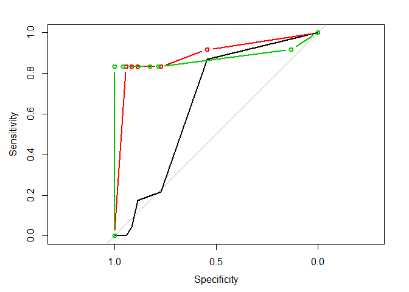

    ##                    [,1]        [,2]       
    ## percent            FALSE       FALSE      
    ## sensitivities      Numeric,7   Numeric,7  
    ## specificities      Numeric,7   Numeric,7  
    ## thresholds         Numeric,7   Numeric,7  
    ## direction          "<"         "<"        
    ## cases              Numeric,12  Numeric,12 
    ## controls           Numeric,35  Numeric,23 
    ## fun.sesp           ?           ?          
    ## call               Expression  Expression 
    ## original.predictor Numeric,70  Numeric,70 
    ## original.response  Numeric,70  Numeric,70 
    ## predictor          Numeric,47  Numeric,35 
    ## response           Numeric,47  Numeric,35 
    ## levels             Character,2 Character,2

``` r
auc(roc)
```

    ## Multi-class area under the curve: 0.8072

``` r
library(rpart.plot)
```

    ## Warning: package 'rpart.plot' was built under R version 3.4.2

    ## Loading required package: rpart

``` r
prp(glass_dec_train$learner.model)
```

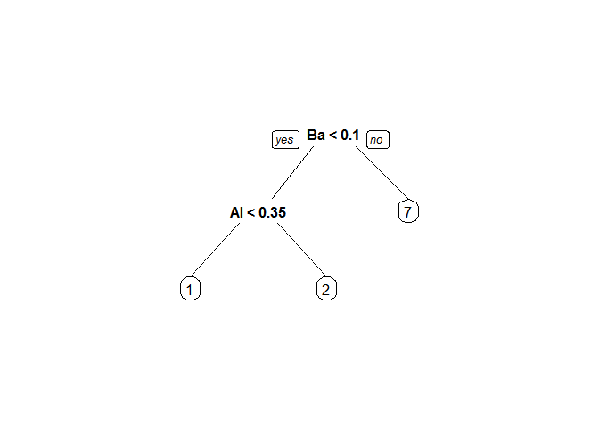

From the above we can see the model is more bais to type 1 and 2 from the confusion matrix.

Random Forest

``` r
library(mlr)
glass_random_model = makeLearner("classif.randomForest", predict.type = "response")
glass_random_model$par.vals = list(importance = TRUE) 
 
glass_random_param <- makeParamSet( makeIntegerParam("ntree",lower = 50, upper = 450),
                                    makeIntegerParam("mtry", lower = 3, upper = 10), 
                                    makeIntegerParam("nodesize", lower = 10, upper = 40)) 
randomcontrol =      makeTuneControlRandom(maxit = 30L) 

glass_random_CV = makeResampleDesc("CV",iter =  10L) 

glass_randomtune <- tuneParams(learner = glass_random_model, resampling = glass_random_CV, task = glass_traintask, par.set = glass_random_param, control = randomcontrol, measures = acc) 
```

    ## [Tune] Started tuning learner classif.randomForest for parameter set:

    ##             Type len Def    Constr Req Tunable Trafo
    ## ntree    integer   -   - 50 to 450   -    TRUE     -
    ## mtry     integer   -   -   3 to 10   -    TRUE     -
    ## nodesize integer   -   -  10 to 40   -    TRUE     -

    ## With control class: TuneControlRandom

    ## Imputation value: -0

    ## [Tune-x] 1: ntree=369; mtry=10; nodesize=26

    ## Warning in randomForest.default(m, y, ...): invalid mtry: reset to within
    ## valid range

    ## Warning in randomForest.default(m, y, ...): invalid mtry: reset to within
    ## valid range

    ## Warning in randomForest.default(m, y, ...): invalid mtry: reset to within
    ## valid range

    ## Warning in randomForest.default(m, y, ...): invalid mtry: reset to within
    ## valid range

    ## Warning in randomForest.default(m, y, ...): invalid mtry: reset to within
    ## valid range

    ## Warning in randomForest.default(m, y, ...): invalid mtry: reset to within
    ## valid range

    ## Warning in randomForest.default(m, y, ...): invalid mtry: reset to within
    ## valid range

    ## Warning in randomForest.default(m, y, ...): invalid mtry: reset to within
    ## valid range

    ## Warning in randomForest.default(m, y, ...): invalid mtry: reset to within
    ## valid range

    ## Warning in randomForest.default(m, y, ...): invalid mtry: reset to within
    ## valid range

    ## [Tune-y] 1: acc.test.mean=0.633; time: 0.0 min

    ## [Tune-x] 2: ntree=391; mtry=7; nodesize=30

    ## [Tune-y] 2: acc.test.mean=0.612; time: 0.0 min

    ## [Tune-x] 3: ntree=255; mtry=9; nodesize=38

    ## [Tune-y] 3: acc.test.mean=0.612; time: 0.0 min

    ## [Tune-x] 4: ntree=379; mtry=3; nodesize=10

    ## [Tune-y] 4: acc.test.mean=0.751; time: 0.0 min

    ## [Tune-x] 5: ntree=70; mtry=9; nodesize=27

    ## [Tune-y] 5: acc.test.mean=0.62; time: 0.0 min

    ## [Tune-x] 6: ntree=175; mtry=10; nodesize=28

    ## Warning in randomForest.default(m, y, ...): invalid mtry: reset to within
    ## valid range

    ## Warning in randomForest.default(m, y, ...): invalid mtry: reset to within
    ## valid range

    ## Warning in randomForest.default(m, y, ...): invalid mtry: reset to within
    ## valid range

    ## Warning in randomForest.default(m, y, ...): invalid mtry: reset to within
    ## valid range

    ## Warning in randomForest.default(m, y, ...): invalid mtry: reset to within
    ## valid range

    ## Warning in randomForest.default(m, y, ...): invalid mtry: reset to within
    ## valid range

    ## Warning in randomForest.default(m, y, ...): invalid mtry: reset to within
    ## valid range

    ## Warning in randomForest.default(m, y, ...): invalid mtry: reset to within
    ## valid range

    ## Warning in randomForest.default(m, y, ...): invalid mtry: reset to within
    ## valid range

    ## Warning in randomForest.default(m, y, ...): invalid mtry: reset to within
    ## valid range

    ## [Tune-y] 6: acc.test.mean=0.633; time: 0.0 min

    ## [Tune-x] 7: ntree=263; mtry=6; nodesize=19

    ## [Tune-y] 7: acc.test.mean=0.674; time: 0.0 min

    ## [Tune-x] 8: ntree=374; mtry=3; nodesize=21

    ## [Tune-y] 8: acc.test.mean=0.639; time: 0.0 min

    ## [Tune-x] 9: ntree=393; mtry=8; nodesize=31

    ## [Tune-y] 9: acc.test.mean=0.611; time: 0.0 min

    ## [Tune-x] 10: ntree=189; mtry=7; nodesize=14

    ## [Tune-y] 10: acc.test.mean=0.695; time: 0.0 min

    ## [Tune-x] 11: ntree=364; mtry=10; nodesize=16

    ## Warning in randomForest.default(m, y, ...): invalid mtry: reset to within
    ## valid range

    ## Warning in randomForest.default(m, y, ...): invalid mtry: reset to within
    ## valid range

    ## Warning in randomForest.default(m, y, ...): invalid mtry: reset to within
    ## valid range

    ## Warning in randomForest.default(m, y, ...): invalid mtry: reset to within
    ## valid range

    ## Warning in randomForest.default(m, y, ...): invalid mtry: reset to within
    ## valid range

    ## Warning in randomForest.default(m, y, ...): invalid mtry: reset to within
    ## valid range

    ## Warning in randomForest.default(m, y, ...): invalid mtry: reset to within
    ## valid range

    ## Warning in randomForest.default(m, y, ...): invalid mtry: reset to within
    ## valid range

    ## Warning in randomForest.default(m, y, ...): invalid mtry: reset to within
    ## valid range

    ## Warning in randomForest.default(m, y, ...): invalid mtry: reset to within
    ## valid range

    ## [Tune-y] 11: acc.test.mean=0.702; time: 0.0 min

    ## [Tune-x] 12: ntree=359; mtry=7; nodesize=39

    ## [Tune-y] 12: acc.test.mean=0.605; time: 0.0 min

    ## [Tune-x] 13: ntree=113; mtry=7; nodesize=37

    ## [Tune-y] 13: acc.test.mean=0.591; time: 0.0 min

    ## [Tune-x] 14: ntree=398; mtry=3; nodesize=40

    ## [Tune-y] 14: acc.test.mean=0.598; time: 0.0 min

    ## [Tune-x] 15: ntree=246; mtry=6; nodesize=22

    ## [Tune-y] 15: acc.test.mean=0.647; time: 0.0 min

    ## [Tune-x] 16: ntree=87; mtry=4; nodesize=22

    ## [Tune-y] 16: acc.test.mean=0.66; time: 0.0 min

    ## [Tune-x] 17: ntree=187; mtry=6; nodesize=19

    ## [Tune-y] 17: acc.test.mean=0.654; time: 0.0 min

    ## [Tune-x] 18: ntree=274; mtry=4; nodesize=39

    ## [Tune-y] 18: acc.test.mean=0.598; time: 0.0 min

    ## [Tune-x] 19: ntree=67; mtry=5; nodesize=39

    ## [Tune-y] 19: acc.test.mean=0.598; time: 0.0 min

    ## [Tune-x] 20: ntree=308; mtry=3; nodesize=22

    ## [Tune-y] 20: acc.test.mean=0.631; time: 0.0 min

    ## [Tune-x] 21: ntree=220; mtry=7; nodesize=23

    ## [Tune-y] 21: acc.test.mean=0.626; time: 0.0 min

    ## [Tune-x] 22: ntree=299; mtry=4; nodesize=38

    ## [Tune-y] 22: acc.test.mean=0.604; time: 0.0 min

    ## [Tune-x] 23: ntree=278; mtry=7; nodesize=13

    ## [Tune-y] 23: acc.test.mean=0.717; time: 0.0 min

    ## [Tune-x] 24: ntree=355; mtry=6; nodesize=34

    ## [Tune-y] 24: acc.test.mean=0.605; time: 0.0 min

    ## [Tune-x] 25: ntree=68; mtry=9; nodesize=18

    ## [Tune-y] 25: acc.test.mean=0.661; time: 0.0 min

    ## [Tune-x] 26: ntree=163; mtry=8; nodesize=39

    ## [Tune-y] 26: acc.test.mean=0.598; time: 0.0 min

    ## [Tune-x] 27: ntree=52; mtry=5; nodesize=22

    ## [Tune-y] 27: acc.test.mean=0.647; time: 0.0 min

    ## [Tune-x] 28: ntree=233; mtry=8; nodesize=38

    ## [Tune-y] 28: acc.test.mean=0.598; time: 0.0 min

    ## [Tune-x] 29: ntree=301; mtry=10; nodesize=33

    ## Warning in randomForest.default(m, y, ...): invalid mtry: reset to within
    ## valid range

    ## Warning in randomForest.default(m, y, ...): invalid mtry: reset to within
    ## valid range

    ## Warning in randomForest.default(m, y, ...): invalid mtry: reset to within
    ## valid range

    ## Warning in randomForest.default(m, y, ...): invalid mtry: reset to within
    ## valid range

    ## Warning in randomForest.default(m, y, ...): invalid mtry: reset to within
    ## valid range

    ## Warning in randomForest.default(m, y, ...): invalid mtry: reset to within
    ## valid range

    ## Warning in randomForest.default(m, y, ...): invalid mtry: reset to within
    ## valid range

    ## Warning in randomForest.default(m, y, ...): invalid mtry: reset to within
    ## valid range

    ## Warning in randomForest.default(m, y, ...): invalid mtry: reset to within
    ## valid range

    ## Warning in randomForest.default(m, y, ...): invalid mtry: reset to within
    ## valid range

    ## [Tune-y] 29: acc.test.mean=0.612; time: 0.0 min

    ## [Tune-x] 30: ntree=105; mtry=4; nodesize=15

    ## [Tune-y] 30: acc.test.mean=0.66; time: 0.0 min

    ## [Tune] Result: ntree=379; mtry=3; nodesize=10 : acc.test.mean=0.751

``` r
glass_randomtune$y
```

    ## acc.test.mean 
    ##     0.7509524

``` r
glass_randomtune$x
```

    ## $ntree
    ## [1] 379
    ## 
    ## $mtry
    ## [1] 3
    ## 
    ## $nodesize
    ## [1] 10

``` r
glass_random_model_updated = setHyperPars(glass_random_model, par.vals =  glass_randomtune$x)
glass_random_train = train(glass_random_model_updated, glass_traintask)
glass_random_predict = predict(glass_random_train, glass_testtask)
confusionMatrix(glass_random_predict$data$response, glass_test$type)
```

    ## Confusion Matrix and Statistics
    ## 
    ##           Reference
    ## Prediction  1  2  3  5  6  7
    ##          1 18  2  3  0  0  1
    ##          2  5 20  1  1  0  1
    ##          3  0  0  1  0  0  0
    ##          5  0  1  0  3  0  0
    ##          6  0  0  0  0  2  0
    ##          7  0  1  0  0  0 10
    ## 
    ## Overall Statistics
    ##                                           
    ##                Accuracy : 0.7714          
    ##                  95% CI : (0.6555, 0.8633)
    ##     No Information Rate : 0.3429          
    ##     P-Value [Acc > NIR] : 2.777e-13       
    ##                                           
    ##                   Kappa : 0.6817          
    ##  Mcnemar's Test P-Value : NA              
    ## 
    ## Statistics by Class:
    ## 
    ##                      Class: 1 Class: 2 Class: 3 Class: 5 Class: 6 Class: 7
    ## Sensitivity            0.7826   0.8333  0.20000  0.75000  1.00000   0.8333
    ## Specificity            0.8723   0.8261  1.00000  0.98485  1.00000   0.9828
    ## Pos Pred Value         0.7500   0.7143  1.00000  0.75000  1.00000   0.9091
    ## Neg Pred Value         0.8913   0.9048  0.94203  0.98485  1.00000   0.9661
    ## Prevalence             0.3286   0.3429  0.07143  0.05714  0.02857   0.1714
    ## Detection Rate         0.2571   0.2857  0.01429  0.04286  0.02857   0.1429
    ## Detection Prevalence   0.3429   0.4000  0.01429  0.05714  0.02857   0.1571
    ## Balanced Accuracy      0.8275   0.8297  0.60000  0.86742  1.00000   0.9080

``` r
library(pROC)
actual = as.numeric(as.character(glass_test$type))
ran_glass_pred= as.numeric(as.character(glass_random_predict$data$response))
roc = multiclass.roc(ran_glass_pred,actual)

plot.roc(roc$rocs[[1]])
sapply(2:length(roc$rocs),function(i) lines.roc(roc$rocs[[i]],col=i, bg="grey",type="b"))
```

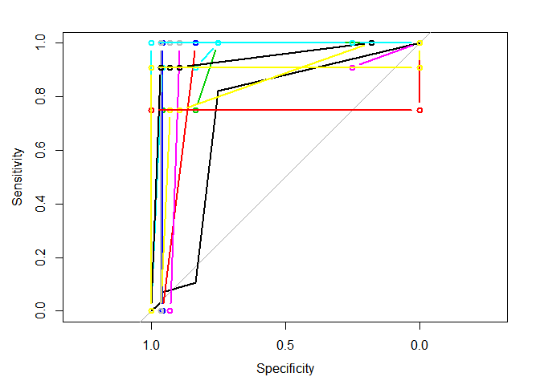

    ##                    [,1]        [,2]        [,3]        [,4]       
    ## percent            FALSE       FALSE       FALSE       FALSE      
    ## sensitivities      Numeric,5   Numeric,6   Numeric,6   Numeric,5  
    ## specificities      Numeric,5   Numeric,6   Numeric,6   Numeric,5  
    ## thresholds         Numeric,5   Numeric,6   Numeric,6   Numeric,5  
    ## direction          "<"         "<"         "<"         "<"        
    ## cases              3           Numeric,4   Numeric,2   Numeric,11 
    ## controls           Numeric,24  Numeric,24  Numeric,24  Numeric,24 
    ## fun.sesp           ?           ?           ?           ?          
    ## call               Expression  Expression  Expression  Expression 
    ## original.predictor Numeric,70  Numeric,70  Numeric,70  Numeric,70 
    ## original.response  Numeric,70  Numeric,70  Numeric,70  Numeric,70 
    ## predictor          Numeric,25  Numeric,28  Numeric,26  Numeric,35 
    ## response           Numeric,25  Numeric,28  Numeric,26  Numeric,35 
    ## levels             Character,2 Character,2 Character,2 Character,2
    ##                    [,5]        [,6]        [,7]        [,8]       
    ## percent            FALSE       FALSE       FALSE       FALSE      
    ## sensitivities      Numeric,6   Numeric,6   Numeric,7   Numeric,6  
    ## specificities      Numeric,6   Numeric,6   Numeric,7   Numeric,6  
    ## thresholds         Numeric,6   Numeric,6   Numeric,7   Numeric,6  
    ## direction          "<"         "<"         "<"         "<"        
    ## cases              3           Numeric,4   Numeric,2   Numeric,11 
    ## controls           Numeric,28  Numeric,28  Numeric,28  Numeric,28 
    ## fun.sesp           ?           ?           ?           ?          
    ## call               Expression  Expression  Expression  Expression 
    ## original.predictor Numeric,70  Numeric,70  Numeric,70  Numeric,70 
    ## original.response  Numeric,70  Numeric,70  Numeric,70  Numeric,70 
    ## predictor          Numeric,29  Numeric,32  Numeric,30  Numeric,39 
    ## response           Numeric,29  Numeric,32  Numeric,30  Numeric,39 
    ## levels             Character,2 Character,2 Character,2 Character,2
    ##                    [,9]        [,10]       [,11]       [,12]      
    ## percent            FALSE       FALSE       FALSE       FALSE      
    ## sensitivities      Numeric,4   Numeric,3   Numeric,4   Numeric,4  
    ## specificities      Numeric,4   Numeric,3   Numeric,4   Numeric,4  
    ## thresholds         Numeric,4   Numeric,3   Numeric,4   Numeric,4  
    ## direction          "<"         "<"         "<"         "<"        
    ## cases              Numeric,4   Numeric,2   Numeric,11  Numeric,2  
    ## controls           3           3           3           Numeric,4  
    ## fun.sesp           ?           ?           ?           ?          
    ## call               Expression  Expression  Expression  Expression 
    ## original.predictor Numeric,70  Numeric,70  Numeric,70  Numeric,70 
    ## original.response  Numeric,70  Numeric,70  Numeric,70  Numeric,70 
    ## predictor          Numeric,5   Numeric,3   Numeric,12  Numeric,6  
    ## response           Numeric,5   Numeric,3   Numeric,12  Numeric,6  
    ## levels             Character,2 Character,2 Character,2 Character,2
    ##                    [,13]       [,14]      
    ## percent            FALSE       FALSE      
    ## sensitivities      Numeric,4   Numeric,4  
    ## specificities      Numeric,4   Numeric,4  
    ## thresholds         Numeric,4   Numeric,4  
    ## direction          "<"         "<"        
    ## cases              Numeric,11  Numeric,11 
    ## controls           Numeric,4   Numeric,2  
    ## fun.sesp           ?           ?          
    ## call               Expression  Expression 
    ## original.predictor Numeric,70  Numeric,70 
    ## original.response  Numeric,70  Numeric,70 
    ## predictor          Numeric,15  Numeric,13 
    ## response           Numeric,15  Numeric,13 
    ## levels             Character,2 Character,2

``` r
auc(roc)
```

    ## Multi-class area under the curve: 0.9077

Naive bayes

``` r
library(e1071)
```

    ## Warning: package 'e1071' was built under R version 3.4.2

    ## 
    ## Attaching package: 'e1071'

    ## The following object is masked from 'package:mlr':
    ## 
    ##     impute

``` r
glass_naive =  naiveBayes(type ~ ., data = glass_train)
```

``` r
glass_naive_pred = predict(glass_naive,glass_test)
confusionMatrix(glass_naive_pred, glass_test$type)
```

    ## Confusion Matrix and Statistics
    ## 
    ##           Reference
    ## Prediction  1  2  3  5  6  7
    ##          1 17  8  4  0  0  1
    ##          2  5 10  0  3  0  0
    ##          3  0  0  0  0  0  0
    ##          5  0  6  0  1  1  1
    ##          6  0  0  1  0  1  0
    ##          7  1  0  0  0  0 10
    ## 
    ## Overall Statistics
    ##                                           
    ##                Accuracy : 0.5571          
    ##                  95% CI : (0.4334, 0.6759)
    ##     No Information Rate : 0.3429          
    ##     P-Value [Acc > NIR] : 0.0001932       
    ##                                           
    ##                   Kappa : 0.3982          
    ##  Mcnemar's Test P-Value : NA              
    ## 
    ## Statistics by Class:
    ## 
    ##                      Class: 1 Class: 2 Class: 3 Class: 5 Class: 6 Class: 7
    ## Sensitivity            0.7391   0.4167  0.00000  0.25000  0.50000   0.8333
    ## Specificity            0.7234   0.8261  1.00000  0.87879  0.98529   0.9828
    ## Pos Pred Value         0.5667   0.5556      NaN  0.11111  0.50000   0.9091
    ## Neg Pred Value         0.8500   0.7308  0.92857  0.95082  0.98529   0.9661
    ## Prevalence             0.3286   0.3429  0.07143  0.05714  0.02857   0.1714
    ## Detection Rate         0.2429   0.1429  0.00000  0.01429  0.01429   0.1429
    ## Detection Prevalence   0.4286   0.2571  0.00000  0.12857  0.02857   0.1571
    ## Balanced Accuracy      0.7313   0.6214  0.50000  0.56439  0.74265   0.9080

The model didnt fit well with Naive Bayes

``` r
library(class)
glass_knn_model = knn(train = glass_train[2:10], test = glass_test[2:10], cl= glass_train$type, k = 7)
confusionMatrix(glass_knn_model, glass_test$type)
```

    ## Confusion Matrix and Statistics
    ## 
    ##           Reference
    ## Prediction  1  2  3  5  6  7
    ##          1 23  0  0  0  0  0
    ##          2  0 24  0  0  0  0
    ##          3  0  0  5  0  0  0
    ##          5  0  0  0  4  0  0
    ##          6  0  0  0  0  2  0
    ##          7  0  0  0  0  0 12
    ## 
    ## Overall Statistics
    ##                                      
    ##                Accuracy : 1          
    ##                  95% CI : (0.9487, 1)
    ##     No Information Rate : 0.3429     
    ##     P-Value [Acc > NIR] : < 2.2e-16  
    ##                                      
    ##                   Kappa : 1          
    ##  Mcnemar's Test P-Value : NA         
    ## 
    ## Statistics by Class:
    ## 
    ##                      Class: 1 Class: 2 Class: 3 Class: 5 Class: 6 Class: 7
    ## Sensitivity            1.0000   1.0000  1.00000  1.00000  1.00000   1.0000
    ## Specificity            1.0000   1.0000  1.00000  1.00000  1.00000   1.0000
    ## Pos Pred Value         1.0000   1.0000  1.00000  1.00000  1.00000   1.0000
    ## Neg Pred Value         1.0000   1.0000  1.00000  1.00000  1.00000   1.0000
    ## Prevalence             0.3286   0.3429  0.07143  0.05714  0.02857   0.1714
    ## Detection Rate         0.3286   0.3429  0.07143  0.05714  0.02857   0.1714
    ## Detection Prevalence   0.3286   0.3429  0.07143  0.05714  0.02857   0.1714
    ## Balanced Accuracy      1.0000   1.0000  1.00000  1.00000  1.00000   1.0000

``` r
summary(glass_knn_model)
```

    ##  1  2  3  5  6  7 
    ## 23 24  5  4  2 12

``` r
names(glass_train)
```

    ##  [1] "RI"   "Na"   "Mg"   "Al"   "Si"   "K"    "Ca"   "Ba"   "Fe"   "type"

``` r
library(ggplot2)
ggplot(glass_test, aes(x = Na, y = Si  , color = glass_knn_model )) + geom_point()
```

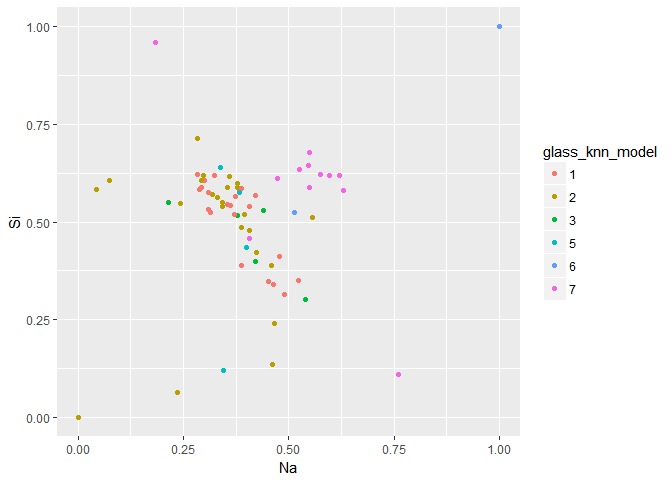

``` r
library(ggplot2)
ggplot(glass_test, aes(x = Na, y = Si  , color = glass_test$type )) + geom_point()
```

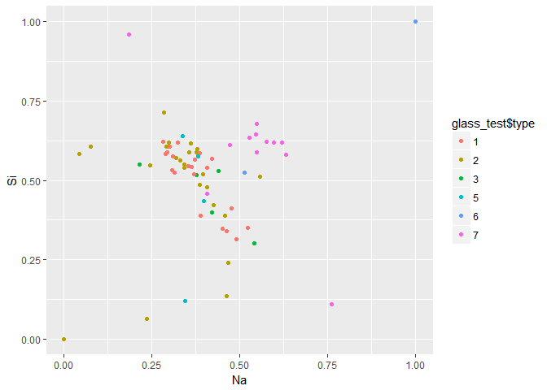

``` r
library(pROC)
actual = as.numeric(as.character(glass_test$type))
knn_glass_pred= as.numeric(as.character(glass_knn_model))
roc = multiclass.roc(knn_glass_pred,actual)

plot.roc(roc$rocs[[1]])
sapply(2:length(roc$rocs),function(i) lines.roc(roc$rocs[[i]],col=i, bg="grey",type="b"))
```

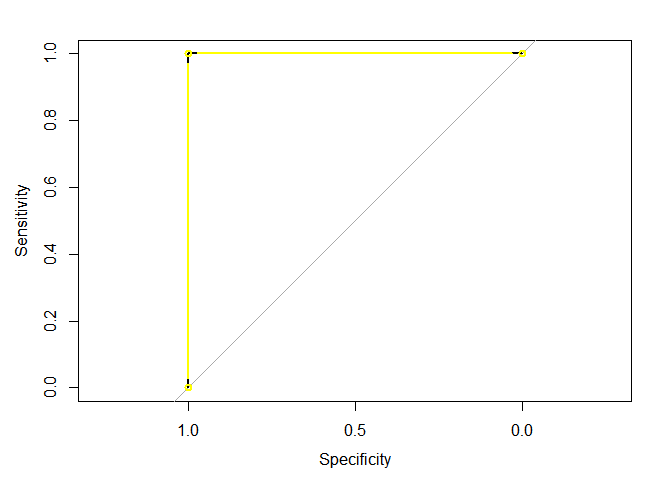

    ##                    [,1]        [,2]        [,3]        [,4]       
    ## percent            FALSE       FALSE       FALSE       FALSE      
    ## sensitivities      Numeric,3   Numeric,3   Numeric,3   Numeric,3  
    ## specificities      Numeric,3   Numeric,3   Numeric,3   Numeric,3  
    ## thresholds         Numeric,3   Numeric,3   Numeric,3   Numeric,3  
    ## direction          "<"         "<"         "<"         "<"        
    ## cases              Numeric,5   Numeric,4   Numeric,2   Numeric,12 
    ## controls           Numeric,23  Numeric,23  Numeric,23  Numeric,23 
    ## fun.sesp           ?           ?           ?           ?          
    ## call               Expression  Expression  Expression  Expression 
    ## original.predictor Numeric,70  Numeric,70  Numeric,70  Numeric,70 
    ## original.response  Numeric,70  Numeric,70  Numeric,70  Numeric,70 
    ## predictor          Numeric,28  Numeric,27  Numeric,25  Numeric,35 
    ## response           Numeric,28  Numeric,27  Numeric,25  Numeric,35 
    ## levels             Character,2 Character,2 Character,2 Character,2
    ##                    [,5]        [,6]        [,7]        [,8]       
    ## percent            FALSE       FALSE       FALSE       FALSE      
    ## sensitivities      Numeric,3   Numeric,3   Numeric,3   Numeric,3  
    ## specificities      Numeric,3   Numeric,3   Numeric,3   Numeric,3  
    ## thresholds         Numeric,3   Numeric,3   Numeric,3   Numeric,3  
    ## direction          "<"         "<"         "<"         "<"        
    ## cases              Numeric,5   Numeric,4   Numeric,2   Numeric,12 
    ## controls           Numeric,24  Numeric,24  Numeric,24  Numeric,24 
    ## fun.sesp           ?           ?           ?           ?          
    ## call               Expression  Expression  Expression  Expression 
    ## original.predictor Numeric,70  Numeric,70  Numeric,70  Numeric,70 
    ## original.response  Numeric,70  Numeric,70  Numeric,70  Numeric,70 
    ## predictor          Numeric,29  Numeric,28  Numeric,26  Numeric,36 
    ## response           Numeric,29  Numeric,28  Numeric,26  Numeric,36 
    ## levels             Character,2 Character,2 Character,2 Character,2
    ##                    [,9]        [,10]       [,11]       [,12]      
    ## percent            FALSE       FALSE       FALSE       FALSE      
    ## sensitivities      Numeric,3   Numeric,3   Numeric,3   Numeric,3  
    ## specificities      Numeric,3   Numeric,3   Numeric,3   Numeric,3  
    ## thresholds         Numeric,3   Numeric,3   Numeric,3   Numeric,3  
    ## direction          "<"         "<"         "<"         "<"        
    ## cases              Numeric,4   Numeric,2   Numeric,12  Numeric,2  
    ## controls           Numeric,5   Numeric,5   Numeric,5   Numeric,4  
    ## fun.sesp           ?           ?           ?           ?          
    ## call               Expression  Expression  Expression  Expression 
    ## original.predictor Numeric,70  Numeric,70  Numeric,70  Numeric,70 
    ## original.response  Numeric,70  Numeric,70  Numeric,70  Numeric,70 
    ## predictor          Numeric,9   Numeric,7   Numeric,17  Numeric,6  
    ## response           Numeric,9   Numeric,7   Numeric,17  Numeric,6  
    ## levels             Character,2 Character,2 Character,2 Character,2
    ##                    [,13]       [,14]      
    ## percent            FALSE       FALSE      
    ## sensitivities      Numeric,3   Numeric,3  
    ## specificities      Numeric,3   Numeric,3  
    ## thresholds         Numeric,3   Numeric,3  
    ## direction          "<"         "<"        
    ## cases              Numeric,12  Numeric,12 
    ## controls           Numeric,4   Numeric,2  
    ## fun.sesp           ?           ?          
    ## call               Expression  Expression 
    ## original.predictor Numeric,70  Numeric,70 
    ## original.response  Numeric,70  Numeric,70 
    ## predictor          Numeric,16  Numeric,14 
    ## response           Numeric,16  Numeric,14 
    ## levels             Character,2 Character,2

From the above we can see 100% which is an overfit, 100 accuracy is obtained as the dataset is small. if we have more data it will be miss leading.

we took some 67 percent and teste the whole dataset to check the accuracy, here is found using the rule k = value of sqaure root of the dataset and iterate down to find the best value.

``` r
library(class)
glass_knn_model_full = knn(train = glass_train[2:10], test = glass[2:10], cl= glass_train$type, k = 7)
confusionMatrix(glass_knn_model_full, glass$Type)
```

    ## Confusion Matrix and Statistics
    ## 
    ##           Reference
    ## Prediction  1  2  3  5  6  7
    ##          1 68  0  0  0  0  0
    ##          2  2 73  4  0  0  0
    ##          3  0  0  0  0  0  0
    ##          5  0  1  5  5  2  0
    ##          6  0  2  8  3  2  1
    ##          7  0  0  0  5  5 28
    ## 
    ## Overall Statistics
    ##                                           
    ##                Accuracy : 0.8224          
    ##                  95% CI : (0.7645, 0.8712)
    ##     No Information Rate : 0.3551          
    ##     P-Value [Acc > NIR] : < 2.2e-16       
    ##                                           
    ##                   Kappa : 0.7581          
    ##  Mcnemar's Test P-Value : NA              
    ## 
    ## Statistics by Class:
    ## 
    ##                      Class: 1 Class: 2 Class: 3 Class: 5 Class: 6 Class: 7
    ## Sensitivity            0.9714   0.9605  0.00000  0.38462 0.222222   0.9655
    ## Specificity            1.0000   0.9565  1.00000  0.96020 0.931707   0.9459
    ## Pos Pred Value         1.0000   0.9241      NaN  0.38462 0.125000   0.7368
    ## Neg Pred Value         0.9863   0.9778  0.92056  0.96020 0.964646   0.9943
    ## Prevalence             0.3271   0.3551  0.07944  0.06075 0.042056   0.1355
    ## Detection Rate         0.3178   0.3411  0.00000  0.02336 0.009346   0.1308
    ## Detection Prevalence   0.3178   0.3692  0.00000  0.06075 0.074766   0.1776
    ## Balanced Accuracy      0.9857   0.9585  0.50000  0.67241 0.576965   0.9557

Here the accuracy is low for the same model. actually very low. so when we have the more data. so lets try with higher k and test

``` r
library(class)
glass_knn_model_full1 = knn(train = glass_train[2:10], test = glass[2:10], cl= glass_train$type, k = 7)
confusionMatrix(glass_knn_model_full1, glass$Type)
```

    ## Confusion Matrix and Statistics
    ## 
    ##           Reference
    ## Prediction  1  2  3  5  6  7
    ##          1 69  0  0  0  0  0
    ##          2  1 72  4  0  0  0
    ##          3  0  0  0  0  0  0
    ##          5  0  1  8  4  3  0
    ##          6  0  3  5  5  2  0
    ##          7  0  0  0  4  4 29
    ## 
    ## Overall Statistics
    ##                                           
    ##                Accuracy : 0.8224          
    ##                  95% CI : (0.7645, 0.8712)
    ##     No Information Rate : 0.3551          
    ##     P-Value [Acc > NIR] : < 2.2e-16       
    ##                                           
    ##                   Kappa : 0.7587          
    ##  Mcnemar's Test P-Value : NA              
    ## 
    ## Statistics by Class:
    ## 
    ##                      Class: 1 Class: 2 Class: 3 Class: 5 Class: 6 Class: 7
    ## Sensitivity            0.9857   0.9474  0.00000  0.30769 0.222222   1.0000
    ## Specificity            1.0000   0.9638  1.00000  0.94030 0.936585   0.9568
    ## Pos Pred Value         1.0000   0.9351      NaN  0.25000 0.133333   0.7838
    ## Neg Pred Value         0.9931   0.9708  0.92056  0.95455 0.964824   1.0000
    ## Prevalence             0.3271   0.3551  0.07944  0.06075 0.042056   0.1355
    ## Detection Rate         0.3224   0.3364  0.00000  0.01869 0.009346   0.1355
    ## Detection Prevalence   0.3224   0.3598  0.00000  0.07477 0.070093   0.1729
    ## Balanced Accuracy      0.9929   0.9556  0.50000  0.62400 0.579404   0.9784

``` r
table(glass_knn_model_full1)
```

    ## glass_knn_model_full1
    ##  1  2  3  5  6  7 
    ## 69 77  0 16 15 37

``` r
table(glass$Type)
```

    ## 
    ##  1  2  3  5  6  7 
    ## 70 76 17 13  9 29

After few iteration this model is better with k = 7 . from the matrix we can clear see that type 3 and 4 has no proper clusters and it divided into cluster of type 5,6,7 we can come to that conclusion from above.so lets plot and see the difference.

since Al and si feature equal density we try to plot cluters with that

``` r
library(ggplot2)
ggplot(glass, aes(x = Al, y = Si  , color = glass$Type )) + geom_point()
```

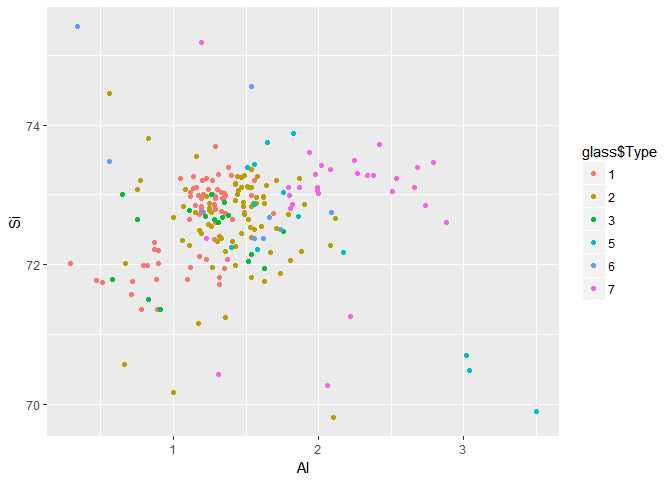

From the above we can clearly tyoe 3 green color is spreaded all over and is divided in all the features.so howmuch ever we change the neibour count "k" will get the same result. so we dataset doesnt have sufficient details about the type 3.

``` r
library(ggplot2)
ggplot(glass, aes(x = Al, y = Si  , color = glass_knn_model_full1 )) + geom_point()
```

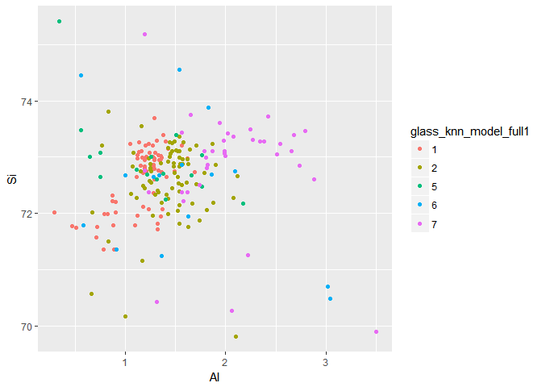 From the above can conclude the KNN is better model for the given dataset.
