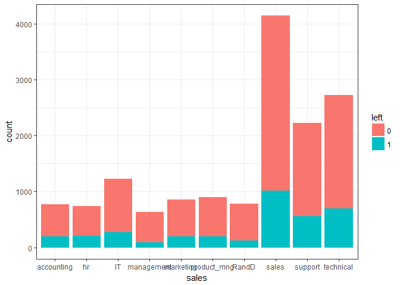

Employee
================

``` r
hrdata = read.csv(file = "HR_comma_sep.csv")
head(hrdata)
```

    ##   satisfaction_level last_evaluation number_project average_montly_hours
    ## 1               0.38            0.53              2                  157
    ## 2               0.80            0.86              5                  262
    ## 3               0.11            0.88              7                  272
    ## 4               0.72            0.87              5                  223
    ## 5               0.37            0.52              2                  159
    ## 6               0.41            0.50              2                  153
    ##   time_spend_company Work_accident left promotion_last_5years sales salary
    ## 1                  3             0    1                     0 sales    low
    ## 2                  6             0    1                     0 sales medium
    ## 3                  4             0    1                     0 sales medium
    ## 4                  5             0    1                     0 sales    low
    ## 5                  3             0    1                     0 sales    low
    ## 6                  3             0    1                     0 sales    low

``` r
anyNA(hrdata)
```

    ## [1] FALSE

There is no missing values. lets visualise the data

``` r
dim(hrdata)
```

    ## [1] 14999    10

``` r
names(hrdata)
```

    ##  [1] "satisfaction_level"    "last_evaluation"      
    ##  [3] "number_project"        "average_montly_hours" 
    ##  [5] "time_spend_company"    "Work_accident"        
    ##  [7] "left"                  "promotion_last_5years"
    ##  [9] "sales"                 "salary"

``` r
summary(hrdata)
```

    ##  satisfaction_level last_evaluation  number_project  average_montly_hours
    ##  Min.   :0.0900     Min.   :0.3600   Min.   :2.000   Min.   : 96.0       
    ##  1st Qu.:0.4400     1st Qu.:0.5600   1st Qu.:3.000   1st Qu.:156.0       
    ##  Median :0.6400     Median :0.7200   Median :4.000   Median :200.0       
    ##  Mean   :0.6128     Mean   :0.7161   Mean   :3.803   Mean   :201.1       
    ##  3rd Qu.:0.8200     3rd Qu.:0.8700   3rd Qu.:5.000   3rd Qu.:245.0       
    ##  Max.   :1.0000     Max.   :1.0000   Max.   :7.000   Max.   :310.0       
    ##                                                                          
    ##  time_spend_company Work_accident         left       
    ##  Min.   : 2.000     Min.   :0.0000   Min.   :0.0000  
    ##  1st Qu.: 3.000     1st Qu.:0.0000   1st Qu.:0.0000  
    ##  Median : 3.000     Median :0.0000   Median :0.0000  
    ##  Mean   : 3.498     Mean   :0.1446   Mean   :0.2381  
    ##  3rd Qu.: 4.000     3rd Qu.:0.0000   3rd Qu.:0.0000  
    ##  Max.   :10.000     Max.   :1.0000   Max.   :1.0000  
    ##                                                      
    ##  promotion_last_5years         sales         salary    
    ##  Min.   :0.00000       sales      :4140   high  :1237  
    ##  1st Qu.:0.00000       technical  :2720   low   :7316  
    ##  Median :0.00000       support    :2229   medium:6446  
    ##  Mean   :0.02127       IT         :1227                
    ##  3rd Qu.:0.00000       product_mng: 902                
    ##  Max.   :1.00000       marketing  : 858                
    ##                        (Other)    :2923

``` r
table(hrdata$left)
```

    ## 
    ##     0     1 
    ## 11428  3571

So here postive class retained or person stayed. they are 3571 records of people left the job.

``` r
library(ggplot2)
ggplot(hrdata, aes(x = left )) + geom_bar(aes(fill = salary)) + theme_bw()
```

 People with lowe salary have left,

``` r
library(ggplot2)
ggplot(hrdata,aes(x = left, y = satisfaction_level,color = salary)) + geom_point() + theme_bw()
```


This is an another perpective , we can see mixed salary in the ppl stayed and there is no high point in the people left.

``` r
library(ggplot2)
ggplot(hrdata, aes(x = number_project, y = satisfaction_level, color= salary)) + geom_point()+theme_bw()
```


``` r
library(ggplot2)

ggplot(hrdata,aes(x = average_montly_hours,y = satisfaction_level, color = salary ))+geom_point()+theme_bw()
```


This stat doesnt give us any picture, but we can see dense square region where avaerag monthly hour and high satisfaction and salary is mixed . and we have another square where low work satisfaction and working hours and low salary as predominent.

``` r
hrdata$left = as.factor(hrdata$left)
```

``` r
library(ggplot2)
ggplot(hrdata, aes( Work_accident))+ geom_bar(aes(fill=left)) + theme_bw()
```

 The work accident doenst give any significant.

``` r
library(ggplot2)
ggplot(hrdata, aes(x = sales))+ geom_bar(aes(fill = left)) +  theme_bw()
```

 we can observe all the dept have similar pattern, suggest us that company may have a policy some rentension policy.

``` r
names(hrdata)
```

    ##  [1] "satisfaction_level"    "last_evaluation"      
    ##  [3] "number_project"        "average_montly_hours" 
    ##  [5] "time_spend_company"    "Work_accident"        
    ##  [7] "left"                  "promotion_last_5years"
    ##  [9] "sales"                 "salary"

so this is of the type classfication and the tagrget variable is left,

sales, salary, left , promotion\_last\_5years are of the type factor and the average \_monthly\_hours feature is having higher scale and need to be scaled, also we need to scale number of preoject.

``` r
hrdata$salary = as.factor(hrdata$salary)
hrdata$sales = as.factor(hrdata$sales)
hrdata$promotion_last_5years = as.factor(hrdata$promotion_last_5years)
factors = function(x){
  
  num = x- min(x)
  den = max(x)- min(x)
  return (num/den)
}

hrdata$number_project = factors(hrdata$number_project)
hrdata$average_montly_hours = factors(hrdata$average_montly_hours)
hrdata$time_spend_company = factors(hrdata$time_spend_company)
```

``` r
summary(hrdata)
```

    ##  satisfaction_level last_evaluation  number_project   average_montly_hours
    ##  Min.   :0.0900     Min.   :0.3600   Min.   :0.0000   Min.   :0.0000      
    ##  1st Qu.:0.4400     1st Qu.:0.5600   1st Qu.:0.2000   1st Qu.:0.2804      
    ##  Median :0.6400     Median :0.7200   Median :0.4000   Median :0.4860      
    ##  Mean   :0.6128     Mean   :0.7161   Mean   :0.3606   Mean   :0.4909      
    ##  3rd Qu.:0.8200     3rd Qu.:0.8700   3rd Qu.:0.6000   3rd Qu.:0.6963      
    ##  Max.   :1.0000     Max.   :1.0000   Max.   :1.0000   Max.   :1.0000      
    ##                                                                           
    ##  time_spend_company Work_accident    left      promotion_last_5years
    ##  Min.   :0.0000     Min.   :0.0000   0:11428   0:14680              
    ##  1st Qu.:0.1250     1st Qu.:0.0000   1: 3571   1:  319              
    ##  Median :0.1250     Median :0.0000                                  
    ##  Mean   :0.1873     Mean   :0.1446                                  
    ##  3rd Qu.:0.2500     3rd Qu.:0.0000                                  
    ##  Max.   :1.0000     Max.   :1.0000                                  
    ##                                                                     
    ##          sales         salary    
    ##  sales      :4140   high  :1237  
    ##  technical  :2720   low   :7316  
    ##  support    :2229   medium:6446  
    ##  IT         :1227                
    ##  product_mng: 902                
    ##  marketing  : 858                
    ##  (Other)    :2923

Now the dataset is read to perform classfication lets reduce the feature which are not significant.

``` r
library(Boruta)
```

    ## Warning: package 'Boruta' was built under R version 3.4.3

    ## Loading required package: ranger

    ## Warning: package 'ranger' was built under R version 3.4.3

``` r
hr_selection_feature = Boruta(left~ . , data = hrdata)


hr_selection_feature$finalDecision
```

    ##    satisfaction_level       last_evaluation        number_project 
    ##             Confirmed             Confirmed             Confirmed 
    ##  average_montly_hours    time_spend_company         Work_accident 
    ##             Confirmed             Confirmed             Confirmed 
    ## promotion_last_5years                 sales                salary 
    ##             Confirmed             Confirmed             Confirmed 
    ## Levels: Tentative Confirmed Rejected

From the above we can see all the features have some significants

spliting the data into train and test

``` r
set.seed(123)
jumble = runif(nrow(hrdata))
hrdata = hrdata[ordered(jumble),]
hr_index = sample(2,nrow(hrdata),prob = c(0.75,0.25), replace = TRUE)
hr_train = hrdata[hr_index == 1,]
hr_test =hrdata[hr_index == 2,]
dim(hr_train)
```

    ## [1] 11222    10

``` r
dim(hr_test)
```

    ## [1] 3777   10

``` r
table(hr_train$left)
```

    ## 
    ##    0    1 
    ## 8556 2666

``` r
table(hr_test$left)
```

    ## 
    ##    0    1 
    ## 2872  905

From the above we an see the split seems balanced.

Classifiation techniques with tuning using MLR

``` r
library(mlr)
```

    ## Warning: package 'mlr' was built under R version 3.4.2

    ## Loading required package: ParamHelpers

    ## Warning: package 'ParamHelpers' was built under R version 3.4.2

``` r
hr_train_task = makeClassifTask(data = hr_train,target = "left" )
hr_test_task = makeClassifTask(data = hr_test, target = "left")
```

LDA analysis

``` r
library(mlr)
library(caret)
```

    ## Warning: package 'caret' was built under R version 3.4.3

    ## Loading required package: lattice

    ## Warning: package 'lattice' was built under R version 3.4.3

    ## 
    ## Attaching package: 'caret'

    ## The following object is masked from 'package:mlr':
    ## 
    ##     train

``` r
hr_lda = makeLearner("classif.lda", predict.type = "response")
hr_lda_train = mlr::train(hr_lda, hr_train_task)
hr_predicted = predict(hr_lda_train, hr_test_task)
confusionMatrix (hr_predicted$data$response, hr_test$left)
```

    ## Confusion Matrix and Statistics
    ## 
    ##           Reference
    ## Prediction    0    1
    ##          0 2655  622
    ##          1  217  283
    ##                                          
    ##                Accuracy : 0.7779         
    ##                  95% CI : (0.7643, 0.791)
    ##     No Information Rate : 0.7604         
    ##     P-Value [Acc > NIR] : 0.005953       
    ##                                          
    ##                   Kappa : 0.2801         
    ##  Mcnemar's Test P-Value : < 2.2e-16      
    ##                                          
    ##             Sensitivity : 0.9244         
    ##             Specificity : 0.3127         
    ##          Pos Pred Value : 0.8102         
    ##          Neg Pred Value : 0.5660         
    ##              Prevalence : 0.7604         
    ##          Detection Rate : 0.7029         
    ##    Detection Prevalence : 0.8676         
    ##       Balanced Accuracy : 0.6186         
    ##                                          
    ##        'Positive' Class : 0              
    ## 

From the above we can use the model performance is low.

``` r
library(ROCR)
```

    ## Warning: package 'ROCR' was built under R version 3.4.2

    ## Loading required package: gplots

    ## Warning: package 'gplots' was built under R version 3.4.2

    ## 
    ## Attaching package: 'gplots'

    ## The following object is masked from 'package:stats':
    ## 
    ##     lowess

    ## 
    ## Attaching package: 'ROCR'

    ## The following object is masked from 'package:mlr':
    ## 
    ##     performance

``` r
library(pROC)
```

    ## Warning: package 'pROC' was built under R version 3.4.3

    ## Type 'citation("pROC")' for a citation.

    ## 
    ## Attaching package: 'pROC'

    ## The following objects are masked from 'package:stats':
    ## 
    ##     cov, smooth, var

``` r
actual = as.numeric(as.character(hr_test$left))
lda_hr_pred= as.numeric(as.character(hr_predicted$data$response))
roc = multiclass.roc(lda_hr_pred,actual)
auc(roc)
```

    ## Multi-class area under the curve: 0.6881

``` r
library(ROCR)
library(pROC)

plot.roc(roc$rocs[[1]])
```


``` r
library(mlr)
hr_des = makeLearner("classif.rpart", predict.type = "response")
treecv =  makeResampleDesc("CV",iters = 10L)
param = makeParamSet(
makeIntegerParam("minsplit",lower = 10, upper = 20),
makeIntegerParam("minbucket", lower = 5, upper = 10),
makeNumericParam("cp", lower = 0.001, upper = 0.1)
)

control = makeTuneControlGrid()
hr_tree_tune = tuneParams(learner = hr_des, resampling = treecv, task = hr_train_task, par.set = param, control = control, measures = acc)
```

    ## [Tune] Started tuning learner classif.rpart for parameter set:

    ##              Type len Def       Constr Req Tunable Trafo
    ## minsplit  integer   -   -     10 to 20   -    TRUE     -
    ## minbucket integer   -   -      5 to 10   -    TRUE     -
    ## cp        numeric   -   - 0.001 to 0.1   -    TRUE     -

    ## With control class: TuneControlGrid

    ## Imputation value: -0

    ## [Tune-x] 1: minsplit=10; minbucket=5; cp=0.001

    ## [Tune-y] 1: acc.test.mean=0.977; time: 0.0 min

    ## [Tune-x] 2: minsplit=11; minbucket=5; cp=0.001

    ## [Tune-y] 2: acc.test.mean=0.977; time: 0.0 min

    ## [Tune-x] 3: minsplit=12; minbucket=5; cp=0.001

    ## [Tune-y] 3: acc.test.mean=0.977; time: 0.0 min

    ## [Tune-x] 4: minsplit=13; minbucket=5; cp=0.001

    ## [Tune-y] 4: acc.test.mean=0.977; time: 0.0 min

    ## [Tune-x] 5: minsplit=14; minbucket=5; cp=0.001

    ## [Tune-y] 5: acc.test.mean=0.977; time: 0.0 min

    ## [Tune-x] 6: minsplit=16; minbucket=5; cp=0.001

    ## [Tune-y] 6: acc.test.mean=0.977; time: 0.0 min

    ## [Tune-x] 7: minsplit=17; minbucket=5; cp=0.001

    ## [Tune-y] 7: acc.test.mean=0.977; time: 0.0 min

    ## [Tune-x] 8: minsplit=18; minbucket=5; cp=0.001

    ## [Tune-y] 8: acc.test.mean=0.977; time: 0.0 min

    ## [Tune-x] 9: minsplit=19; minbucket=5; cp=0.001

    ## [Tune-y] 9: acc.test.mean=0.977; time: 0.0 min

    ## [Tune-x] 10: minsplit=20; minbucket=5; cp=0.001

    ## [Tune-y] 10: acc.test.mean=0.977; time: 0.0 min

    ## [Tune-x] 11: minsplit=10; minbucket=6; cp=0.001

    ## [Tune-y] 11: acc.test.mean=0.977; time: 0.0 min

    ## [Tune-x] 12: minsplit=11; minbucket=6; cp=0.001

    ## [Tune-y] 12: acc.test.mean=0.977; time: 0.0 min

    ## [Tune-x] 13: minsplit=12; minbucket=6; cp=0.001

    ## [Tune-y] 13: acc.test.mean=0.977; time: 0.0 min

    ## [Tune-x] 14: minsplit=13; minbucket=6; cp=0.001

    ## [Tune-y] 14: acc.test.mean=0.977; time: 0.0 min

    ## [Tune-x] 15: minsplit=14; minbucket=6; cp=0.001

    ## [Tune-y] 15: acc.test.mean=0.977; time: 0.0 min

    ## [Tune-x] 16: minsplit=16; minbucket=6; cp=0.001

    ## [Tune-y] 16: acc.test.mean=0.977; time: 0.0 min

    ## [Tune-x] 17: minsplit=17; minbucket=6; cp=0.001

    ## [Tune-y] 17: acc.test.mean=0.977; time: 0.0 min

    ## [Tune-x] 18: minsplit=18; minbucket=6; cp=0.001

    ## [Tune-y] 18: acc.test.mean=0.977; time: 0.0 min

    ## [Tune-x] 19: minsplit=19; minbucket=6; cp=0.001

    ## [Tune-y] 19: acc.test.mean=0.977; time: 0.0 min

    ## [Tune-x] 20: minsplit=20; minbucket=6; cp=0.001

    ## [Tune-y] 20: acc.test.mean=0.977; time: 0.0 min

    ## [Tune-x] 21: minsplit=10; minbucket=7; cp=0.001

    ## [Tune-y] 21: acc.test.mean=0.976; time: 0.0 min

    ## [Tune-x] 22: minsplit=11; minbucket=7; cp=0.001

    ## [Tune-y] 22: acc.test.mean=0.976; time: 0.0 min

    ## [Tune-x] 23: minsplit=12; minbucket=7; cp=0.001

    ## [Tune-y] 23: acc.test.mean=0.976; time: 0.0 min

    ## [Tune-x] 24: minsplit=13; minbucket=7; cp=0.001

    ## [Tune-y] 24: acc.test.mean=0.976; time: 0.0 min

    ## [Tune-x] 25: minsplit=14; minbucket=7; cp=0.001

    ## [Tune-y] 25: acc.test.mean=0.976; time: 0.0 min

    ## [Tune-x] 26: minsplit=16; minbucket=7; cp=0.001

    ## [Tune-y] 26: acc.test.mean=0.976; time: 0.0 min

    ## [Tune-x] 27: minsplit=17; minbucket=7; cp=0.001

    ## [Tune-y] 27: acc.test.mean=0.976; time: 0.0 min

    ## [Tune-x] 28: minsplit=18; minbucket=7; cp=0.001

    ## [Tune-y] 28: acc.test.mean=0.976; time: 0.0 min

    ## [Tune-x] 29: minsplit=19; minbucket=7; cp=0.001

    ## [Tune-y] 29: acc.test.mean=0.976; time: 0.0 min

    ## [Tune-x] 30: minsplit=20; minbucket=7; cp=0.001

    ## [Tune-y] 30: acc.test.mean=0.976; time: 0.0 min

    ## [Tune-x] 31: minsplit=10; minbucket=8; cp=0.001

    ## [Tune-y] 31: acc.test.mean=0.975; time: 0.0 min

    ## [Tune-x] 32: minsplit=11; minbucket=8; cp=0.001

    ## [Tune-y] 32: acc.test.mean=0.975; time: 0.0 min

    ## [Tune-x] 33: minsplit=12; minbucket=8; cp=0.001

    ## [Tune-y] 33: acc.test.mean=0.975; time: 0.0 min

    ## [Tune-x] 34: minsplit=13; minbucket=8; cp=0.001

    ## [Tune-y] 34: acc.test.mean=0.975; time: 0.0 min

    ## [Tune-x] 35: minsplit=14; minbucket=8; cp=0.001

    ## [Tune-y] 35: acc.test.mean=0.975; time: 0.0 min

    ## [Tune-x] 36: minsplit=16; minbucket=8; cp=0.001

    ## [Tune-y] 36: acc.test.mean=0.975; time: 0.0 min

    ## [Tune-x] 37: minsplit=17; minbucket=8; cp=0.001

    ## [Tune-y] 37: acc.test.mean=0.975; time: 0.0 min

    ## [Tune-x] 38: minsplit=18; minbucket=8; cp=0.001

    ## [Tune-y] 38: acc.test.mean=0.975; time: 0.0 min

    ## [Tune-x] 39: minsplit=19; minbucket=8; cp=0.001

    ## [Tune-y] 39: acc.test.mean=0.975; time: 0.0 min

    ## [Tune-x] 40: minsplit=20; minbucket=8; cp=0.001

    ## [Tune-y] 40: acc.test.mean=0.975; time: 0.0 min

    ## [Tune-x] 41: minsplit=10; minbucket=9; cp=0.001

    ## [Tune-y] 41: acc.test.mean=0.975; time: 0.0 min

    ## [Tune-x] 42: minsplit=11; minbucket=9; cp=0.001

    ## [Tune-y] 42: acc.test.mean=0.975; time: 0.0 min

    ## [Tune-x] 43: minsplit=12; minbucket=9; cp=0.001

    ## [Tune-y] 43: acc.test.mean=0.975; time: 0.0 min

    ## [Tune-x] 44: minsplit=13; minbucket=9; cp=0.001

    ## [Tune-y] 44: acc.test.mean=0.975; time: 0.0 min

    ## [Tune-x] 45: minsplit=14; minbucket=9; cp=0.001

    ## [Tune-y] 45: acc.test.mean=0.975; time: 0.0 min

    ## [Tune-x] 46: minsplit=16; minbucket=9; cp=0.001

    ## [Tune-y] 46: acc.test.mean=0.975; time: 0.0 min

    ## [Tune-x] 47: minsplit=17; minbucket=9; cp=0.001

    ## [Tune-y] 47: acc.test.mean=0.975; time: 0.0 min

    ## [Tune-x] 48: minsplit=18; minbucket=9; cp=0.001

    ## [Tune-y] 48: acc.test.mean=0.975; time: 0.0 min

    ## [Tune-x] 49: minsplit=19; minbucket=9; cp=0.001

    ## [Tune-y] 49: acc.test.mean=0.975; time: 0.0 min

    ## [Tune-x] 50: minsplit=20; minbucket=9; cp=0.001

    ## [Tune-y] 50: acc.test.mean=0.975; time: 0.0 min

    ## [Tune-x] 51: minsplit=10; minbucket=10; cp=0.001

    ## [Tune-y] 51: acc.test.mean=0.975; time: 0.0 min

    ## [Tune-x] 52: minsplit=11; minbucket=10; cp=0.001

    ## [Tune-y] 52: acc.test.mean=0.975; time: 0.0 min

    ## [Tune-x] 53: minsplit=12; minbucket=10; cp=0.001

    ## [Tune-y] 53: acc.test.mean=0.975; time: 0.0 min

    ## [Tune-x] 54: minsplit=13; minbucket=10; cp=0.001

    ## [Tune-y] 54: acc.test.mean=0.975; time: 0.0 min

    ## [Tune-x] 55: minsplit=14; minbucket=10; cp=0.001

    ## [Tune-y] 55: acc.test.mean=0.975; time: 0.0 min

    ## [Tune-x] 56: minsplit=16; minbucket=10; cp=0.001

    ## [Tune-y] 56: acc.test.mean=0.975; time: 0.0 min

    ## [Tune-x] 57: minsplit=17; minbucket=10; cp=0.001

    ## [Tune-y] 57: acc.test.mean=0.975; time: 0.0 min

    ## [Tune-x] 58: minsplit=18; minbucket=10; cp=0.001

    ## [Tune-y] 58: acc.test.mean=0.975; time: 0.0 min

    ## [Tune-x] 59: minsplit=19; minbucket=10; cp=0.001

    ## [Tune-y] 59: acc.test.mean=0.975; time: 0.0 min

    ## [Tune-x] 60: minsplit=20; minbucket=10; cp=0.001

    ## [Tune-y] 60: acc.test.mean=0.975; time: 0.0 min

    ## [Tune-x] 61: minsplit=10; minbucket=5; cp=0.012

    ## [Tune-y] 61: acc.test.mean=0.967; time: 0.0 min

    ## [Tune-x] 62: minsplit=11; minbucket=5; cp=0.012

    ## [Tune-y] 62: acc.test.mean=0.967; time: 0.0 min

    ## [Tune-x] 63: minsplit=12; minbucket=5; cp=0.012

    ## [Tune-y] 63: acc.test.mean=0.967; time: 0.0 min

    ## [Tune-x] 64: minsplit=13; minbucket=5; cp=0.012

    ## [Tune-y] 64: acc.test.mean=0.967; time: 0.0 min

    ## [Tune-x] 65: minsplit=14; minbucket=5; cp=0.012

    ## [Tune-y] 65: acc.test.mean=0.967; time: 0.0 min

    ## [Tune-x] 66: minsplit=16; minbucket=5; cp=0.012

    ## [Tune-y] 66: acc.test.mean=0.967; time: 0.0 min

    ## [Tune-x] 67: minsplit=17; minbucket=5; cp=0.012

    ## [Tune-y] 67: acc.test.mean=0.967; time: 0.0 min

    ## [Tune-x] 68: minsplit=18; minbucket=5; cp=0.012

    ## [Tune-y] 68: acc.test.mean=0.967; time: 0.0 min

    ## [Tune-x] 69: minsplit=19; minbucket=5; cp=0.012

    ## [Tune-y] 69: acc.test.mean=0.967; time: 0.0 min

    ## [Tune-x] 70: minsplit=20; minbucket=5; cp=0.012

    ## [Tune-y] 70: acc.test.mean=0.967; time: 0.0 min

    ## [Tune-x] 71: minsplit=10; minbucket=6; cp=0.012

    ## [Tune-y] 71: acc.test.mean=0.967; time: 0.0 min

    ## [Tune-x] 72: minsplit=11; minbucket=6; cp=0.012

    ## [Tune-y] 72: acc.test.mean=0.967; time: 0.0 min

    ## [Tune-x] 73: minsplit=12; minbucket=6; cp=0.012

    ## [Tune-y] 73: acc.test.mean=0.967; time: 0.0 min

    ## [Tune-x] 74: minsplit=13; minbucket=6; cp=0.012

    ## [Tune-y] 74: acc.test.mean=0.967; time: 0.0 min

    ## [Tune-x] 75: minsplit=14; minbucket=6; cp=0.012

    ## [Tune-y] 75: acc.test.mean=0.967; time: 0.0 min

    ## [Tune-x] 76: minsplit=16; minbucket=6; cp=0.012

    ## [Tune-y] 76: acc.test.mean=0.967; time: 0.0 min

    ## [Tune-x] 77: minsplit=17; minbucket=6; cp=0.012

    ## [Tune-y] 77: acc.test.mean=0.967; time: 0.0 min

    ## [Tune-x] 78: minsplit=18; minbucket=6; cp=0.012

    ## [Tune-y] 78: acc.test.mean=0.967; time: 0.0 min

    ## [Tune-x] 79: minsplit=19; minbucket=6; cp=0.012

    ## [Tune-y] 79: acc.test.mean=0.967; time: 0.0 min

    ## [Tune-x] 80: minsplit=20; minbucket=6; cp=0.012

    ## [Tune-y] 80: acc.test.mean=0.967; time: 0.0 min

    ## [Tune-x] 81: minsplit=10; minbucket=7; cp=0.012

    ## [Tune-y] 81: acc.test.mean=0.967; time: 0.0 min

    ## [Tune-x] 82: minsplit=11; minbucket=7; cp=0.012

    ## [Tune-y] 82: acc.test.mean=0.967; time: 0.0 min

    ## [Tune-x] 83: minsplit=12; minbucket=7; cp=0.012

    ## [Tune-y] 83: acc.test.mean=0.967; time: 0.0 min

    ## [Tune-x] 84: minsplit=13; minbucket=7; cp=0.012

    ## [Tune-y] 84: acc.test.mean=0.967; time: 0.0 min

    ## [Tune-x] 85: minsplit=14; minbucket=7; cp=0.012

    ## [Tune-y] 85: acc.test.mean=0.967; time: 0.0 min

    ## [Tune-x] 86: minsplit=16; minbucket=7; cp=0.012

    ## [Tune-y] 86: acc.test.mean=0.967; time: 0.0 min

    ## [Tune-x] 87: minsplit=17; minbucket=7; cp=0.012

    ## [Tune-y] 87: acc.test.mean=0.967; time: 0.0 min

    ## [Tune-x] 88: minsplit=18; minbucket=7; cp=0.012

    ## [Tune-y] 88: acc.test.mean=0.967; time: 0.0 min

    ## [Tune-x] 89: minsplit=19; minbucket=7; cp=0.012

    ## [Tune-y] 89: acc.test.mean=0.967; time: 0.0 min

    ## [Tune-x] 90: minsplit=20; minbucket=7; cp=0.012

    ## [Tune-y] 90: acc.test.mean=0.967; time: 0.0 min

    ## [Tune-x] 91: minsplit=10; minbucket=8; cp=0.012

    ## [Tune-y] 91: acc.test.mean=0.967; time: 0.0 min

    ## [Tune-x] 92: minsplit=11; minbucket=8; cp=0.012

    ## [Tune-y] 92: acc.test.mean=0.967; time: 0.0 min

    ## [Tune-x] 93: minsplit=12; minbucket=8; cp=0.012

    ## [Tune-y] 93: acc.test.mean=0.967; time: 0.0 min

    ## [Tune-x] 94: minsplit=13; minbucket=8; cp=0.012

    ## [Tune-y] 94: acc.test.mean=0.967; time: 0.0 min

    ## [Tune-x] 95: minsplit=14; minbucket=8; cp=0.012

    ## [Tune-y] 95: acc.test.mean=0.967; time: 0.0 min

    ## [Tune-x] 96: minsplit=16; minbucket=8; cp=0.012

    ## [Tune-y] 96: acc.test.mean=0.967; time: 0.0 min

    ## [Tune-x] 97: minsplit=17; minbucket=8; cp=0.012

    ## [Tune-y] 97: acc.test.mean=0.967; time: 0.0 min

    ## [Tune-x] 98: minsplit=18; minbucket=8; cp=0.012

    ## [Tune-y] 98: acc.test.mean=0.967; time: 0.0 min

    ## [Tune-x] 99: minsplit=19; minbucket=8; cp=0.012

    ## [Tune-y] 99: acc.test.mean=0.967; time: 0.0 min

    ## [Tune-x] 100: minsplit=20; minbucket=8; cp=0.012

    ## [Tune-y] 100: acc.test.mean=0.967; time: 0.0 min

    ## [Tune-x] 101: minsplit=10; minbucket=9; cp=0.012

    ## [Tune-y] 101: acc.test.mean=0.967; time: 0.0 min

    ## [Tune-x] 102: minsplit=11; minbucket=9; cp=0.012

    ## [Tune-y] 102: acc.test.mean=0.967; time: 0.0 min

    ## [Tune-x] 103: minsplit=12; minbucket=9; cp=0.012

    ## [Tune-y] 103: acc.test.mean=0.967; time: 0.0 min

    ## [Tune-x] 104: minsplit=13; minbucket=9; cp=0.012

    ## [Tune-y] 104: acc.test.mean=0.967; time: 0.0 min

    ## [Tune-x] 105: minsplit=14; minbucket=9; cp=0.012

    ## [Tune-y] 105: acc.test.mean=0.967; time: 0.0 min

    ## [Tune-x] 106: minsplit=16; minbucket=9; cp=0.012

    ## [Tune-y] 106: acc.test.mean=0.967; time: 0.0 min

    ## [Tune-x] 107: minsplit=17; minbucket=9; cp=0.012

    ## [Tune-y] 107: acc.test.mean=0.967; time: 0.0 min

    ## [Tune-x] 108: minsplit=18; minbucket=9; cp=0.012

    ## [Tune-y] 108: acc.test.mean=0.967; time: 0.0 min

    ## [Tune-x] 109: minsplit=19; minbucket=9; cp=0.012

    ## [Tune-y] 109: acc.test.mean=0.967; time: 0.0 min

    ## [Tune-x] 110: minsplit=20; minbucket=9; cp=0.012

    ## [Tune-y] 110: acc.test.mean=0.967; time: 0.0 min

    ## [Tune-x] 111: minsplit=10; minbucket=10; cp=0.012

    ## [Tune-y] 111: acc.test.mean=0.967; time: 0.0 min

    ## [Tune-x] 112: minsplit=11; minbucket=10; cp=0.012

    ## [Tune-y] 112: acc.test.mean=0.967; time: 0.0 min

    ## [Tune-x] 113: minsplit=12; minbucket=10; cp=0.012

    ## [Tune-y] 113: acc.test.mean=0.967; time: 0.0 min

    ## [Tune-x] 114: minsplit=13; minbucket=10; cp=0.012

    ## [Tune-y] 114: acc.test.mean=0.967; time: 0.0 min

    ## [Tune-x] 115: minsplit=14; minbucket=10; cp=0.012

    ## [Tune-y] 115: acc.test.mean=0.967; time: 0.0 min

    ## [Tune-x] 116: minsplit=16; minbucket=10; cp=0.012

    ## [Tune-y] 116: acc.test.mean=0.967; time: 0.0 min

    ## [Tune-x] 117: minsplit=17; minbucket=10; cp=0.012

    ## [Tune-y] 117: acc.test.mean=0.967; time: 0.0 min

    ## [Tune-x] 118: minsplit=18; minbucket=10; cp=0.012

    ## [Tune-y] 118: acc.test.mean=0.967; time: 0.0 min

    ## [Tune-x] 119: minsplit=19; minbucket=10; cp=0.012

    ## [Tune-y] 119: acc.test.mean=0.967; time: 0.0 min

    ## [Tune-x] 120: minsplit=20; minbucket=10; cp=0.012

    ## [Tune-y] 120: acc.test.mean=0.967; time: 0.0 min

    ## [Tune-x] 121: minsplit=10; minbucket=5; cp=0.023

    ## [Tune-y] 121: acc.test.mean=0.963; time: 0.0 min

    ## [Tune-x] 122: minsplit=11; minbucket=5; cp=0.023

    ## [Tune-y] 122: acc.test.mean=0.963; time: 0.0 min

    ## [Tune-x] 123: minsplit=12; minbucket=5; cp=0.023

    ## [Tune-y] 123: acc.test.mean=0.963; time: 0.0 min

    ## [Tune-x] 124: minsplit=13; minbucket=5; cp=0.023

    ## [Tune-y] 124: acc.test.mean=0.963; time: 0.0 min

    ## [Tune-x] 125: minsplit=14; minbucket=5; cp=0.023

    ## [Tune-y] 125: acc.test.mean=0.963; time: 0.0 min

    ## [Tune-x] 126: minsplit=16; minbucket=5; cp=0.023

    ## [Tune-y] 126: acc.test.mean=0.963; time: 0.0 min

    ## [Tune-x] 127: minsplit=17; minbucket=5; cp=0.023

    ## [Tune-y] 127: acc.test.mean=0.963; time: 0.0 min

    ## [Tune-x] 128: minsplit=18; minbucket=5; cp=0.023

    ## [Tune-y] 128: acc.test.mean=0.963; time: 0.0 min

    ## [Tune-x] 129: minsplit=19; minbucket=5; cp=0.023

    ## [Tune-y] 129: acc.test.mean=0.963; time: 0.0 min

    ## [Tune-x] 130: minsplit=20; minbucket=5; cp=0.023

    ## [Tune-y] 130: acc.test.mean=0.963; time: 0.0 min

    ## [Tune-x] 131: minsplit=10; minbucket=6; cp=0.023

    ## [Tune-y] 131: acc.test.mean=0.963; time: 0.0 min

    ## [Tune-x] 132: minsplit=11; minbucket=6; cp=0.023

    ## [Tune-y] 132: acc.test.mean=0.963; time: 0.0 min

    ## [Tune-x] 133: minsplit=12; minbucket=6; cp=0.023

    ## [Tune-y] 133: acc.test.mean=0.963; time: 0.0 min

    ## [Tune-x] 134: minsplit=13; minbucket=6; cp=0.023

    ## [Tune-y] 134: acc.test.mean=0.963; time: 0.0 min

    ## [Tune-x] 135: minsplit=14; minbucket=6; cp=0.023

    ## [Tune-y] 135: acc.test.mean=0.963; time: 0.0 min

    ## [Tune-x] 136: minsplit=16; minbucket=6; cp=0.023

    ## [Tune-y] 136: acc.test.mean=0.963; time: 0.0 min

    ## [Tune-x] 137: minsplit=17; minbucket=6; cp=0.023

    ## [Tune-y] 137: acc.test.mean=0.963; time: 0.0 min

    ## [Tune-x] 138: minsplit=18; minbucket=6; cp=0.023

    ## [Tune-y] 138: acc.test.mean=0.963; time: 0.0 min

    ## [Tune-x] 139: minsplit=19; minbucket=6; cp=0.023

    ## [Tune-y] 139: acc.test.mean=0.963; time: 0.0 min

    ## [Tune-x] 140: minsplit=20; minbucket=6; cp=0.023

    ## [Tune-y] 140: acc.test.mean=0.963; time: 0.0 min

    ## [Tune-x] 141: minsplit=10; minbucket=7; cp=0.023

    ## [Tune-y] 141: acc.test.mean=0.963; time: 0.0 min

    ## [Tune-x] 142: minsplit=11; minbucket=7; cp=0.023

    ## [Tune-y] 142: acc.test.mean=0.963; time: 0.0 min

    ## [Tune-x] 143: minsplit=12; minbucket=7; cp=0.023

    ## [Tune-y] 143: acc.test.mean=0.963; time: 0.0 min

    ## [Tune-x] 144: minsplit=13; minbucket=7; cp=0.023

    ## [Tune-y] 144: acc.test.mean=0.963; time: 0.0 min

    ## [Tune-x] 145: minsplit=14; minbucket=7; cp=0.023

    ## [Tune-y] 145: acc.test.mean=0.963; time: 0.0 min

    ## [Tune-x] 146: minsplit=16; minbucket=7; cp=0.023

    ## [Tune-y] 146: acc.test.mean=0.963; time: 0.0 min

    ## [Tune-x] 147: minsplit=17; minbucket=7; cp=0.023

    ## [Tune-y] 147: acc.test.mean=0.963; time: 0.0 min

    ## [Tune-x] 148: minsplit=18; minbucket=7; cp=0.023

    ## [Tune-y] 148: acc.test.mean=0.963; time: 0.0 min

    ## [Tune-x] 149: minsplit=19; minbucket=7; cp=0.023

    ## [Tune-y] 149: acc.test.mean=0.963; time: 0.0 min

    ## [Tune-x] 150: minsplit=20; minbucket=7; cp=0.023

    ## [Tune-y] 150: acc.test.mean=0.963; time: 0.0 min

    ## [Tune-x] 151: minsplit=10; minbucket=8; cp=0.023

    ## [Tune-y] 151: acc.test.mean=0.963; time: 0.0 min

    ## [Tune-x] 152: minsplit=11; minbucket=8; cp=0.023

    ## [Tune-y] 152: acc.test.mean=0.963; time: 0.0 min

    ## [Tune-x] 153: minsplit=12; minbucket=8; cp=0.023

    ## [Tune-y] 153: acc.test.mean=0.963; time: 0.0 min

    ## [Tune-x] 154: minsplit=13; minbucket=8; cp=0.023

    ## [Tune-y] 154: acc.test.mean=0.963; time: 0.0 min

    ## [Tune-x] 155: minsplit=14; minbucket=8; cp=0.023

    ## [Tune-y] 155: acc.test.mean=0.963; time: 0.0 min

    ## [Tune-x] 156: minsplit=16; minbucket=8; cp=0.023

    ## [Tune-y] 156: acc.test.mean=0.963; time: 0.0 min

    ## [Tune-x] 157: minsplit=17; minbucket=8; cp=0.023

    ## [Tune-y] 157: acc.test.mean=0.963; time: 0.0 min

    ## [Tune-x] 158: minsplit=18; minbucket=8; cp=0.023

    ## [Tune-y] 158: acc.test.mean=0.963; time: 0.0 min

    ## [Tune-x] 159: minsplit=19; minbucket=8; cp=0.023

    ## [Tune-y] 159: acc.test.mean=0.963; time: 0.0 min

    ## [Tune-x] 160: minsplit=20; minbucket=8; cp=0.023

    ## [Tune-y] 160: acc.test.mean=0.963; time: 0.0 min

    ## [Tune-x] 161: minsplit=10; minbucket=9; cp=0.023

    ## [Tune-y] 161: acc.test.mean=0.963; time: 0.0 min

    ## [Tune-x] 162: minsplit=11; minbucket=9; cp=0.023

    ## [Tune-y] 162: acc.test.mean=0.963; time: 0.0 min

    ## [Tune-x] 163: minsplit=12; minbucket=9; cp=0.023

    ## [Tune-y] 163: acc.test.mean=0.963; time: 0.0 min

    ## [Tune-x] 164: minsplit=13; minbucket=9; cp=0.023

    ## [Tune-y] 164: acc.test.mean=0.963; time: 0.0 min

    ## [Tune-x] 165: minsplit=14; minbucket=9; cp=0.023

    ## [Tune-y] 165: acc.test.mean=0.963; time: 0.0 min

    ## [Tune-x] 166: minsplit=16; minbucket=9; cp=0.023

    ## [Tune-y] 166: acc.test.mean=0.963; time: 0.0 min

    ## [Tune-x] 167: minsplit=17; minbucket=9; cp=0.023

    ## [Tune-y] 167: acc.test.mean=0.963; time: 0.0 min

    ## [Tune-x] 168: minsplit=18; minbucket=9; cp=0.023

    ## [Tune-y] 168: acc.test.mean=0.963; time: 0.0 min

    ## [Tune-x] 169: minsplit=19; minbucket=9; cp=0.023

    ## [Tune-y] 169: acc.test.mean=0.963; time: 0.0 min

    ## [Tune-x] 170: minsplit=20; minbucket=9; cp=0.023

    ## [Tune-y] 170: acc.test.mean=0.963; time: 0.0 min

    ## [Tune-x] 171: minsplit=10; minbucket=10; cp=0.023

    ## [Tune-y] 171: acc.test.mean=0.963; time: 0.0 min

    ## [Tune-x] 172: minsplit=11; minbucket=10; cp=0.023

    ## [Tune-y] 172: acc.test.mean=0.963; time: 0.0 min

    ## [Tune-x] 173: minsplit=12; minbucket=10; cp=0.023

    ## [Tune-y] 173: acc.test.mean=0.963; time: 0.0 min

    ## [Tune-x] 174: minsplit=13; minbucket=10; cp=0.023

    ## [Tune-y] 174: acc.test.mean=0.963; time: 0.0 min

    ## [Tune-x] 175: minsplit=14; minbucket=10; cp=0.023

    ## [Tune-y] 175: acc.test.mean=0.963; time: 0.0 min

    ## [Tune-x] 176: minsplit=16; minbucket=10; cp=0.023

    ## [Tune-y] 176: acc.test.mean=0.963; time: 0.0 min

    ## [Tune-x] 177: minsplit=17; minbucket=10; cp=0.023

    ## [Tune-y] 177: acc.test.mean=0.963; time: 0.0 min

    ## [Tune-x] 178: minsplit=18; minbucket=10; cp=0.023

    ## [Tune-y] 178: acc.test.mean=0.963; time: 0.0 min

    ## [Tune-x] 179: minsplit=19; minbucket=10; cp=0.023

    ## [Tune-y] 179: acc.test.mean=0.963; time: 0.0 min

    ## [Tune-x] 180: minsplit=20; minbucket=10; cp=0.023

    ## [Tune-y] 180: acc.test.mean=0.963; time: 0.0 min

    ## [Tune-x] 181: minsplit=10; minbucket=5; cp=0.034

    ## [Tune-y] 181: acc.test.mean=0.96; time: 0.0 min

    ## [Tune-x] 182: minsplit=11; minbucket=5; cp=0.034

    ## [Tune-y] 182: acc.test.mean=0.96; time: 0.0 min

    ## [Tune-x] 183: minsplit=12; minbucket=5; cp=0.034

    ## [Tune-y] 183: acc.test.mean=0.96; time: 0.0 min

    ## [Tune-x] 184: minsplit=13; minbucket=5; cp=0.034

    ## [Tune-y] 184: acc.test.mean=0.96; time: 0.0 min

    ## [Tune-x] 185: minsplit=14; minbucket=5; cp=0.034

    ## [Tune-y] 185: acc.test.mean=0.96; time: 0.0 min

    ## [Tune-x] 186: minsplit=16; minbucket=5; cp=0.034

    ## [Tune-y] 186: acc.test.mean=0.96; time: 0.0 min

    ## [Tune-x] 187: minsplit=17; minbucket=5; cp=0.034

    ## [Tune-y] 187: acc.test.mean=0.96; time: 0.0 min

    ## [Tune-x] 188: minsplit=18; minbucket=5; cp=0.034

    ## [Tune-y] 188: acc.test.mean=0.96; time: 0.0 min

    ## [Tune-x] 189: minsplit=19; minbucket=5; cp=0.034

    ## [Tune-y] 189: acc.test.mean=0.96; time: 0.0 min

    ## [Tune-x] 190: minsplit=20; minbucket=5; cp=0.034

    ## [Tune-y] 190: acc.test.mean=0.96; time: 0.0 min

    ## [Tune-x] 191: minsplit=10; minbucket=6; cp=0.034

    ## [Tune-y] 191: acc.test.mean=0.96; time: 0.0 min

    ## [Tune-x] 192: minsplit=11; minbucket=6; cp=0.034

    ## [Tune-y] 192: acc.test.mean=0.96; time: 0.0 min

    ## [Tune-x] 193: minsplit=12; minbucket=6; cp=0.034

    ## [Tune-y] 193: acc.test.mean=0.96; time: 0.0 min

    ## [Tune-x] 194: minsplit=13; minbucket=6; cp=0.034

    ## [Tune-y] 194: acc.test.mean=0.96; time: 0.0 min

    ## [Tune-x] 195: minsplit=14; minbucket=6; cp=0.034

    ## [Tune-y] 195: acc.test.mean=0.96; time: 0.0 min

    ## [Tune-x] 196: minsplit=16; minbucket=6; cp=0.034

    ## [Tune-y] 196: acc.test.mean=0.96; time: 0.0 min

    ## [Tune-x] 197: minsplit=17; minbucket=6; cp=0.034

    ## [Tune-y] 197: acc.test.mean=0.96; time: 0.0 min

    ## [Tune-x] 198: minsplit=18; minbucket=6; cp=0.034

    ## [Tune-y] 198: acc.test.mean=0.96; time: 0.0 min

    ## [Tune-x] 199: minsplit=19; minbucket=6; cp=0.034

    ## [Tune-y] 199: acc.test.mean=0.96; time: 0.0 min

    ## [Tune-x] 200: minsplit=20; minbucket=6; cp=0.034

    ## [Tune-y] 200: acc.test.mean=0.96; time: 0.0 min

    ## [Tune-x] 201: minsplit=10; minbucket=7; cp=0.034

    ## [Tune-y] 201: acc.test.mean=0.96; time: 0.0 min

    ## [Tune-x] 202: minsplit=11; minbucket=7; cp=0.034

    ## [Tune-y] 202: acc.test.mean=0.96; time: 0.0 min

    ## [Tune-x] 203: minsplit=12; minbucket=7; cp=0.034

    ## [Tune-y] 203: acc.test.mean=0.96; time: 0.0 min

    ## [Tune-x] 204: minsplit=13; minbucket=7; cp=0.034

    ## [Tune-y] 204: acc.test.mean=0.96; time: 0.0 min

    ## [Tune-x] 205: minsplit=14; minbucket=7; cp=0.034

    ## [Tune-y] 205: acc.test.mean=0.96; time: 0.0 min

    ## [Tune-x] 206: minsplit=16; minbucket=7; cp=0.034

    ## [Tune-y] 206: acc.test.mean=0.96; time: 0.0 min

    ## [Tune-x] 207: minsplit=17; minbucket=7; cp=0.034

    ## [Tune-y] 207: acc.test.mean=0.96; time: 0.0 min

    ## [Tune-x] 208: minsplit=18; minbucket=7; cp=0.034

    ## [Tune-y] 208: acc.test.mean=0.96; time: 0.0 min

    ## [Tune-x] 209: minsplit=19; minbucket=7; cp=0.034

    ## [Tune-y] 209: acc.test.mean=0.96; time: 0.0 min

    ## [Tune-x] 210: minsplit=20; minbucket=7; cp=0.034

    ## [Tune-y] 210: acc.test.mean=0.96; time: 0.0 min

    ## [Tune-x] 211: minsplit=10; minbucket=8; cp=0.034

    ## [Tune-y] 211: acc.test.mean=0.96; time: 0.0 min

    ## [Tune-x] 212: minsplit=11; minbucket=8; cp=0.034

    ## [Tune-y] 212: acc.test.mean=0.96; time: 0.0 min

    ## [Tune-x] 213: minsplit=12; minbucket=8; cp=0.034

    ## [Tune-y] 213: acc.test.mean=0.96; time: 0.0 min

    ## [Tune-x] 214: minsplit=13; minbucket=8; cp=0.034

    ## [Tune-y] 214: acc.test.mean=0.96; time: 0.0 min

    ## [Tune-x] 215: minsplit=14; minbucket=8; cp=0.034

    ## [Tune-y] 215: acc.test.mean=0.96; time: 0.0 min

    ## [Tune-x] 216: minsplit=16; minbucket=8; cp=0.034

    ## [Tune-y] 216: acc.test.mean=0.96; time: 0.0 min

    ## [Tune-x] 217: minsplit=17; minbucket=8; cp=0.034

    ## [Tune-y] 217: acc.test.mean=0.96; time: 0.0 min

    ## [Tune-x] 218: minsplit=18; minbucket=8; cp=0.034

    ## [Tune-y] 218: acc.test.mean=0.96; time: 0.0 min

    ## [Tune-x] 219: minsplit=19; minbucket=8; cp=0.034

    ## [Tune-y] 219: acc.test.mean=0.96; time: 0.0 min

    ## [Tune-x] 220: minsplit=20; minbucket=8; cp=0.034

    ## [Tune-y] 220: acc.test.mean=0.96; time: 0.0 min

    ## [Tune-x] 221: minsplit=10; minbucket=9; cp=0.034

    ## [Tune-y] 221: acc.test.mean=0.96; time: 0.0 min

    ## [Tune-x] 222: minsplit=11; minbucket=9; cp=0.034

    ## [Tune-y] 222: acc.test.mean=0.96; time: 0.0 min

    ## [Tune-x] 223: minsplit=12; minbucket=9; cp=0.034

    ## [Tune-y] 223: acc.test.mean=0.96; time: 0.0 min

    ## [Tune-x] 224: minsplit=13; minbucket=9; cp=0.034

    ## [Tune-y] 224: acc.test.mean=0.96; time: 0.0 min

    ## [Tune-x] 225: minsplit=14; minbucket=9; cp=0.034

    ## [Tune-y] 225: acc.test.mean=0.96; time: 0.0 min

    ## [Tune-x] 226: minsplit=16; minbucket=9; cp=0.034

    ## [Tune-y] 226: acc.test.mean=0.96; time: 0.0 min

    ## [Tune-x] 227: minsplit=17; minbucket=9; cp=0.034

    ## [Tune-y] 227: acc.test.mean=0.96; time: 0.0 min

    ## [Tune-x] 228: minsplit=18; minbucket=9; cp=0.034

    ## [Tune-y] 228: acc.test.mean=0.96; time: 0.0 min

    ## [Tune-x] 229: minsplit=19; minbucket=9; cp=0.034

    ## [Tune-y] 229: acc.test.mean=0.96; time: 0.0 min

    ## [Tune-x] 230: minsplit=20; minbucket=9; cp=0.034

    ## [Tune-y] 230: acc.test.mean=0.96; time: 0.0 min

    ## [Tune-x] 231: minsplit=10; minbucket=10; cp=0.034

    ## [Tune-y] 231: acc.test.mean=0.96; time: 0.0 min

    ## [Tune-x] 232: minsplit=11; minbucket=10; cp=0.034

    ## [Tune-y] 232: acc.test.mean=0.96; time: 0.0 min

    ## [Tune-x] 233: minsplit=12; minbucket=10; cp=0.034

    ## [Tune-y] 233: acc.test.mean=0.96; time: 0.0 min

    ## [Tune-x] 234: minsplit=13; minbucket=10; cp=0.034

    ## [Tune-y] 234: acc.test.mean=0.96; time: 0.0 min

    ## [Tune-x] 235: minsplit=14; minbucket=10; cp=0.034

    ## [Tune-y] 235: acc.test.mean=0.96; time: 0.0 min

    ## [Tune-x] 236: minsplit=16; minbucket=10; cp=0.034

    ## [Tune-y] 236: acc.test.mean=0.96; time: 0.0 min

    ## [Tune-x] 237: minsplit=17; minbucket=10; cp=0.034

    ## [Tune-y] 237: acc.test.mean=0.96; time: 0.0 min

    ## [Tune-x] 238: minsplit=18; minbucket=10; cp=0.034

    ## [Tune-y] 238: acc.test.mean=0.96; time: 0.0 min

    ## [Tune-x] 239: minsplit=19; minbucket=10; cp=0.034

    ## [Tune-y] 239: acc.test.mean=0.96; time: 0.0 min

    ## [Tune-x] 240: minsplit=20; minbucket=10; cp=0.034

    ## [Tune-y] 240: acc.test.mean=0.96; time: 0.0 min

    ## [Tune-x] 241: minsplit=10; minbucket=5; cp=0.045

    ## [Tune-y] 241: acc.test.mean=0.955; time: 0.0 min

    ## [Tune-x] 242: minsplit=11; minbucket=5; cp=0.045

    ## [Tune-y] 242: acc.test.mean=0.955; time: 0.0 min

    ## [Tune-x] 243: minsplit=12; minbucket=5; cp=0.045

    ## [Tune-y] 243: acc.test.mean=0.955; time: 0.0 min

    ## [Tune-x] 244: minsplit=13; minbucket=5; cp=0.045

    ## [Tune-y] 244: acc.test.mean=0.955; time: 0.0 min

    ## [Tune-x] 245: minsplit=14; minbucket=5; cp=0.045

    ## [Tune-y] 245: acc.test.mean=0.955; time: 0.0 min

    ## [Tune-x] 246: minsplit=16; minbucket=5; cp=0.045

    ## [Tune-y] 246: acc.test.mean=0.955; time: 0.0 min

    ## [Tune-x] 247: minsplit=17; minbucket=5; cp=0.045

    ## [Tune-y] 247: acc.test.mean=0.955; time: 0.0 min

    ## [Tune-x] 248: minsplit=18; minbucket=5; cp=0.045

    ## [Tune-y] 248: acc.test.mean=0.955; time: 0.0 min

    ## [Tune-x] 249: minsplit=19; minbucket=5; cp=0.045

    ## [Tune-y] 249: acc.test.mean=0.955; time: 0.0 min

    ## [Tune-x] 250: minsplit=20; minbucket=5; cp=0.045

    ## [Tune-y] 250: acc.test.mean=0.955; time: 0.0 min

    ## [Tune-x] 251: minsplit=10; minbucket=6; cp=0.045

    ## [Tune-y] 251: acc.test.mean=0.955; time: 0.0 min

    ## [Tune-x] 252: minsplit=11; minbucket=6; cp=0.045

    ## [Tune-y] 252: acc.test.mean=0.955; time: 0.0 min

    ## [Tune-x] 253: minsplit=12; minbucket=6; cp=0.045

    ## [Tune-y] 253: acc.test.mean=0.955; time: 0.0 min

    ## [Tune-x] 254: minsplit=13; minbucket=6; cp=0.045

    ## [Tune-y] 254: acc.test.mean=0.955; time: 0.0 min

    ## [Tune-x] 255: minsplit=14; minbucket=6; cp=0.045

    ## [Tune-y] 255: acc.test.mean=0.955; time: 0.0 min

    ## [Tune-x] 256: minsplit=16; minbucket=6; cp=0.045

    ## [Tune-y] 256: acc.test.mean=0.955; time: 0.0 min

    ## [Tune-x] 257: minsplit=17; minbucket=6; cp=0.045

    ## [Tune-y] 257: acc.test.mean=0.955; time: 0.0 min

    ## [Tune-x] 258: minsplit=18; minbucket=6; cp=0.045

    ## [Tune-y] 258: acc.test.mean=0.955; time: 0.0 min

    ## [Tune-x] 259: minsplit=19; minbucket=6; cp=0.045

    ## [Tune-y] 259: acc.test.mean=0.955; time: 0.0 min

    ## [Tune-x] 260: minsplit=20; minbucket=6; cp=0.045

    ## [Tune-y] 260: acc.test.mean=0.955; time: 0.0 min

    ## [Tune-x] 261: minsplit=10; minbucket=7; cp=0.045

    ## [Tune-y] 261: acc.test.mean=0.955; time: 0.0 min

    ## [Tune-x] 262: minsplit=11; minbucket=7; cp=0.045

    ## [Tune-y] 262: acc.test.mean=0.955; time: 0.0 min

    ## [Tune-x] 263: minsplit=12; minbucket=7; cp=0.045

    ## [Tune-y] 263: acc.test.mean=0.955; time: 0.0 min

    ## [Tune-x] 264: minsplit=13; minbucket=7; cp=0.045

    ## [Tune-y] 264: acc.test.mean=0.955; time: 0.0 min

    ## [Tune-x] 265: minsplit=14; minbucket=7; cp=0.045

    ## [Tune-y] 265: acc.test.mean=0.955; time: 0.0 min

    ## [Tune-x] 266: minsplit=16; minbucket=7; cp=0.045

    ## [Tune-y] 266: acc.test.mean=0.955; time: 0.0 min

    ## [Tune-x] 267: minsplit=17; minbucket=7; cp=0.045

    ## [Tune-y] 267: acc.test.mean=0.955; time: 0.0 min

    ## [Tune-x] 268: minsplit=18; minbucket=7; cp=0.045

    ## [Tune-y] 268: acc.test.mean=0.955; time: 0.0 min

    ## [Tune-x] 269: minsplit=19; minbucket=7; cp=0.045

    ## [Tune-y] 269: acc.test.mean=0.955; time: 0.0 min

    ## [Tune-x] 270: minsplit=20; minbucket=7; cp=0.045

    ## [Tune-y] 270: acc.test.mean=0.955; time: 0.0 min

    ## [Tune-x] 271: minsplit=10; minbucket=8; cp=0.045

    ## [Tune-y] 271: acc.test.mean=0.955; time: 0.0 min

    ## [Tune-x] 272: minsplit=11; minbucket=8; cp=0.045

    ## [Tune-y] 272: acc.test.mean=0.955; time: 0.0 min

    ## [Tune-x] 273: minsplit=12; minbucket=8; cp=0.045

    ## [Tune-y] 273: acc.test.mean=0.955; time: 0.0 min

    ## [Tune-x] 274: minsplit=13; minbucket=8; cp=0.045

    ## [Tune-y] 274: acc.test.mean=0.955; time: 0.0 min

    ## [Tune-x] 275: minsplit=14; minbucket=8; cp=0.045

    ## [Tune-y] 275: acc.test.mean=0.955; time: 0.0 min

    ## [Tune-x] 276: minsplit=16; minbucket=8; cp=0.045

    ## [Tune-y] 276: acc.test.mean=0.955; time: 0.0 min

    ## [Tune-x] 277: minsplit=17; minbucket=8; cp=0.045

    ## [Tune-y] 277: acc.test.mean=0.955; time: 0.0 min

    ## [Tune-x] 278: minsplit=18; minbucket=8; cp=0.045

    ## [Tune-y] 278: acc.test.mean=0.955; time: 0.0 min

    ## [Tune-x] 279: minsplit=19; minbucket=8; cp=0.045

    ## [Tune-y] 279: acc.test.mean=0.955; time: 0.0 min

    ## [Tune-x] 280: minsplit=20; minbucket=8; cp=0.045

    ## [Tune-y] 280: acc.test.mean=0.955; time: 0.0 min

    ## [Tune-x] 281: minsplit=10; minbucket=9; cp=0.045

    ## [Tune-y] 281: acc.test.mean=0.955; time: 0.0 min

    ## [Tune-x] 282: minsplit=11; minbucket=9; cp=0.045

    ## [Tune-y] 282: acc.test.mean=0.955; time: 0.0 min

    ## [Tune-x] 283: minsplit=12; minbucket=9; cp=0.045

    ## [Tune-y] 283: acc.test.mean=0.955; time: 0.0 min

    ## [Tune-x] 284: minsplit=13; minbucket=9; cp=0.045

    ## [Tune-y] 284: acc.test.mean=0.955; time: 0.0 min

    ## [Tune-x] 285: minsplit=14; minbucket=9; cp=0.045

    ## [Tune-y] 285: acc.test.mean=0.955; time: 0.0 min

    ## [Tune-x] 286: minsplit=16; minbucket=9; cp=0.045

    ## [Tune-y] 286: acc.test.mean=0.955; time: 0.0 min

    ## [Tune-x] 287: minsplit=17; minbucket=9; cp=0.045

    ## [Tune-y] 287: acc.test.mean=0.955; time: 0.0 min

    ## [Tune-x] 288: minsplit=18; minbucket=9; cp=0.045

    ## [Tune-y] 288: acc.test.mean=0.955; time: 0.0 min

    ## [Tune-x] 289: minsplit=19; minbucket=9; cp=0.045

    ## [Tune-y] 289: acc.test.mean=0.955; time: 0.0 min

    ## [Tune-x] 290: minsplit=20; minbucket=9; cp=0.045

    ## [Tune-y] 290: acc.test.mean=0.955; time: 0.0 min

    ## [Tune-x] 291: minsplit=10; minbucket=10; cp=0.045

    ## [Tune-y] 291: acc.test.mean=0.955; time: 0.0 min

    ## [Tune-x] 292: minsplit=11; minbucket=10; cp=0.045

    ## [Tune-y] 292: acc.test.mean=0.955; time: 0.0 min

    ## [Tune-x] 293: minsplit=12; minbucket=10; cp=0.045

    ## [Tune-y] 293: acc.test.mean=0.955; time: 0.0 min

    ## [Tune-x] 294: minsplit=13; minbucket=10; cp=0.045

    ## [Tune-y] 294: acc.test.mean=0.955; time: 0.0 min

    ## [Tune-x] 295: minsplit=14; minbucket=10; cp=0.045

    ## [Tune-y] 295: acc.test.mean=0.955; time: 0.0 min

    ## [Tune-x] 296: minsplit=16; minbucket=10; cp=0.045

    ## [Tune-y] 296: acc.test.mean=0.955; time: 0.0 min

    ## [Tune-x] 297: minsplit=17; minbucket=10; cp=0.045

    ## [Tune-y] 297: acc.test.mean=0.955; time: 0.0 min

    ## [Tune-x] 298: minsplit=18; minbucket=10; cp=0.045

    ## [Tune-y] 298: acc.test.mean=0.955; time: 0.0 min

    ## [Tune-x] 299: minsplit=19; minbucket=10; cp=0.045

    ## [Tune-y] 299: acc.test.mean=0.955; time: 0.0 min

    ## [Tune-x] 300: minsplit=20; minbucket=10; cp=0.045

    ## [Tune-y] 300: acc.test.mean=0.955; time: 0.0 min

    ## [Tune-x] 301: minsplit=10; minbucket=5; cp=0.056

    ## [Tune-y] 301: acc.test.mean=0.946; time: 0.0 min

    ## [Tune-x] 302: minsplit=11; minbucket=5; cp=0.056

    ## [Tune-y] 302: acc.test.mean=0.946; time: 0.0 min

    ## [Tune-x] 303: minsplit=12; minbucket=5; cp=0.056

    ## [Tune-y] 303: acc.test.mean=0.946; time: 0.0 min

    ## [Tune-x] 304: minsplit=13; minbucket=5; cp=0.056

    ## [Tune-y] 304: acc.test.mean=0.946; time: 0.0 min

    ## [Tune-x] 305: minsplit=14; minbucket=5; cp=0.056

    ## [Tune-y] 305: acc.test.mean=0.946; time: 0.0 min

    ## [Tune-x] 306: minsplit=16; minbucket=5; cp=0.056

    ## [Tune-y] 306: acc.test.mean=0.946; time: 0.0 min

    ## [Tune-x] 307: minsplit=17; minbucket=5; cp=0.056

    ## [Tune-y] 307: acc.test.mean=0.946; time: 0.0 min

    ## [Tune-x] 308: minsplit=18; minbucket=5; cp=0.056

    ## [Tune-y] 308: acc.test.mean=0.946; time: 0.0 min

    ## [Tune-x] 309: minsplit=19; minbucket=5; cp=0.056

    ## [Tune-y] 309: acc.test.mean=0.946; time: 0.0 min

    ## [Tune-x] 310: minsplit=20; minbucket=5; cp=0.056

    ## [Tune-y] 310: acc.test.mean=0.946; time: 0.0 min

    ## [Tune-x] 311: minsplit=10; minbucket=6; cp=0.056

    ## [Tune-y] 311: acc.test.mean=0.946; time: 0.0 min

    ## [Tune-x] 312: minsplit=11; minbucket=6; cp=0.056

    ## [Tune-y] 312: acc.test.mean=0.946; time: 0.0 min

    ## [Tune-x] 313: minsplit=12; minbucket=6; cp=0.056

    ## [Tune-y] 313: acc.test.mean=0.946; time: 0.0 min

    ## [Tune-x] 314: minsplit=13; minbucket=6; cp=0.056

    ## [Tune-y] 314: acc.test.mean=0.946; time: 0.0 min

    ## [Tune-x] 315: minsplit=14; minbucket=6; cp=0.056

    ## [Tune-y] 315: acc.test.mean=0.946; time: 0.0 min

    ## [Tune-x] 316: minsplit=16; minbucket=6; cp=0.056

    ## [Tune-y] 316: acc.test.mean=0.946; time: 0.0 min

    ## [Tune-x] 317: minsplit=17; minbucket=6; cp=0.056

    ## [Tune-y] 317: acc.test.mean=0.946; time: 0.0 min

    ## [Tune-x] 318: minsplit=18; minbucket=6; cp=0.056

    ## [Tune-y] 318: acc.test.mean=0.946; time: 0.0 min

    ## [Tune-x] 319: minsplit=19; minbucket=6; cp=0.056

    ## [Tune-y] 319: acc.test.mean=0.946; time: 0.0 min

    ## [Tune-x] 320: minsplit=20; minbucket=6; cp=0.056

    ## [Tune-y] 320: acc.test.mean=0.946; time: 0.0 min

    ## [Tune-x] 321: minsplit=10; minbucket=7; cp=0.056

    ## [Tune-y] 321: acc.test.mean=0.946; time: 0.0 min

    ## [Tune-x] 322: minsplit=11; minbucket=7; cp=0.056

    ## [Tune-y] 322: acc.test.mean=0.946; time: 0.0 min

    ## [Tune-x] 323: minsplit=12; minbucket=7; cp=0.056

    ## [Tune-y] 323: acc.test.mean=0.946; time: 0.0 min

    ## [Tune-x] 324: minsplit=13; minbucket=7; cp=0.056

    ## [Tune-y] 324: acc.test.mean=0.946; time: 0.0 min

    ## [Tune-x] 325: minsplit=14; minbucket=7; cp=0.056

    ## [Tune-y] 325: acc.test.mean=0.946; time: 0.0 min

    ## [Tune-x] 326: minsplit=16; minbucket=7; cp=0.056

    ## [Tune-y] 326: acc.test.mean=0.946; time: 0.0 min

    ## [Tune-x] 327: minsplit=17; minbucket=7; cp=0.056

    ## [Tune-y] 327: acc.test.mean=0.946; time: 0.0 min

    ## [Tune-x] 328: minsplit=18; minbucket=7; cp=0.056

    ## [Tune-y] 328: acc.test.mean=0.946; time: 0.0 min

    ## [Tune-x] 329: minsplit=19; minbucket=7; cp=0.056

    ## [Tune-y] 329: acc.test.mean=0.946; time: 0.0 min

    ## [Tune-x] 330: minsplit=20; minbucket=7; cp=0.056

    ## [Tune-y] 330: acc.test.mean=0.946; time: 0.0 min

    ## [Tune-x] 331: minsplit=10; minbucket=8; cp=0.056

    ## [Tune-y] 331: acc.test.mean=0.946; time: 0.0 min

    ## [Tune-x] 332: minsplit=11; minbucket=8; cp=0.056

    ## [Tune-y] 332: acc.test.mean=0.946; time: 0.0 min

    ## [Tune-x] 333: minsplit=12; minbucket=8; cp=0.056

    ## [Tune-y] 333: acc.test.mean=0.946; time: 0.0 min

    ## [Tune-x] 334: minsplit=13; minbucket=8; cp=0.056

    ## [Tune-y] 334: acc.test.mean=0.946; time: 0.0 min

    ## [Tune-x] 335: minsplit=14; minbucket=8; cp=0.056

    ## [Tune-y] 335: acc.test.mean=0.946; time: 0.0 min

    ## [Tune-x] 336: minsplit=16; minbucket=8; cp=0.056

    ## [Tune-y] 336: acc.test.mean=0.946; time: 0.0 min

    ## [Tune-x] 337: minsplit=17; minbucket=8; cp=0.056

    ## [Tune-y] 337: acc.test.mean=0.946; time: 0.0 min

    ## [Tune-x] 338: minsplit=18; minbucket=8; cp=0.056

    ## [Tune-y] 338: acc.test.mean=0.946; time: 0.0 min

    ## [Tune-x] 339: minsplit=19; minbucket=8; cp=0.056

    ## [Tune-y] 339: acc.test.mean=0.946; time: 0.0 min

    ## [Tune-x] 340: minsplit=20; minbucket=8; cp=0.056

    ## [Tune-y] 340: acc.test.mean=0.946; time: 0.0 min

    ## [Tune-x] 341: minsplit=10; minbucket=9; cp=0.056

    ## [Tune-y] 341: acc.test.mean=0.946; time: 0.0 min

    ## [Tune-x] 342: minsplit=11; minbucket=9; cp=0.056

    ## [Tune-y] 342: acc.test.mean=0.946; time: 0.0 min

    ## [Tune-x] 343: minsplit=12; minbucket=9; cp=0.056

    ## [Tune-y] 343: acc.test.mean=0.946; time: 0.0 min

    ## [Tune-x] 344: minsplit=13; minbucket=9; cp=0.056

    ## [Tune-y] 344: acc.test.mean=0.946; time: 0.0 min

    ## [Tune-x] 345: minsplit=14; minbucket=9; cp=0.056

    ## [Tune-y] 345: acc.test.mean=0.946; time: 0.0 min

    ## [Tune-x] 346: minsplit=16; minbucket=9; cp=0.056

    ## [Tune-y] 346: acc.test.mean=0.946; time: 0.0 min

    ## [Tune-x] 347: minsplit=17; minbucket=9; cp=0.056

    ## [Tune-y] 347: acc.test.mean=0.946; time: 0.0 min

    ## [Tune-x] 348: minsplit=18; minbucket=9; cp=0.056

    ## [Tune-y] 348: acc.test.mean=0.946; time: 0.0 min

    ## [Tune-x] 349: minsplit=19; minbucket=9; cp=0.056

    ## [Tune-y] 349: acc.test.mean=0.946; time: 0.0 min

    ## [Tune-x] 350: minsplit=20; minbucket=9; cp=0.056

    ## [Tune-y] 350: acc.test.mean=0.946; time: 0.0 min

    ## [Tune-x] 351: minsplit=10; minbucket=10; cp=0.056

    ## [Tune-y] 351: acc.test.mean=0.946; time: 0.0 min

    ## [Tune-x] 352: minsplit=11; minbucket=10; cp=0.056

    ## [Tune-y] 352: acc.test.mean=0.946; time: 0.0 min

    ## [Tune-x] 353: minsplit=12; minbucket=10; cp=0.056

    ## [Tune-y] 353: acc.test.mean=0.946; time: 0.0 min

    ## [Tune-x] 354: minsplit=13; minbucket=10; cp=0.056

    ## [Tune-y] 354: acc.test.mean=0.946; time: 0.0 min

    ## [Tune-x] 355: minsplit=14; minbucket=10; cp=0.056

    ## [Tune-y] 355: acc.test.mean=0.946; time: 0.0 min

    ## [Tune-x] 356: minsplit=16; minbucket=10; cp=0.056

    ## [Tune-y] 356: acc.test.mean=0.946; time: 0.0 min

    ## [Tune-x] 357: minsplit=17; minbucket=10; cp=0.056

    ## [Tune-y] 357: acc.test.mean=0.946; time: 0.0 min

    ## [Tune-x] 358: minsplit=18; minbucket=10; cp=0.056

    ## [Tune-y] 358: acc.test.mean=0.946; time: 0.0 min

    ## [Tune-x] 359: minsplit=19; minbucket=10; cp=0.056

    ## [Tune-y] 359: acc.test.mean=0.946; time: 0.0 min

    ## [Tune-x] 360: minsplit=20; minbucket=10; cp=0.056

    ## [Tune-y] 360: acc.test.mean=0.946; time: 0.0 min

    ## [Tune-x] 361: minsplit=10; minbucket=5; cp=0.067

    ## [Tune-y] 361: acc.test.mean=0.942; time: 0.0 min

    ## [Tune-x] 362: minsplit=11; minbucket=5; cp=0.067

    ## [Tune-y] 362: acc.test.mean=0.942; time: 0.0 min

    ## [Tune-x] 363: minsplit=12; minbucket=5; cp=0.067

    ## [Tune-y] 363: acc.test.mean=0.942; time: 0.0 min

    ## [Tune-x] 364: minsplit=13; minbucket=5; cp=0.067

    ## [Tune-y] 364: acc.test.mean=0.942; time: 0.0 min

    ## [Tune-x] 365: minsplit=14; minbucket=5; cp=0.067

    ## [Tune-y] 365: acc.test.mean=0.942; time: 0.0 min

    ## [Tune-x] 366: minsplit=16; minbucket=5; cp=0.067

    ## [Tune-y] 366: acc.test.mean=0.942; time: 0.0 min

    ## [Tune-x] 367: minsplit=17; minbucket=5; cp=0.067

    ## [Tune-y] 367: acc.test.mean=0.942; time: 0.0 min

    ## [Tune-x] 368: minsplit=18; minbucket=5; cp=0.067

    ## [Tune-y] 368: acc.test.mean=0.942; time: 0.0 min

    ## [Tune-x] 369: minsplit=19; minbucket=5; cp=0.067

    ## [Tune-y] 369: acc.test.mean=0.942; time: 0.0 min

    ## [Tune-x] 370: minsplit=20; minbucket=5; cp=0.067

    ## [Tune-y] 370: acc.test.mean=0.942; time: 0.0 min

    ## [Tune-x] 371: minsplit=10; minbucket=6; cp=0.067

    ## [Tune-y] 371: acc.test.mean=0.942; time: 0.0 min

    ## [Tune-x] 372: minsplit=11; minbucket=6; cp=0.067

    ## [Tune-y] 372: acc.test.mean=0.942; time: 0.0 min

    ## [Tune-x] 373: minsplit=12; minbucket=6; cp=0.067

    ## [Tune-y] 373: acc.test.mean=0.942; time: 0.0 min

    ## [Tune-x] 374: minsplit=13; minbucket=6; cp=0.067

    ## [Tune-y] 374: acc.test.mean=0.942; time: 0.0 min

    ## [Tune-x] 375: minsplit=14; minbucket=6; cp=0.067

    ## [Tune-y] 375: acc.test.mean=0.942; time: 0.0 min

    ## [Tune-x] 376: minsplit=16; minbucket=6; cp=0.067

    ## [Tune-y] 376: acc.test.mean=0.942; time: 0.0 min

    ## [Tune-x] 377: minsplit=17; minbucket=6; cp=0.067

    ## [Tune-y] 377: acc.test.mean=0.942; time: 0.0 min

    ## [Tune-x] 378: minsplit=18; minbucket=6; cp=0.067

    ## [Tune-y] 378: acc.test.mean=0.942; time: 0.0 min

    ## [Tune-x] 379: minsplit=19; minbucket=6; cp=0.067

    ## [Tune-y] 379: acc.test.mean=0.942; time: 0.0 min

    ## [Tune-x] 380: minsplit=20; minbucket=6; cp=0.067

    ## [Tune-y] 380: acc.test.mean=0.942; time: 0.0 min

    ## [Tune-x] 381: minsplit=10; minbucket=7; cp=0.067

    ## [Tune-y] 381: acc.test.mean=0.942; time: 0.0 min

    ## [Tune-x] 382: minsplit=11; minbucket=7; cp=0.067

    ## [Tune-y] 382: acc.test.mean=0.942; time: 0.0 min

    ## [Tune-x] 383: minsplit=12; minbucket=7; cp=0.067

    ## [Tune-y] 383: acc.test.mean=0.942; time: 0.0 min

    ## [Tune-x] 384: minsplit=13; minbucket=7; cp=0.067

    ## [Tune-y] 384: acc.test.mean=0.942; time: 0.0 min

    ## [Tune-x] 385: minsplit=14; minbucket=7; cp=0.067

    ## [Tune-y] 385: acc.test.mean=0.942; time: 0.0 min

    ## [Tune-x] 386: minsplit=16; minbucket=7; cp=0.067

    ## [Tune-y] 386: acc.test.mean=0.942; time: 0.0 min

    ## [Tune-x] 387: minsplit=17; minbucket=7; cp=0.067

    ## [Tune-y] 387: acc.test.mean=0.942; time: 0.0 min

    ## [Tune-x] 388: minsplit=18; minbucket=7; cp=0.067

    ## [Tune-y] 388: acc.test.mean=0.942; time: 0.0 min

    ## [Tune-x] 389: minsplit=19; minbucket=7; cp=0.067

    ## [Tune-y] 389: acc.test.mean=0.942; time: 0.0 min

    ## [Tune-x] 390: minsplit=20; minbucket=7; cp=0.067

    ## [Tune-y] 390: acc.test.mean=0.942; time: 0.0 min

    ## [Tune-x] 391: minsplit=10; minbucket=8; cp=0.067

    ## [Tune-y] 391: acc.test.mean=0.942; time: 0.0 min

    ## [Tune-x] 392: minsplit=11; minbucket=8; cp=0.067

    ## [Tune-y] 392: acc.test.mean=0.942; time: 0.0 min

    ## [Tune-x] 393: minsplit=12; minbucket=8; cp=0.067

    ## [Tune-y] 393: acc.test.mean=0.942; time: 0.0 min

    ## [Tune-x] 394: minsplit=13; minbucket=8; cp=0.067

    ## [Tune-y] 394: acc.test.mean=0.942; time: 0.0 min

    ## [Tune-x] 395: minsplit=14; minbucket=8; cp=0.067

    ## [Tune-y] 395: acc.test.mean=0.942; time: 0.0 min

    ## [Tune-x] 396: minsplit=16; minbucket=8; cp=0.067

    ## [Tune-y] 396: acc.test.mean=0.942; time: 0.0 min

    ## [Tune-x] 397: minsplit=17; minbucket=8; cp=0.067

    ## [Tune-y] 397: acc.test.mean=0.942; time: 0.0 min

    ## [Tune-x] 398: minsplit=18; minbucket=8; cp=0.067

    ## [Tune-y] 398: acc.test.mean=0.942; time: 0.0 min

    ## [Tune-x] 399: minsplit=19; minbucket=8; cp=0.067

    ## [Tune-y] 399: acc.test.mean=0.942; time: 0.0 min

    ## [Tune-x] 400: minsplit=20; minbucket=8; cp=0.067

    ## [Tune-y] 400: acc.test.mean=0.942; time: 0.0 min

    ## [Tune-x] 401: minsplit=10; minbucket=9; cp=0.067

    ## [Tune-y] 401: acc.test.mean=0.942; time: 0.0 min

    ## [Tune-x] 402: minsplit=11; minbucket=9; cp=0.067

    ## [Tune-y] 402: acc.test.mean=0.942; time: 0.0 min

    ## [Tune-x] 403: minsplit=12; minbucket=9; cp=0.067

    ## [Tune-y] 403: acc.test.mean=0.942; time: 0.0 min

    ## [Tune-x] 404: minsplit=13; minbucket=9; cp=0.067

    ## [Tune-y] 404: acc.test.mean=0.942; time: 0.0 min

    ## [Tune-x] 405: minsplit=14; minbucket=9; cp=0.067

    ## [Tune-y] 405: acc.test.mean=0.942; time: 0.0 min

    ## [Tune-x] 406: minsplit=16; minbucket=9; cp=0.067

    ## [Tune-y] 406: acc.test.mean=0.942; time: 0.0 min

    ## [Tune-x] 407: minsplit=17; minbucket=9; cp=0.067

    ## [Tune-y] 407: acc.test.mean=0.942; time: 0.0 min

    ## [Tune-x] 408: minsplit=18; minbucket=9; cp=0.067

    ## [Tune-y] 408: acc.test.mean=0.942; time: 0.0 min

    ## [Tune-x] 409: minsplit=19; minbucket=9; cp=0.067

    ## [Tune-y] 409: acc.test.mean=0.942; time: 0.0 min

    ## [Tune-x] 410: minsplit=20; minbucket=9; cp=0.067

    ## [Tune-y] 410: acc.test.mean=0.942; time: 0.0 min

    ## [Tune-x] 411: minsplit=10; minbucket=10; cp=0.067

    ## [Tune-y] 411: acc.test.mean=0.942; time: 0.0 min

    ## [Tune-x] 412: minsplit=11; minbucket=10; cp=0.067

    ## [Tune-y] 412: acc.test.mean=0.942; time: 0.0 min

    ## [Tune-x] 413: minsplit=12; minbucket=10; cp=0.067

    ## [Tune-y] 413: acc.test.mean=0.942; time: 0.0 min

    ## [Tune-x] 414: minsplit=13; minbucket=10; cp=0.067

    ## [Tune-y] 414: acc.test.mean=0.942; time: 0.0 min

    ## [Tune-x] 415: minsplit=14; minbucket=10; cp=0.067

    ## [Tune-y] 415: acc.test.mean=0.942; time: 0.0 min

    ## [Tune-x] 416: minsplit=16; minbucket=10; cp=0.067

    ## [Tune-y] 416: acc.test.mean=0.942; time: 0.0 min

    ## [Tune-x] 417: minsplit=17; minbucket=10; cp=0.067

    ## [Tune-y] 417: acc.test.mean=0.942; time: 0.0 min

    ## [Tune-x] 418: minsplit=18; minbucket=10; cp=0.067

    ## [Tune-y] 418: acc.test.mean=0.942; time: 0.0 min

    ## [Tune-x] 419: minsplit=19; minbucket=10; cp=0.067

    ## [Tune-y] 419: acc.test.mean=0.942; time: 0.0 min

    ## [Tune-x] 420: minsplit=20; minbucket=10; cp=0.067

    ## [Tune-y] 420: acc.test.mean=0.942; time: 0.0 min

    ## [Tune-x] 421: minsplit=10; minbucket=5; cp=0.078

    ## [Tune-y] 421: acc.test.mean=0.907; time: 0.0 min

    ## [Tune-x] 422: minsplit=11; minbucket=5; cp=0.078

    ## [Tune-y] 422: acc.test.mean=0.907; time: 0.0 min

    ## [Tune-x] 423: minsplit=12; minbucket=5; cp=0.078

    ## [Tune-y] 423: acc.test.mean=0.907; time: 0.0 min

    ## [Tune-x] 424: minsplit=13; minbucket=5; cp=0.078

    ## [Tune-y] 424: acc.test.mean=0.907; time: 0.0 min

    ## [Tune-x] 425: minsplit=14; minbucket=5; cp=0.078

    ## [Tune-y] 425: acc.test.mean=0.907; time: 0.0 min

    ## [Tune-x] 426: minsplit=16; minbucket=5; cp=0.078

    ## [Tune-y] 426: acc.test.mean=0.907; time: 0.0 min

    ## [Tune-x] 427: minsplit=17; minbucket=5; cp=0.078

    ## [Tune-y] 427: acc.test.mean=0.907; time: 0.0 min

    ## [Tune-x] 428: minsplit=18; minbucket=5; cp=0.078

    ## [Tune-y] 428: acc.test.mean=0.907; time: 0.0 min

    ## [Tune-x] 429: minsplit=19; minbucket=5; cp=0.078

    ## [Tune-y] 429: acc.test.mean=0.907; time: 0.0 min

    ## [Tune-x] 430: minsplit=20; minbucket=5; cp=0.078

    ## [Tune-y] 430: acc.test.mean=0.907; time: 0.0 min

    ## [Tune-x] 431: minsplit=10; minbucket=6; cp=0.078

    ## [Tune-y] 431: acc.test.mean=0.907; time: 0.0 min

    ## [Tune-x] 432: minsplit=11; minbucket=6; cp=0.078

    ## [Tune-y] 432: acc.test.mean=0.907; time: 0.0 min

    ## [Tune-x] 433: minsplit=12; minbucket=6; cp=0.078

    ## [Tune-y] 433: acc.test.mean=0.907; time: 0.0 min

    ## [Tune-x] 434: minsplit=13; minbucket=6; cp=0.078

    ## [Tune-y] 434: acc.test.mean=0.907; time: 0.0 min

    ## [Tune-x] 435: minsplit=14; minbucket=6; cp=0.078

    ## [Tune-y] 435: acc.test.mean=0.907; time: 0.0 min

    ## [Tune-x] 436: minsplit=16; minbucket=6; cp=0.078

    ## [Tune-y] 436: acc.test.mean=0.907; time: 0.0 min

    ## [Tune-x] 437: minsplit=17; minbucket=6; cp=0.078

    ## [Tune-y] 437: acc.test.mean=0.907; time: 0.0 min

    ## [Tune-x] 438: minsplit=18; minbucket=6; cp=0.078

    ## [Tune-y] 438: acc.test.mean=0.907; time: 0.0 min

    ## [Tune-x] 439: minsplit=19; minbucket=6; cp=0.078

    ## [Tune-y] 439: acc.test.mean=0.907; time: 0.0 min

    ## [Tune-x] 440: minsplit=20; minbucket=6; cp=0.078

    ## [Tune-y] 440: acc.test.mean=0.907; time: 0.0 min

    ## [Tune-x] 441: minsplit=10; minbucket=7; cp=0.078

    ## [Tune-y] 441: acc.test.mean=0.907; time: 0.0 min

    ## [Tune-x] 442: minsplit=11; minbucket=7; cp=0.078

    ## [Tune-y] 442: acc.test.mean=0.907; time: 0.0 min

    ## [Tune-x] 443: minsplit=12; minbucket=7; cp=0.078

    ## [Tune-y] 443: acc.test.mean=0.907; time: 0.0 min

    ## [Tune-x] 444: minsplit=13; minbucket=7; cp=0.078

    ## [Tune-y] 444: acc.test.mean=0.907; time: 0.0 min

    ## [Tune-x] 445: minsplit=14; minbucket=7; cp=0.078

    ## [Tune-y] 445: acc.test.mean=0.907; time: 0.0 min

    ## [Tune-x] 446: minsplit=16; minbucket=7; cp=0.078

    ## [Tune-y] 446: acc.test.mean=0.907; time: 0.0 min

    ## [Tune-x] 447: minsplit=17; minbucket=7; cp=0.078

    ## [Tune-y] 447: acc.test.mean=0.907; time: 0.0 min

    ## [Tune-x] 448: minsplit=18; minbucket=7; cp=0.078

    ## [Tune-y] 448: acc.test.mean=0.907; time: 0.0 min

    ## [Tune-x] 449: minsplit=19; minbucket=7; cp=0.078

    ## [Tune-y] 449: acc.test.mean=0.907; time: 0.0 min

    ## [Tune-x] 450: minsplit=20; minbucket=7; cp=0.078

    ## [Tune-y] 450: acc.test.mean=0.907; time: 0.0 min

    ## [Tune-x] 451: minsplit=10; minbucket=8; cp=0.078

    ## [Tune-y] 451: acc.test.mean=0.907; time: 0.0 min

    ## [Tune-x] 452: minsplit=11; minbucket=8; cp=0.078

    ## [Tune-y] 452: acc.test.mean=0.907; time: 0.0 min

    ## [Tune-x] 453: minsplit=12; minbucket=8; cp=0.078

    ## [Tune-y] 453: acc.test.mean=0.907; time: 0.0 min

    ## [Tune-x] 454: minsplit=13; minbucket=8; cp=0.078

    ## [Tune-y] 454: acc.test.mean=0.907; time: 0.0 min

    ## [Tune-x] 455: minsplit=14; minbucket=8; cp=0.078

    ## [Tune-y] 455: acc.test.mean=0.907; time: 0.0 min

    ## [Tune-x] 456: minsplit=16; minbucket=8; cp=0.078

    ## [Tune-y] 456: acc.test.mean=0.907; time: 0.0 min

    ## [Tune-x] 457: minsplit=17; minbucket=8; cp=0.078

    ## [Tune-y] 457: acc.test.mean=0.907; time: 0.0 min

    ## [Tune-x] 458: minsplit=18; minbucket=8; cp=0.078

    ## [Tune-y] 458: acc.test.mean=0.907; time: 0.0 min

    ## [Tune-x] 459: minsplit=19; minbucket=8; cp=0.078

    ## [Tune-y] 459: acc.test.mean=0.907; time: 0.0 min

    ## [Tune-x] 460: minsplit=20; minbucket=8; cp=0.078

    ## [Tune-y] 460: acc.test.mean=0.907; time: 0.0 min

    ## [Tune-x] 461: minsplit=10; minbucket=9; cp=0.078

    ## [Tune-y] 461: acc.test.mean=0.907; time: 0.0 min

    ## [Tune-x] 462: minsplit=11; minbucket=9; cp=0.078

    ## [Tune-y] 462: acc.test.mean=0.907; time: 0.0 min

    ## [Tune-x] 463: minsplit=12; minbucket=9; cp=0.078

    ## [Tune-y] 463: acc.test.mean=0.907; time: 0.0 min

    ## [Tune-x] 464: minsplit=13; minbucket=9; cp=0.078

    ## [Tune-y] 464: acc.test.mean=0.907; time: 0.0 min

    ## [Tune-x] 465: minsplit=14; minbucket=9; cp=0.078

    ## [Tune-y] 465: acc.test.mean=0.907; time: 0.0 min

    ## [Tune-x] 466: minsplit=16; minbucket=9; cp=0.078

    ## [Tune-y] 466: acc.test.mean=0.907; time: 0.0 min

    ## [Tune-x] 467: minsplit=17; minbucket=9; cp=0.078

    ## [Tune-y] 467: acc.test.mean=0.907; time: 0.0 min

    ## [Tune-x] 468: minsplit=18; minbucket=9; cp=0.078

    ## [Tune-y] 468: acc.test.mean=0.907; time: 0.0 min

    ## [Tune-x] 469: minsplit=19; minbucket=9; cp=0.078

    ## [Tune-y] 469: acc.test.mean=0.907; time: 0.0 min

    ## [Tune-x] 470: minsplit=20; minbucket=9; cp=0.078

    ## [Tune-y] 470: acc.test.mean=0.907; time: 0.0 min

    ## [Tune-x] 471: minsplit=10; minbucket=10; cp=0.078

    ## [Tune-y] 471: acc.test.mean=0.907; time: 0.0 min

    ## [Tune-x] 472: minsplit=11; minbucket=10; cp=0.078

    ## [Tune-y] 472: acc.test.mean=0.907; time: 0.0 min

    ## [Tune-x] 473: minsplit=12; minbucket=10; cp=0.078

    ## [Tune-y] 473: acc.test.mean=0.907; time: 0.0 min

    ## [Tune-x] 474: minsplit=13; minbucket=10; cp=0.078

    ## [Tune-y] 474: acc.test.mean=0.907; time: 0.0 min

    ## [Tune-x] 475: minsplit=14; minbucket=10; cp=0.078

    ## [Tune-y] 475: acc.test.mean=0.907; time: 0.0 min

    ## [Tune-x] 476: minsplit=16; minbucket=10; cp=0.078

    ## [Tune-y] 476: acc.test.mean=0.907; time: 0.0 min

    ## [Tune-x] 477: minsplit=17; minbucket=10; cp=0.078

    ## [Tune-y] 477: acc.test.mean=0.907; time: 0.0 min

    ## [Tune-x] 478: minsplit=18; minbucket=10; cp=0.078

    ## [Tune-y] 478: acc.test.mean=0.907; time: 0.0 min

    ## [Tune-x] 479: minsplit=19; minbucket=10; cp=0.078

    ## [Tune-y] 479: acc.test.mean=0.907; time: 0.0 min

    ## [Tune-x] 480: minsplit=20; minbucket=10; cp=0.078

    ## [Tune-y] 480: acc.test.mean=0.907; time: 0.0 min

    ## [Tune-x] 481: minsplit=10; minbucket=5; cp=0.089

    ## [Tune-y] 481: acc.test.mean=0.907; time: 0.0 min

    ## [Tune-x] 482: minsplit=11; minbucket=5; cp=0.089

    ## [Tune-y] 482: acc.test.mean=0.907; time: 0.0 min

    ## [Tune-x] 483: minsplit=12; minbucket=5; cp=0.089

    ## [Tune-y] 483: acc.test.mean=0.907; time: 0.0 min

    ## [Tune-x] 484: minsplit=13; minbucket=5; cp=0.089

    ## [Tune-y] 484: acc.test.mean=0.907; time: 0.0 min

    ## [Tune-x] 485: minsplit=14; minbucket=5; cp=0.089

    ## [Tune-y] 485: acc.test.mean=0.907; time: 0.0 min

    ## [Tune-x] 486: minsplit=16; minbucket=5; cp=0.089

    ## [Tune-y] 486: acc.test.mean=0.907; time: 0.0 min

    ## [Tune-x] 487: minsplit=17; minbucket=5; cp=0.089

    ## [Tune-y] 487: acc.test.mean=0.907; time: 0.0 min

    ## [Tune-x] 488: minsplit=18; minbucket=5; cp=0.089

    ## [Tune-y] 488: acc.test.mean=0.907; time: 0.0 min

    ## [Tune-x] 489: minsplit=19; minbucket=5; cp=0.089

    ## [Tune-y] 489: acc.test.mean=0.907; time: 0.0 min

    ## [Tune-x] 490: minsplit=20; minbucket=5; cp=0.089

    ## [Tune-y] 490: acc.test.mean=0.907; time: 0.0 min

    ## [Tune-x] 491: minsplit=10; minbucket=6; cp=0.089

    ## [Tune-y] 491: acc.test.mean=0.907; time: 0.0 min

    ## [Tune-x] 492: minsplit=11; minbucket=6; cp=0.089

    ## [Tune-y] 492: acc.test.mean=0.907; time: 0.0 min

    ## [Tune-x] 493: minsplit=12; minbucket=6; cp=0.089

    ## [Tune-y] 493: acc.test.mean=0.907; time: 0.0 min

    ## [Tune-x] 494: minsplit=13; minbucket=6; cp=0.089

    ## [Tune-y] 494: acc.test.mean=0.907; time: 0.0 min

    ## [Tune-x] 495: minsplit=14; minbucket=6; cp=0.089

    ## [Tune-y] 495: acc.test.mean=0.907; time: 0.0 min

    ## [Tune-x] 496: minsplit=16; minbucket=6; cp=0.089

    ## [Tune-y] 496: acc.test.mean=0.907; time: 0.0 min

    ## [Tune-x] 497: minsplit=17; minbucket=6; cp=0.089

    ## [Tune-y] 497: acc.test.mean=0.907; time: 0.0 min

    ## [Tune-x] 498: minsplit=18; minbucket=6; cp=0.089

    ## [Tune-y] 498: acc.test.mean=0.907; time: 0.0 min

    ## [Tune-x] 499: minsplit=19; minbucket=6; cp=0.089

    ## [Tune-y] 499: acc.test.mean=0.907; time: 0.0 min

    ## [Tune-x] 500: minsplit=20; minbucket=6; cp=0.089

    ## [Tune-y] 500: acc.test.mean=0.907; time: 0.0 min

    ## [Tune-x] 501: minsplit=10; minbucket=7; cp=0.089

    ## [Tune-y] 501: acc.test.mean=0.907; time: 0.0 min

    ## [Tune-x] 502: minsplit=11; minbucket=7; cp=0.089

    ## [Tune-y] 502: acc.test.mean=0.907; time: 0.0 min

    ## [Tune-x] 503: minsplit=12; minbucket=7; cp=0.089

    ## [Tune-y] 503: acc.test.mean=0.907; time: 0.0 min

    ## [Tune-x] 504: minsplit=13; minbucket=7; cp=0.089

    ## [Tune-y] 504: acc.test.mean=0.907; time: 0.0 min

    ## [Tune-x] 505: minsplit=14; minbucket=7; cp=0.089

    ## [Tune-y] 505: acc.test.mean=0.907; time: 0.0 min

    ## [Tune-x] 506: minsplit=16; minbucket=7; cp=0.089

    ## [Tune-y] 506: acc.test.mean=0.907; time: 0.0 min

    ## [Tune-x] 507: minsplit=17; minbucket=7; cp=0.089

    ## [Tune-y] 507: acc.test.mean=0.907; time: 0.0 min

    ## [Tune-x] 508: minsplit=18; minbucket=7; cp=0.089

    ## [Tune-y] 508: acc.test.mean=0.907; time: 0.0 min

    ## [Tune-x] 509: minsplit=19; minbucket=7; cp=0.089

    ## [Tune-y] 509: acc.test.mean=0.907; time: 0.0 min

    ## [Tune-x] 510: minsplit=20; minbucket=7; cp=0.089

    ## [Tune-y] 510: acc.test.mean=0.907; time: 0.0 min

    ## [Tune-x] 511: minsplit=10; minbucket=8; cp=0.089

    ## [Tune-y] 511: acc.test.mean=0.907; time: 0.0 min

    ## [Tune-x] 512: minsplit=11; minbucket=8; cp=0.089

    ## [Tune-y] 512: acc.test.mean=0.907; time: 0.0 min

    ## [Tune-x] 513: minsplit=12; minbucket=8; cp=0.089

    ## [Tune-y] 513: acc.test.mean=0.907; time: 0.0 min

    ## [Tune-x] 514: minsplit=13; minbucket=8; cp=0.089

    ## [Tune-y] 514: acc.test.mean=0.907; time: 0.0 min

    ## [Tune-x] 515: minsplit=14; minbucket=8; cp=0.089

    ## [Tune-y] 515: acc.test.mean=0.907; time: 0.0 min

    ## [Tune-x] 516: minsplit=16; minbucket=8; cp=0.089

    ## [Tune-y] 516: acc.test.mean=0.907; time: 0.0 min

    ## [Tune-x] 517: minsplit=17; minbucket=8; cp=0.089

    ## [Tune-y] 517: acc.test.mean=0.907; time: 0.0 min

    ## [Tune-x] 518: minsplit=18; minbucket=8; cp=0.089

    ## [Tune-y] 518: acc.test.mean=0.907; time: 0.0 min

    ## [Tune-x] 519: minsplit=19; minbucket=8; cp=0.089

    ## [Tune-y] 519: acc.test.mean=0.907; time: 0.0 min

    ## [Tune-x] 520: minsplit=20; minbucket=8; cp=0.089

    ## [Tune-y] 520: acc.test.mean=0.907; time: 0.0 min

    ## [Tune-x] 521: minsplit=10; minbucket=9; cp=0.089

    ## [Tune-y] 521: acc.test.mean=0.907; time: 0.0 min

    ## [Tune-x] 522: minsplit=11; minbucket=9; cp=0.089

    ## [Tune-y] 522: acc.test.mean=0.907; time: 0.0 min

    ## [Tune-x] 523: minsplit=12; minbucket=9; cp=0.089

    ## [Tune-y] 523: acc.test.mean=0.907; time: 0.0 min

    ## [Tune-x] 524: minsplit=13; minbucket=9; cp=0.089

    ## [Tune-y] 524: acc.test.mean=0.907; time: 0.0 min

    ## [Tune-x] 525: minsplit=14; minbucket=9; cp=0.089

    ## [Tune-y] 525: acc.test.mean=0.907; time: 0.0 min

    ## [Tune-x] 526: minsplit=16; minbucket=9; cp=0.089

    ## [Tune-y] 526: acc.test.mean=0.907; time: 0.0 min

    ## [Tune-x] 527: minsplit=17; minbucket=9; cp=0.089

    ## [Tune-y] 527: acc.test.mean=0.907; time: 0.0 min

    ## [Tune-x] 528: minsplit=18; minbucket=9; cp=0.089

    ## [Tune-y] 528: acc.test.mean=0.907; time: 0.0 min

    ## [Tune-x] 529: minsplit=19; minbucket=9; cp=0.089

    ## [Tune-y] 529: acc.test.mean=0.907; time: 0.0 min

    ## [Tune-x] 530: minsplit=20; minbucket=9; cp=0.089

    ## [Tune-y] 530: acc.test.mean=0.907; time: 0.0 min

    ## [Tune-x] 531: minsplit=10; minbucket=10; cp=0.089

    ## [Tune-y] 531: acc.test.mean=0.907; time: 0.0 min

    ## [Tune-x] 532: minsplit=11; minbucket=10; cp=0.089

    ## [Tune-y] 532: acc.test.mean=0.907; time: 0.0 min

    ## [Tune-x] 533: minsplit=12; minbucket=10; cp=0.089

    ## [Tune-y] 533: acc.test.mean=0.907; time: 0.0 min

    ## [Tune-x] 534: minsplit=13; minbucket=10; cp=0.089

    ## [Tune-y] 534: acc.test.mean=0.907; time: 0.0 min

    ## [Tune-x] 535: minsplit=14; minbucket=10; cp=0.089

    ## [Tune-y] 535: acc.test.mean=0.907; time: 0.0 min

    ## [Tune-x] 536: minsplit=16; minbucket=10; cp=0.089

    ## [Tune-y] 536: acc.test.mean=0.907; time: 0.0 min

    ## [Tune-x] 537: minsplit=17; minbucket=10; cp=0.089

    ## [Tune-y] 537: acc.test.mean=0.907; time: 0.0 min

    ## [Tune-x] 538: minsplit=18; minbucket=10; cp=0.089

    ## [Tune-y] 538: acc.test.mean=0.907; time: 0.0 min

    ## [Tune-x] 539: minsplit=19; minbucket=10; cp=0.089

    ## [Tune-y] 539: acc.test.mean=0.907; time: 0.0 min

    ## [Tune-x] 540: minsplit=20; minbucket=10; cp=0.089

    ## [Tune-y] 540: acc.test.mean=0.907; time: 0.0 min

    ## [Tune-x] 541: minsplit=10; minbucket=5; cp=0.1

    ## [Tune-y] 541: acc.test.mean=0.907; time: 0.0 min

    ## [Tune-x] 542: minsplit=11; minbucket=5; cp=0.1

    ## [Tune-y] 542: acc.test.mean=0.907; time: 0.0 min

    ## [Tune-x] 543: minsplit=12; minbucket=5; cp=0.1

    ## [Tune-y] 543: acc.test.mean=0.907; time: 0.0 min

    ## [Tune-x] 544: minsplit=13; minbucket=5; cp=0.1

    ## [Tune-y] 544: acc.test.mean=0.907; time: 0.0 min

    ## [Tune-x] 545: minsplit=14; minbucket=5; cp=0.1

    ## [Tune-y] 545: acc.test.mean=0.907; time: 0.0 min

    ## [Tune-x] 546: minsplit=16; minbucket=5; cp=0.1

    ## [Tune-y] 546: acc.test.mean=0.907; time: 0.0 min

    ## [Tune-x] 547: minsplit=17; minbucket=5; cp=0.1

    ## [Tune-y] 547: acc.test.mean=0.907; time: 0.0 min

    ## [Tune-x] 548: minsplit=18; minbucket=5; cp=0.1

    ## [Tune-y] 548: acc.test.mean=0.907; time: 0.0 min

    ## [Tune-x] 549: minsplit=19; minbucket=5; cp=0.1

    ## [Tune-y] 549: acc.test.mean=0.907; time: 0.0 min

    ## [Tune-x] 550: minsplit=20; minbucket=5; cp=0.1

    ## [Tune-y] 550: acc.test.mean=0.907; time: 0.0 min

    ## [Tune-x] 551: minsplit=10; minbucket=6; cp=0.1

    ## [Tune-y] 551: acc.test.mean=0.907; time: 0.0 min

    ## [Tune-x] 552: minsplit=11; minbucket=6; cp=0.1

    ## [Tune-y] 552: acc.test.mean=0.907; time: 0.0 min

    ## [Tune-x] 553: minsplit=12; minbucket=6; cp=0.1

    ## [Tune-y] 553: acc.test.mean=0.907; time: 0.0 min

    ## [Tune-x] 554: minsplit=13; minbucket=6; cp=0.1

    ## [Tune-y] 554: acc.test.mean=0.907; time: 0.0 min

    ## [Tune-x] 555: minsplit=14; minbucket=6; cp=0.1

    ## [Tune-y] 555: acc.test.mean=0.907; time: 0.0 min

    ## [Tune-x] 556: minsplit=16; minbucket=6; cp=0.1

    ## [Tune-y] 556: acc.test.mean=0.907; time: 0.0 min

    ## [Tune-x] 557: minsplit=17; minbucket=6; cp=0.1

    ## [Tune-y] 557: acc.test.mean=0.907; time: 0.0 min

    ## [Tune-x] 558: minsplit=18; minbucket=6; cp=0.1

    ## [Tune-y] 558: acc.test.mean=0.907; time: 0.0 min

    ## [Tune-x] 559: minsplit=19; minbucket=6; cp=0.1

    ## [Tune-y] 559: acc.test.mean=0.907; time: 0.0 min

    ## [Tune-x] 560: minsplit=20; minbucket=6; cp=0.1

    ## [Tune-y] 560: acc.test.mean=0.907; time: 0.0 min

    ## [Tune-x] 561: minsplit=10; minbucket=7; cp=0.1

    ## [Tune-y] 561: acc.test.mean=0.907; time: 0.0 min

    ## [Tune-x] 562: minsplit=11; minbucket=7; cp=0.1

    ## [Tune-y] 562: acc.test.mean=0.907; time: 0.0 min

    ## [Tune-x] 563: minsplit=12; minbucket=7; cp=0.1

    ## [Tune-y] 563: acc.test.mean=0.907; time: 0.0 min

    ## [Tune-x] 564: minsplit=13; minbucket=7; cp=0.1

    ## [Tune-y] 564: acc.test.mean=0.907; time: 0.0 min

    ## [Tune-x] 565: minsplit=14; minbucket=7; cp=0.1

    ## [Tune-y] 565: acc.test.mean=0.907; time: 0.0 min

    ## [Tune-x] 566: minsplit=16; minbucket=7; cp=0.1

    ## [Tune-y] 566: acc.test.mean=0.907; time: 0.0 min

    ## [Tune-x] 567: minsplit=17; minbucket=7; cp=0.1

    ## [Tune-y] 567: acc.test.mean=0.907; time: 0.0 min

    ## [Tune-x] 568: minsplit=18; minbucket=7; cp=0.1

    ## [Tune-y] 568: acc.test.mean=0.907; time: 0.0 min

    ## [Tune-x] 569: minsplit=19; minbucket=7; cp=0.1

    ## [Tune-y] 569: acc.test.mean=0.907; time: 0.0 min

    ## [Tune-x] 570: minsplit=20; minbucket=7; cp=0.1

    ## [Tune-y] 570: acc.test.mean=0.907; time: 0.0 min

    ## [Tune-x] 571: minsplit=10; minbucket=8; cp=0.1

    ## [Tune-y] 571: acc.test.mean=0.907; time: 0.0 min

    ## [Tune-x] 572: minsplit=11; minbucket=8; cp=0.1

    ## [Tune-y] 572: acc.test.mean=0.907; time: 0.0 min

    ## [Tune-x] 573: minsplit=12; minbucket=8; cp=0.1

    ## [Tune-y] 573: acc.test.mean=0.907; time: 0.0 min

    ## [Tune-x] 574: minsplit=13; minbucket=8; cp=0.1

    ## [Tune-y] 574: acc.test.mean=0.907; time: 0.0 min

    ## [Tune-x] 575: minsplit=14; minbucket=8; cp=0.1

    ## [Tune-y] 575: acc.test.mean=0.907; time: 0.0 min

    ## [Tune-x] 576: minsplit=16; minbucket=8; cp=0.1

    ## [Tune-y] 576: acc.test.mean=0.907; time: 0.0 min

    ## [Tune-x] 577: minsplit=17; minbucket=8; cp=0.1

    ## [Tune-y] 577: acc.test.mean=0.907; time: 0.0 min

    ## [Tune-x] 578: minsplit=18; minbucket=8; cp=0.1

    ## [Tune-y] 578: acc.test.mean=0.907; time: 0.0 min

    ## [Tune-x] 579: minsplit=19; minbucket=8; cp=0.1

    ## [Tune-y] 579: acc.test.mean=0.907; time: 0.0 min

    ## [Tune-x] 580: minsplit=20; minbucket=8; cp=0.1

    ## [Tune-y] 580: acc.test.mean=0.907; time: 0.0 min

    ## [Tune-x] 581: minsplit=10; minbucket=9; cp=0.1

    ## [Tune-y] 581: acc.test.mean=0.907; time: 0.0 min

    ## [Tune-x] 582: minsplit=11; minbucket=9; cp=0.1

    ## [Tune-y] 582: acc.test.mean=0.907; time: 0.0 min

    ## [Tune-x] 583: minsplit=12; minbucket=9; cp=0.1

    ## [Tune-y] 583: acc.test.mean=0.907; time: 0.0 min

    ## [Tune-x] 584: minsplit=13; minbucket=9; cp=0.1

    ## [Tune-y] 584: acc.test.mean=0.907; time: 0.0 min

    ## [Tune-x] 585: minsplit=14; minbucket=9; cp=0.1

    ## [Tune-y] 585: acc.test.mean=0.907; time: 0.0 min

    ## [Tune-x] 586: minsplit=16; minbucket=9; cp=0.1

    ## [Tune-y] 586: acc.test.mean=0.907; time: 0.0 min

    ## [Tune-x] 587: minsplit=17; minbucket=9; cp=0.1

    ## [Tune-y] 587: acc.test.mean=0.907; time: 0.0 min

    ## [Tune-x] 588: minsplit=18; minbucket=9; cp=0.1

    ## [Tune-y] 588: acc.test.mean=0.907; time: 0.0 min

    ## [Tune-x] 589: minsplit=19; minbucket=9; cp=0.1

    ## [Tune-y] 589: acc.test.mean=0.907; time: 0.0 min

    ## [Tune-x] 590: minsplit=20; minbucket=9; cp=0.1

    ## [Tune-y] 590: acc.test.mean=0.907; time: 0.0 min

    ## [Tune-x] 591: minsplit=10; minbucket=10; cp=0.1

    ## [Tune-y] 591: acc.test.mean=0.907; time: 0.0 min

    ## [Tune-x] 592: minsplit=11; minbucket=10; cp=0.1

    ## [Tune-y] 592: acc.test.mean=0.907; time: 0.0 min

    ## [Tune-x] 593: minsplit=12; minbucket=10; cp=0.1

    ## [Tune-y] 593: acc.test.mean=0.907; time: 0.0 min

    ## [Tune-x] 594: minsplit=13; minbucket=10; cp=0.1

    ## [Tune-y] 594: acc.test.mean=0.907; time: 0.0 min

    ## [Tune-x] 595: minsplit=14; minbucket=10; cp=0.1

    ## [Tune-y] 595: acc.test.mean=0.907; time: 0.0 min

    ## [Tune-x] 596: minsplit=16; minbucket=10; cp=0.1

    ## [Tune-y] 596: acc.test.mean=0.907; time: 0.0 min

    ## [Tune-x] 597: minsplit=17; minbucket=10; cp=0.1

    ## [Tune-y] 597: acc.test.mean=0.907; time: 0.0 min

    ## [Tune-x] 598: minsplit=18; minbucket=10; cp=0.1

    ## [Tune-y] 598: acc.test.mean=0.907; time: 0.0 min

    ## [Tune-x] 599: minsplit=19; minbucket=10; cp=0.1

    ## [Tune-y] 599: acc.test.mean=0.907; time: 0.0 min

    ## [Tune-x] 600: minsplit=20; minbucket=10; cp=0.1

    ## [Tune-y] 600: acc.test.mean=0.907; time: 0.0 min

    ## [Tune] Result: minsplit=16; minbucket=5; cp=0.001 : acc.test.mean=0.977

``` r
hr_tree_tune$y
```

    ## acc.test.mean 
    ##     0.9771885

Cross validation error is better for the decition tree.

``` r
library(mlr)
library(caret)
hr_dec_model = setHyperPars(hr_des,par.vals =  hr_tree_tune$x)
hr_dec_train = mlr::train(hr_dec_model, hr_train_task)
hr_dec_predict = predict(hr_dec_train, hr_test_task)
confusionMatrix(hr_dec_predict$data$response, hr_test$left)
```

    ## Confusion Matrix and Statistics
    ## 
    ##           Reference
    ## Prediction    0    1
    ##          0 2865   67
    ##          1    7  838
    ##                                           
    ##                Accuracy : 0.9804          
    ##                  95% CI : (0.9755, 0.9846)
    ##     No Information Rate : 0.7604          
    ##     P-Value [Acc > NIR] : < 2.2e-16       
    ##                                           
    ##                   Kappa : 0.945           
    ##  Mcnemar's Test P-Value : 6.953e-12       
    ##                                           
    ##             Sensitivity : 0.9976          
    ##             Specificity : 0.9260          
    ##          Pos Pred Value : 0.9771          
    ##          Neg Pred Value : 0.9917          
    ##              Prevalence : 0.7604          
    ##          Detection Rate : 0.7585          
    ##    Detection Prevalence : 0.7763          
    ##       Balanced Accuracy : 0.9618          
    ##                                           
    ##        'Positive' Class : 0               
    ## 

From the above we can see the decision tree model work really well for the dataset. to make sure the model is not over fit let create a new test set fit the model

``` r
set.seed(125)
jumble1 = runif(nrow(hrdata))
hrdata1 = hrdata[ordered(jumble1),]
testindex = sample(2,nrow(hrdata1), replace = TRUE)
hr_test_1 = hrdata1[testindex == 1,]
hr_test_2 = hrdata1[testindex == 2,]
hr_test_task_1 = makeClassifTask(data = hr_test_1, target = "left")
hr_test_task_2 = makeClassifTask(data = hr_test_2, target = "left")
```

``` r
library(mlr)
library(caret)
hr_dec_train = mlr::train(hr_dec_model, hr_train_task)
hr_dec_predict = predict(hr_dec_train, hr_test_task_1)
confusionMatrix(hr_dec_predict$data$response, hr_test_1$left)
```

    ## Confusion Matrix and Statistics
    ## 
    ##           Reference
    ## Prediction    0    1
    ##          0 5607  140
    ##          1   14 1638
    ##                                           
    ##                Accuracy : 0.9792          
    ##                  95% CI : (0.9757, 0.9823)
    ##     No Information Rate : 0.7597          
    ##     P-Value [Acc > NIR] : < 2.2e-16       
    ##                                           
    ##                   Kappa : 0.9416          
    ##  Mcnemar's Test P-Value : < 2.2e-16       
    ##                                           
    ##             Sensitivity : 0.9975          
    ##             Specificity : 0.9213          
    ##          Pos Pred Value : 0.9756          
    ##          Neg Pred Value : 0.9915          
    ##              Prevalence : 0.7597          
    ##          Detection Rate : 0.7578          
    ##    Detection Prevalence : 0.7767          
    ##       Balanced Accuracy : 0.9594          
    ##                                           
    ##        'Positive' Class : 0               
    ## 

``` r
library(mlr)
library(caret)
hr_dec_train = mlr::train(hr_dec_model, hr_train_task)
hr_dec_predict = predict(hr_dec_train, hr_test_task_2)
confusionMatrix(hr_dec_predict$data$response, hr_test_2$left)
```

    ## Confusion Matrix and Statistics
    ## 
    ##           Reference
    ## Prediction    0    1
    ##          0 5794  148
    ##          1   13 1645
    ##                                           
    ##                Accuracy : 0.9788          
    ##                  95% CI : (0.9753, 0.9819)
    ##     No Information Rate : 0.7641          
    ##     P-Value [Acc > NIR] : < 2.2e-16       
    ##                                           
    ##                   Kappa : 0.9397          
    ##  Mcnemar's Test P-Value : < 2.2e-16       
    ##                                           
    ##             Sensitivity : 0.9978          
    ##             Specificity : 0.9175          
    ##          Pos Pred Value : 0.9751          
    ##          Neg Pred Value : 0.9922          
    ##              Prevalence : 0.7641          
    ##          Detection Rate : 0.7624          
    ##    Detection Prevalence : 0.7818          
    ##       Balanced Accuracy : 0.9576          
    ##                                           
    ##        'Positive' Class : 0               
    ## 

From the we can see the model performs well for the given dataset

Lets view the result in tree structure

``` r
library(rattle)
```

    ## Warning: package 'rattle' was built under R version 3.4.2

    ## Rattle: A free graphical interface for data science with R.
    ## Version 5.1.0 Copyright (c) 2006-2017 Togaware Pty Ltd.
    ## Type 'rattle()' to shake, rattle, and roll your data.

    ## 
    ## Attaching package: 'rattle'

    ## The following object is masked from 'package:ranger':
    ## 
    ##     importance

``` r
fancyRpartPlot(hr_dec_train$learner.model)
```


Roc curve

``` r
library(ROCR)
library(pROC)
library(gplots)
actual = c()
predicted1 = c()
for(n in hr_test_2$left ){
  if ( n == "0"){
    actual = c(actual,0)
  }
  else{
    actual = c(actual,1)
  }
  
}
for(n1 in hr_dec_predict$data$response ){
  if ( n1 == "0"){
    predicted1 = c(predicted1,0)
  }
  else{
    predicted1 = c(predicted1,1)
  }
  
}
length(predicted1)
```

    ## [1] 7600

``` r
dec_roc  = prediction(actual,predicted1)

dec_peformance = performance(dec_roc, measure = "auc")

auc = dec_peformance@y.values[[1]]
dec_performance_1 = performance(dec_roc, measure = "tpr", x.measure = "fpr")

dec_roc_data = data.frame(fpr = unlist(dec_performance_1@x.values), 
                             tpr = unlist(dec_performance_1@y.values))

ggplot(dec_roc_data,aes(x = fpr, ymin = 0 , ymax = tpr)) + geom_ribbon(alpha=0.2) +
    geom_line(aes(y=tpr),color= "blue") +
    ggtitle(paste0("ROC Curve w/ AUC=", auc))
```


From the above achive 97% accuracy , so this is one of the batter model.
