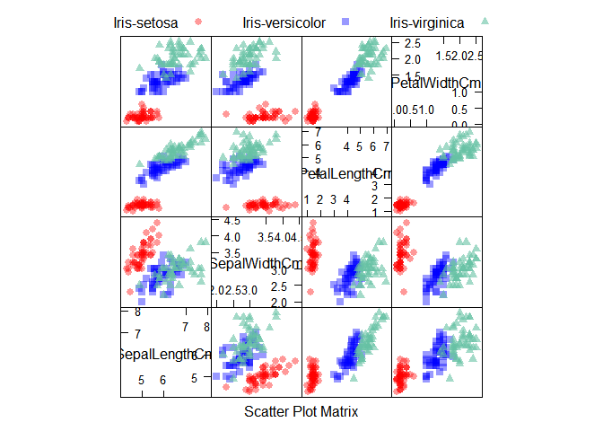
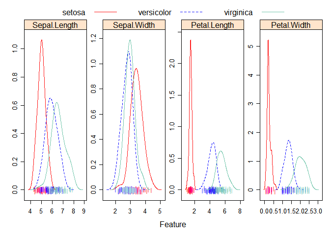
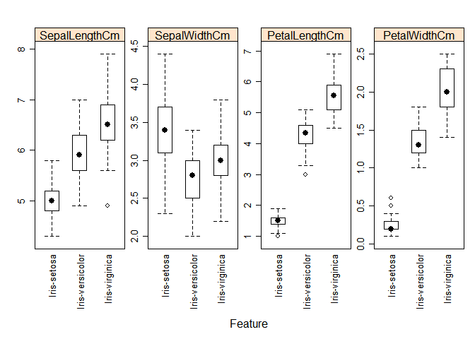
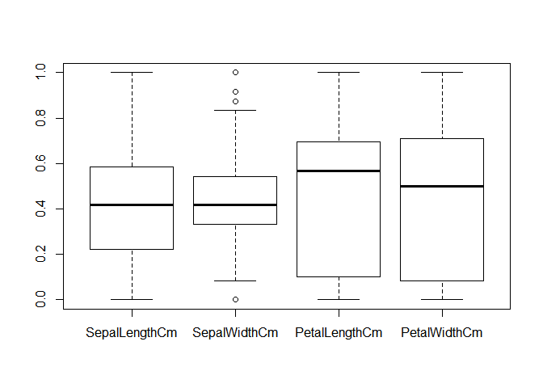
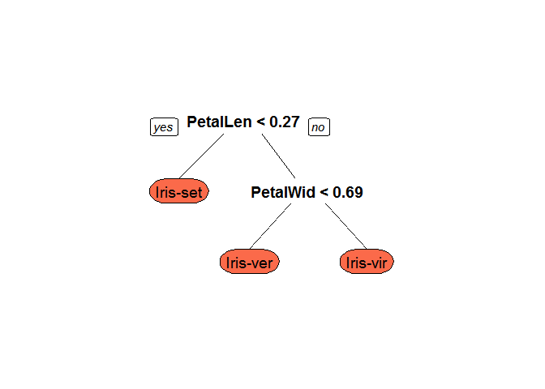
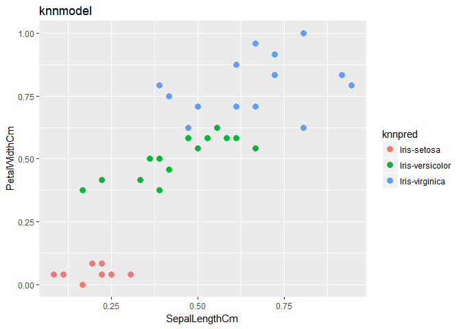
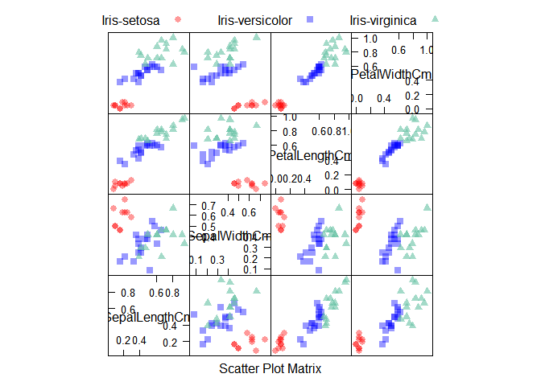

iris
================

Loading the dataset

``` r
irirdata = read.csv(file = "iris.csv")
```

``` r
fix(irirdata)
```

check for missing data

``` r
irirdata[irirdata == ""] = NA
sum(is.na(irirdata))
```

    ## [1] 0

The dataset deosnt have any missing data.

``` r
summary(irirdata)
```

    ##        Id         SepalLengthCm    SepalWidthCm   PetalLengthCm  
    ##  Min.   :  1.00   Min.   :4.300   Min.   :2.000   Min.   :1.000  
    ##  1st Qu.: 38.25   1st Qu.:5.100   1st Qu.:2.800   1st Qu.:1.600  
    ##  Median : 75.50   Median :5.800   Median :3.000   Median :4.350  
    ##  Mean   : 75.50   Mean   :5.843   Mean   :3.054   Mean   :3.759  
    ##  3rd Qu.:112.75   3rd Qu.:6.400   3rd Qu.:3.300   3rd Qu.:5.100  
    ##  Max.   :150.00   Max.   :7.900   Max.   :4.400   Max.   :6.900  
    ##   PetalWidthCm              Species  
    ##  Min.   :0.100   Iris-setosa    :50  
    ##  1st Qu.:0.300   Iris-versicolor:50  
    ##  Median :1.300   Iris-virginica :50  
    ##  Mean   :1.199                       
    ##  3rd Qu.:1.800                       
    ##  Max.   :2.500

From the above we can see all nuemeric type and one is of the type class. So the it is the type of classification

so lets scale the the data .

``` r
library(AppliedPredictiveModeling)
```

    ## Warning: package 'AppliedPredictiveModeling' was built under R version
    ## 3.4.3

``` r
transparentTheme(trans = .4)
```

    ## Warning: package 'lattice' was built under R version 3.4.3

``` r
library(caret)
```

    ## Warning: package 'caret' was built under R version 3.4.3

    ## Loading required package: ggplot2

``` r
featurePlot(x = irirdata[, 2:5], 
            y = irirdata$Species, 
            plot = "pairs",
            ## Add a key at the top
            auto.key = list(columns = 3))
```



``` r
library(AppliedPredictiveModeling)
library(caret)
transparentTheme(trans = .9)
featurePlot(x = iris[, 1:4], 
            y = iris$Species,
            plot = "density", 
            ## Pass in options to xyplot() to 
            ## make it prettier
            scales = list(x = list(relation="free"), 
                          y = list(relation="free")), 
            adjust = 1.5, 
            pch = "|", 
            layout = c(4, 1), 
            auto.key = list(columns = 3))
```



``` r
library(AppliedPredictiveModeling)
library(caret)
featurePlot(x = irirdata[, 2:5], 
            y = irirdata$Species, 
            plot = "box", 
            ## Pass in options to bwplot() 
            scales = list(y = list(relation="free"),
                          x = list(rot = 90)),  
            layout = c(4,1 ), 
            auto.key = list(columns = 2))
```



except sepalWidth feature all other have seperate cluster.

``` r
normal = function(x){
  num = x - min(x)
  den =max(x) - min(x)
  return ( num/den)
  
}
iris_scaled = as.data.frame(lapply(Filter(is.numeric,irirdata),normal))
iris_scaled = cbind(iris_scaled,Species =irirdata[,6])
summary(iris_scaled)
```

    ##        Id       SepalLengthCm     SepalWidthCm    PetalLengthCm   
    ##  Min.   :0.00   Min.   :0.0000   Min.   :0.0000   Min.   :0.0000  
    ##  1st Qu.:0.25   1st Qu.:0.2222   1st Qu.:0.3333   1st Qu.:0.1017  
    ##  Median :0.50   Median :0.4167   Median :0.4167   Median :0.5678  
    ##  Mean   :0.50   Mean   :0.4287   Mean   :0.4392   Mean   :0.4676  
    ##  3rd Qu.:0.75   3rd Qu.:0.5833   3rd Qu.:0.5417   3rd Qu.:0.6949  
    ##  Max.   :1.00   Max.   :1.0000   Max.   :1.0000   Max.   :1.0000  
    ##   PetalWidthCm                Species  
    ##  Min.   :0.00000   Iris-setosa    :50  
    ##  1st Qu.:0.08333   Iris-versicolor:50  
    ##  Median :0.50000   Iris-virginica :50  
    ##  Mean   :0.45778                       
    ##  3rd Qu.:0.70833                       
    ##  Max.   :1.00000

Now data is prepared and lets look for outliers.

``` r
boxplot(iris_scaled[,2:5])
```

 Only Sepalwidth has the outliers 4 of them are there.

``` r
summary(iris_scaled)
```

    ##        Id       SepalLengthCm     SepalWidthCm    PetalLengthCm   
    ##  Min.   :0.00   Min.   :0.0000   Min.   :0.0000   Min.   :0.0000  
    ##  1st Qu.:0.25   1st Qu.:0.2222   1st Qu.:0.3333   1st Qu.:0.1017  
    ##  Median :0.50   Median :0.4167   Median :0.4167   Median :0.5678  
    ##  Mean   :0.50   Mean   :0.4287   Mean   :0.4392   Mean   :0.4676  
    ##  3rd Qu.:0.75   3rd Qu.:0.5833   3rd Qu.:0.5417   3rd Qu.:0.6949  
    ##  Max.   :1.00   Max.   :1.0000   Max.   :1.0000   Max.   :1.0000  
    ##   PetalWidthCm                Species  
    ##  Min.   :0.00000   Iris-setosa    :50  
    ##  1st Qu.:0.08333   Iris-versicolor:50  
    ##  Median :0.50000   Iris-virginica :50  
    ##  Mean   :0.45778                       
    ##  3rd Qu.:0.70833                       
    ##  Max.   :1.00000

``` r
iris_scaled = iris_scaled[iris_scaled$SepalWidthCm < 0.80,]
```

``` r
dim(iris_scaled)
```

    ## [1] 146   6

outliers are removed

Spliting the data into train and test.

``` r
set.seed(123)
jumble = runif(nrow(iris_scaled))
iris_scaled = iris_scaled[ordered(jumble),]
sampleindex = sample(2,nrow(iris_scaled),replace = TRUE,prob = c(0.67,0.33))
iris_train = iris_scaled[sampleindex == 1,]
iris_test = iris_scaled[sampleindex == 2,]
dim(iris_test)
```

    ## [1] 41  6

``` r
dim(iris_train)
```

    ## [1] 105   6

``` r
library(caret)
library(rpart.plot)
```

    ## Warning: package 'rpart.plot' was built under R version 3.4.2

    ## Loading required package: rpart

``` r
trctrl <- trainControl(method = "repeatedcv", number = 10, repeats = 3)

dtree_fit <- train(Species ~., data = iris_train[,2:6], method = "rpart",
                   parms = list(split = "information"),
                   trControl=trctrl,
                   tuneLength = 10)
```

``` r
library(rpart.plot)
prp(dtree_fit$finalModel, box.palette = "Reds", tweak = 1.2)
```



``` r
decisionpred = predict(dtree_fit,iris_test[,2:5])
confusionMatrix(iris_test[,6],decisionpred)
```

    ## Confusion Matrix and Statistics
    ## 
    ##                  Reference
    ## Prediction        Iris-setosa Iris-versicolor Iris-virginica
    ##   Iris-setosa              10               0              0
    ##   Iris-versicolor           0              18              0
    ##   Iris-virginica            0               1             12
    ## 
    ## Overall Statistics
    ##                                           
    ##                Accuracy : 0.9756          
    ##                  95% CI : (0.8714, 0.9994)
    ##     No Information Rate : 0.4634          
    ##     P-Value [Acc > NIR] : 9.778e-13       
    ##                                           
    ##                   Kappa : 0.9621          
    ##  Mcnemar's Test P-Value : NA              
    ## 
    ## Statistics by Class:
    ## 
    ##                      Class: Iris-setosa Class: Iris-versicolor
    ## Sensitivity                      1.0000                 0.9474
    ## Specificity                      1.0000                 1.0000
    ## Pos Pred Value                   1.0000                 1.0000
    ## Neg Pred Value                   1.0000                 0.9565
    ## Prevalence                       0.2439                 0.4634
    ## Detection Rate                   0.2439                 0.4390
    ## Detection Prevalence             0.2439                 0.4390
    ## Balanced Accuracy                1.0000                 0.9737
    ##                      Class: Iris-virginica
    ## Sensitivity                         1.0000
    ## Specificity                         0.9655
    ## Pos Pred Value                      0.9231
    ## Neg Pred Value                      1.0000
    ## Prevalence                          0.2927
    ## Detection Rate                      0.2927
    ## Detection Prevalence                0.3171
    ## Balanced Accuracy                   0.9828

``` r
iris_train[,6] = as.factor(iris_train[,6])
iris_test[,6] = as.factor(iris_test[,6])
```

KNN model

``` r
library(caret)
cctrl <- trainControl(method = "cv", number = 3, repeats = 3)
```

    ## Warning: `repeats` has no meaning for this resampling method.

``` r
knnmodel <- train(Species ~ ., data = iris_train[,2:6], 
                            method = "knn", 
                            trControl = cctrl,
                             tuneLength = 15
                            )
```

``` r
knnpred = predict(knnmodel, iris_test[,2:6])
confusionMatrix(knnpred,iris_test[,6])
```

    ## Confusion Matrix and Statistics
    ## 
    ##                  Reference
    ## Prediction        Iris-setosa Iris-versicolor Iris-virginica
    ##   Iris-setosa              10               0              0
    ##   Iris-versicolor           0              17              0
    ##   Iris-virginica            0               1             13
    ## 
    ## Overall Statistics
    ##                                           
    ##                Accuracy : 0.9756          
    ##                  95% CI : (0.8714, 0.9994)
    ##     No Information Rate : 0.439           
    ##     P-Value [Acc > NIR] : 1.174e-13       
    ##                                           
    ##                   Kappa : 0.9625          
    ##  Mcnemar's Test P-Value : NA              
    ## 
    ## Statistics by Class:
    ## 
    ##                      Class: Iris-setosa Class: Iris-versicolor
    ## Sensitivity                      1.0000                 0.9444
    ## Specificity                      1.0000                 1.0000
    ## Pos Pred Value                   1.0000                 1.0000
    ## Neg Pred Value                   1.0000                 0.9583
    ## Prevalence                       0.2439                 0.4390
    ## Detection Rate                   0.2439                 0.4146
    ## Detection Prevalence             0.2439                 0.4146
    ## Balanced Accuracy                1.0000                 0.9722
    ##                      Class: Iris-virginica
    ## Sensitivity                         1.0000
    ## Specificity                         0.9643
    ## Pos Pred Value                      0.9286
    ## Neg Pred Value                      1.0000
    ## Prevalence                          0.3171
    ## Detection Rate                      0.3171
    ## Detection Prevalence                0.3415
    ## Balanced Accuracy                   0.9821

``` r
names(iris_test)
```

    ## [1] "Id"            "SepalLengthCm" "SepalWidthCm"  "PetalLengthCm"
    ## [5] "PetalWidthCm"  "Species"

\`\`\`{r}
=========

##### 

library(plyr)

plotdata = cbind(x = iris\_test*S**e**p**a**l**L**e**n**g**t**h**C**m*, *y* = *i**r**i**s*<sub>*t*</sub>*e**s**t*PetalLengthCm , predicted = knnpred)

find\_hull = function(df) df\[chull(df*x*, *d**f*y), \]

boundary = ddply(plotdata, .variables = "predicted", .fun = find\_hull)

\`\`\`
======

``` r
library(ggplot2)
ggplot(iris_test, aes(x=SepalLengthCm,y =PetalWidthCm,color = knnpred))+ geom_point(size = 3) + ggtitle("knnmodel") 
```



``` r
library(AppliedPredictiveModeling)
transparentTheme(trans = .4)
library(caret)
featurePlot(x = iris_test[, 2:5], 
            y = knnpred, 
            plot = "pairs",
            ## Add a key at the top
            auto.key = list(columns = 3))
```



The above is the visiualization of test results
